# Unit 03. 流體輸送與混合單元模擬

## 導讀：本單元學習指南

### 知識學習重點

本單元涵蓋 Aspen Plus 中**流體輸送**與**流體混合**兩大基礎單元操作，核心知識點如下：

**3.1 流體輸送單元**

| 知識點 | 說明 |
|:------|:----|
| 泵功率三層關係 | 有效功率 → 軸功率 → 電功率，各層效率（ $\eta_{\mathrm{pump}}$ 、 $\eta_{\mathrm{driver}}$ ）的物理意義 |
| 泵模塊設定規範 | 排放壓力、壓力增量、壓力比、指定功率四種出口規範模式 |
| 性能曲線的使用 | 如何在 Aspen Plus 中輸入 $H$-$Q$ 性能曲線確定實際工作點 |
| 壓縮機類型選擇 | 等熵（Isentropic）vs. 多變（Polytropic）壓縮的物理差異與適用條件 |
| 壓縮機計算方法 | Mollier、GPSA、ASME、分段積分法的適用範圍（見表 3-3）|
| 多級壓縮的優勢 | 中間冷卻降低總功耗的熱力學原理，`Mcompr` 中冷卻器的設置方法 |

**3.2 流體混合單元**

| 知識點 | 說明 |
|:------|:----|
| Mixer 物料與能量衡算 | 多進料混合的物料平衡式 (3-1) 與能量平衡式 (3-2)，絕熱閃蒸確定出口溫度 |
| 電解質過程數據包 | 選擇並套用 `eh2so4` 電解質數據包，使用電解質向導完成組分體系構建 |
| Fsplit 分流規範 | 自由度分析： $n$ 個出口流股需指定 $n-1$ 個規範（分率、流量或組分流量） |
| 分流分數計算 | 分離分數 $\alpha_i$ 的定義及其在流量衡算方程 (3-6)～(3-8) 中的應用 |

---

### 學習路徑建議

```
步驟 1：泵的功率計算（3.1.1 理論背景）
  └─ 先理解有效功率→軸功率→電功率三層計算邏輯，再動手操作 Aspen Plus
        ↓
步驟 2：例 3-1（指定壓力模式）
  └─ 建立流程圖、設定 Pump 模塊、解讀功率結果
        ↓
步驟 3：例 3-2（性能曲線模式）
  └─ 了解如何輸入 H-Q 曲線，確認泵在實際工況下的工作點
        ↓
步驟 4：壓縮機理論背景（3.1.2）
  └─ 理解等熵與多變壓縮的差異，對照表 3-3 選擇合適計算方法
        ↓
步驟 5：例 3-3（單級壓縮機）→ 例 3-4（多級壓縮機）
  └─ 比較單級與二級多變壓縮的功率差異，體會中間冷卻的節能效果
        ↓
步驟 6：混合器理論（3.2.1）
  └─ 掌握能量平衡，理解絕熱混合時出口溫度的計算方式
        ↓
步驟 7：例 3-5（電解質混合器）
  └─ 學習電解質過程數據包的選用，計算混合酸物性
        ↓
步驟 8：分流器理論（3.2.2） → 例 3-6（Fsplit）
  └─ 理解分流規範的自由度，設定分率與流量約束
```

> **先修知識**：建議學生已完成 Unit 02（物性方法），熟悉 Aspen Plus 基本操作（新建檔案、組分輸入、物性方法選取）。本單元泵與壓縮機的功率計算及混合器的能量衡算需具備基礎熱力學知識（焓、等熵效率）。

---

**前言：流體輸送與混合的工程意義**

流體輸送設備（泵、壓縮機、管線）與混合設備（混合器、分流器）是化工廠中出現頻率最高的基礎設備。幾乎任何一個化工流程都需要將物料從一個壓力狀態輸送至另一狀態（泵送液體、壓縮氣體），並在進入反應器或分離設備前進行混合配比。Aspen Plus 針對這些操作提供了六種**壓力改變設備（Pressure Changers）**模塊與兩種**混合設備（Mixers/Splitters）**模塊，涵蓋從簡單液態輸送到多級氣體壓縮的所有應用情境。

掌握本單元的模擬技能，是後續換熱（Unit 05）、精餾（Unit 06）與吸收萃取（Unit 07）等複雜單元操作模擬的重要基礎。

---

## 3.1 流體輸送單元模擬

Aspen Plus 中有六種流體輸送（壓力變送）單元模塊，如表 3-1 所示，涵蓋泵、壓縮機、多級壓縮機、閥門、管段和管線。

**表 3-1　流體輸送單元模塊介紹**

| 模塊 | 中文名稱 | 主要功能 | 適用情境 |
|:----:|:-------:|:-------:|:-------:|
| `Pump` | 泵 / 水力透平 | 液相升壓，計算泵功率或出口壓力；亦可反轉模擬水力透平回收能量 | 液態物料輸送、泵功率計算 |
| `Compr` | 壓縮機 / 透平機 | 氣相升壓，計算壓縮功率或出口狀態（可單相、兩相或三相計算） | 單級等熵/多變壓縮機、氣體透平機 |
| `Mcompr` | 多級壓縮機 / 透平機 | 多段升壓，級間可設冷卻器並採出冷凝相 | 高壓縮比多級壓縮系統 |
| `Valve` | 閥門 | 模擬節流膨脹的等焓壓降過程 | 控制閥、減壓設備 |
| `Pipe` | 管段 | 模擬單一定徑管路的壓降與熱損 | 等徑直管段（可含管件） |
| `Pipeline` | 管線 | 模擬多段不同管徑或地形起伏的管路壓降 | 具有多段管徑或高程變化的複雜管線 |

---

### 3.1.1 泵（Pump）

#### 理論背景：泵的功率計算

泵主要用於輸送液態流體並使其升壓至指定壓力。泵的功率計算涉及三個層次——從流體獲得的有效功率，到泵軸所消耗的軸功率，再到驅動機所消耗的電功率：

$$
P_{\text{fluid}} = Q \cdot \Delta P \qquad \text{(3-0a)}
$$

$$
P_{\text{shaft}} = \frac{P_{\text{fluid}}}{\eta_{\text{pump}}} \qquad \text{(3-0b)}
$$

$$
P_{\text{elec}} = \frac{P_{\text{shaft}}}{\eta_{\text{driver}}} \qquad \text{(3-0c)}
$$

式中 $Q$ 為體積流量（m³/s）， $\Delta P$ 為壓力增量（Pa）， $\eta_{\mathrm{pump}}$ 為泵效率， $\eta_{\mathrm{driver}}$ 為驅動機（電機）效率。

> **功率三層關係**
>
> - **有效功率（Fluid/Water Power, $P_{\text{fluid}}$ ）**：理想泵施加於流體的功率，僅與流量和壓差有關，不含任何損耗。
> - **軸功率（Brake/Shaft Power, $P_{\text{shaft}}$ ）**：實際傳遞到泵葉輪軸上的功率，須扣除泵內液力損耗與機械摩擦，故 $P_{\text{shaft}} > P_{\text{fluid}}$ 。
> - **電功率（Electric Power, $P_{\text{elec}}$ ）**：電動機消耗的電力，須再扣除電機傳動損耗，故 $P_{\text{elec}} > P_{\text{shaft}}$ 。完整能量鏈：電能 → 電機軸 → 泵軸 → 流體。
>
> **泵效率 $\eta_{\text{pump}}$ 與驅動機效率 $\eta_{\text{driver}}$ 的區別**
>
> | | 泵效率 $\eta_{\text{pump}}$ | 驅動機效率 $\eta_{\text{driver}}$ |
> |:--|:--|:--|
> | **描述的轉換** | 軸功率 → 流體有效功率 | 電功率 → 軸功率 |
> | **損耗來源** | 泵內部水力損耗（渦流、流道摩擦、葉輪間隙洩漏） | 電機內部損耗（銅損、鐵損、軸承摩擦、風阻） |
> | **典型範圍** | 60–90%（視泵型與工況點） | 90–98%（電動機通常較高） |
>
> 兩者串聯相乘即為整個驅動系統的**總效率**：
>
> $$\eta_{\text{total}} = \eta_{\text{pump}} \times \eta_{\text{driver}} = \frac{P_{\text{fluid}}}{P_{\text{elec}}}$$

`Pump` 模塊的出口規範支援以下四種模式：

| 規範模式 | 已知條件 | 計算目標 |
|:-------:|:-------:|:-------:|
| 排放壓力（Discharge pressure）| 出口壓力 $P_2$ | 所需功率 |
| 壓力增量（Pressure increase）| $\Delta P = P_2 - P_1$ | 所需功率 |
| 壓力比（Pressure ratio）| $P_2/P_1$ | 所需功率 |
| 指定功率（Power）| 功率 $P_{\text{shaft}}$ | 出口壓力 |


---

> **【例 3-1】** 用一台離心泵將甲醇與水混合物壓力從 0.1 MPa 升至 0.7 MPa，混合物流量為 100 kmol/h，其中甲醇摩爾分數為 80%，水摩爾分數為 20%，溫度為 40°C。泵效率為 85%，驅動機效率為 95%。試計算泵的有效功率、軸功率和驅動機電功率。物性方法採用 NRTL-RK。

**本題模擬步驟如下：**

**(1) 輸入組分**

新建 Aspen 模擬文件，選擇物性，在**組分 | 規定**頁面輸入如圖 3-1a 所示的組分信息，本例題中組分包括甲醇（CH₃OH）和水（H₂O）。在**方法 | 規定**頁面選擇物性方法為 NRTL-RK，如圖 3-1b 所示。

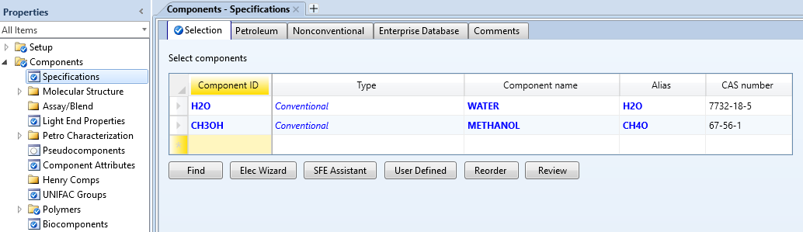 <br>
**圖 3-1a　組分規定頁面**

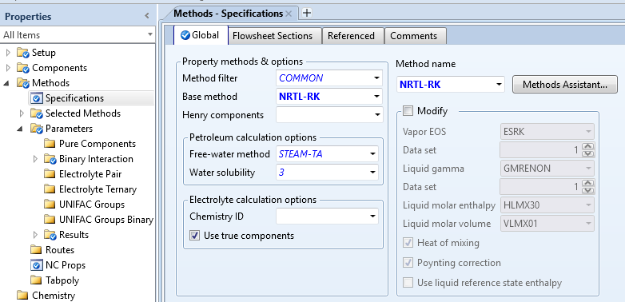 <br>
**圖 3-1b　物性方法選擇**

**(2) 建立流程圖**

選擇模擬，在模型選項板 **| 壓力變送設備** 選擇 `Pump` 模塊，搭建如圖 3-2 所示的具有一進料和一出料的流程圖。

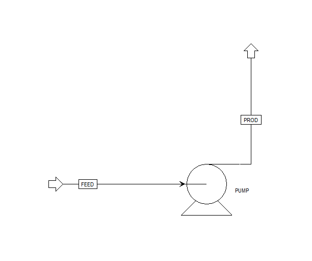 <br>**圖 3-2　例 3-1 流程圖**

**(3) 設置流股信息**

在**流股 | FEED | 輸入 | 混合**頁面輸入題目已知條件，如圖 3-3 所示。

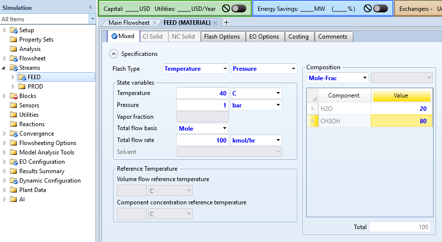 <br>**圖 3-3　進料流股設定**

**(4) 設置模塊操作參數**

在**模塊 | PUMP | 設置 | 規定**頁面中，模型選擇泵。如圖 3-4 所示，在泵出口規範中輸入排放壓力為 7 bar，輸入泵效率（0.85）和驅動機效率（0.95）的值。

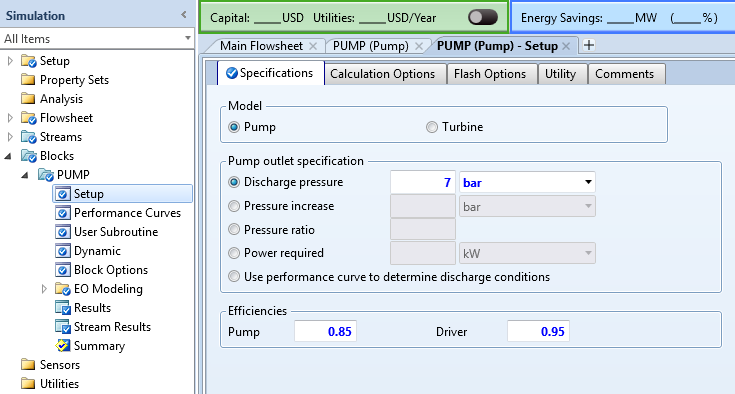 <br>**圖 3-4　Pump 模塊設置頁面**

**(5) 運行和查看結果**

運行模擬，進入**模塊 | PUMP | 結果**頁面查看結果，如圖 3-5 所示，泵的有效功率為 0.615 kW，軸功率為 0.724 kW，驅動機電功率為 0.762 kW。

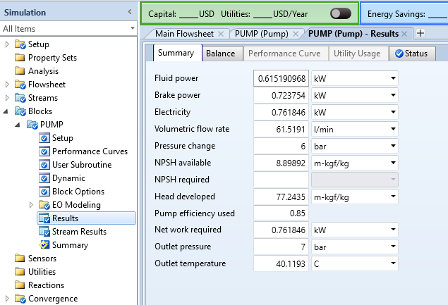 <br>**圖 3-5　Pump 模塊計算結果**

> **結果驗算**：代入式 (3-0a)～(3-0c) 手動驗核功率三層關係：
> - 有效功率 $P_{\text{fluid}} = 0.615$ kW
> - 軸功率：$0.615 \div 0.85 = 0.724$ kW ✓
> - 電功率：$0.724 \div 0.95 = 0.762$ kW ✓
>
> 三值依效率逐層遞增（ $P_{\text{fluid}} < P_{\text{shaft}} < P_{\text{elec}}$ ），與輸入效率完全自洽。亦可反推：有效功率 $= Q \cdot \Delta P = 0.615$ kW，對應體積流量 $Q = 0.615 \times 10^3 \div (6 \times 10^5) \approx 1.025 \times 10^{-3}$ m³/s $\approx 3.7$ m³/h，此即液態甲醇水混合物的實際輸送體積流量。

---

> **【例 3-2】** 現有一泵效率為 85%，驅動機效率為 95%，性能曲線如表 3-2 所示的離心泵，試問能否滿足例 3-1 的物流出口壓力要求，並求得相應的泵有效功率、軸功率和驅動機電功率是多少？

**表 3-2　泵性能曲線數據**

| 流量 / (m³/h) | 25 | 15 | 5 | 2 |
|:------------:|:--:|:--:|:-:|:-:|
| 揚程 / m      | 10 | 30 | 70 | 100 |

打開例 3-1 文件，另存為新的文件名。如圖 3-6 所示，進入**模塊 | PUMP | 設置 | 規定**，在泵出口規範頁面勾選「使用性能曲線確定排放條件」，效率參數不變。

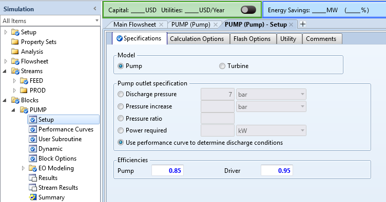 <br>**圖 3-6　勾選性能曲線選項**

點擊下一步，進入**模塊 | PUMP | 性能曲線 | 曲線設置**頁面，如圖 3-7 所示，選擇曲線格式為表格數據，流量變量選擇體積流量，曲線數選擇操作速度下單一曲線。

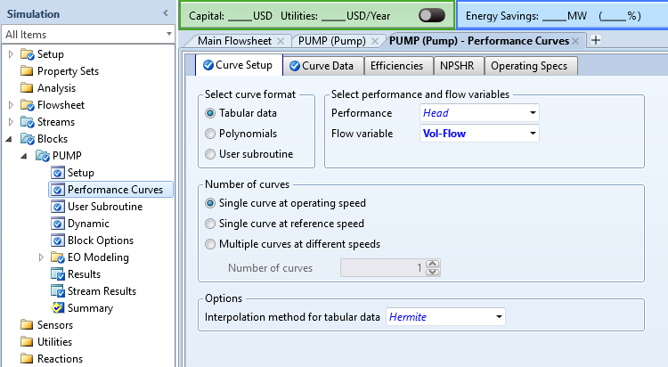 <br>**圖 3-7　性能曲線設置頁面**

點擊下一步，進入曲線數據輸入界面，如圖 3-8 所示，壓頭單位選擇 meter，流量單位選擇 cum/hr，在壓頭與流量表格中輸入表 3-2 中的數據。

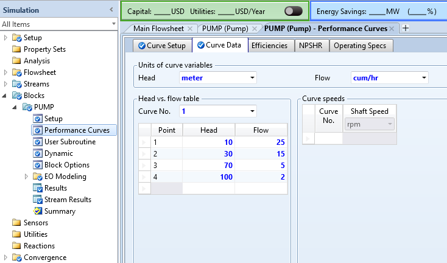 <br>**圖 3-8　性能曲線數據輸入**

運行模擬，進入**模塊 | PUMP | 結果**頁面查看結果，如圖 3-9 所示，泵出口壓力為 7.27 bar，滿足例 3-1 的輸送壓力要求。相應的泵有效功率為 0.646 kW，軸功率為 0.759 kW，驅動機電功率為 0.799 kW，各功率數值略高於例 3-1，是合適型號的泵。

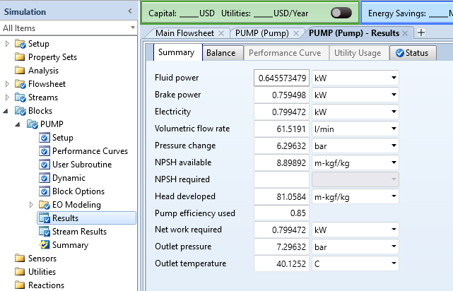 <br>**圖 3-9　性能曲線模式計算結果**

> **例 3-1 vs 例 3-2 比較（兩種壓力規範模式的差異）**：兩例進料、效率完全相同，差別僅在出口壓力的指定方式：
>
> | 比較項目 | 例 3-1（指定排放壓力）| 例 3-2（性能曲線）|
> |:--------:|:-------------------:|:----------------:|
> | 出口壓力 / bar | 7.00（給定）| 7.27（曲線插值）|
> | 有效功率 / kW | 0.615 | 0.646 |
> | 軸功率 / kW | 0.724 | 0.759 |
>
> 例 3-2 功率略高，是因為在該流量工作點下性能曲線所給出的揚程（7.27 bar）略高於 7 bar 需求，泵多輸出了少量「富裕揚程」。工程設計中採用性能曲線模式，可確認所選泵型號在實際工況下能滿足升壓需求，並判斷工作點是否落在曲線高效率區段內。

> **注意**：採用性能曲線時，Aspen Plus 以進料物流的體積流量在曲線上插值求得揚程（壓頭），再換算為壓力增量。若工況點位於曲線範圍外，模擬將產生外插誤差，應確認輸入流量落在曲線定義範圍內。


---

### 3.1.2 壓縮機（Compr）與多級壓縮機（Mcompr）

#### 理論背景：等熵壓縮與多變壓縮

與泵處理不可壓縮液相不同，壓縮機處理可壓縮氣相，壓縮過程中溫度與密度均隨壓力顯著變化，計算需基於熱力學方程。

**等熵壓縮（Isentropic Compression）**

假設壓縮過程絕熱（無熱量損失）且可逆（無摩擦），對理想氣體，等熵出口溫度 $T_{2,s}$ 為：

$$
\frac{T_{2,s}}{T_1} = \left(\frac{P_2}{P_1}\right)^{\!\frac{\gamma - 1}{\gamma}} \qquad \text{(3-0d)}
$$

式中 $\gamma = C_p/C_v$ 為比熱容比， $T_1$ 與 $T_{2,s}$ 均須以絕對溫度（K）代入。等熵功（理想壓縮功）：

$$
W_s = \frac{\gamma}{\gamma - 1} \, R \, T_1 \left[\left(\frac{P_2}{P_1}\right)^{\!\frac{\gamma-1}{\gamma}} - 1\right] \qquad \text{(3-0e)}
$$

式中 $R = 8.314$ J/(mol·K) 為通用氣體常數，$W_s$ 單位為 J/mol。考慮等熵效率 $\eta_s$（ $0 < \eta_s < 1$ ），實際軸功 $W_{\text{shaft}} = W_s / \eta_s$ ，實際出口溫度高於 $T_{2,s}$ 。

**多變壓縮（Polytropic Compression）**

多變過程描述為 $PV^n = \text{const}$ ，多變指數 $n$ 反映壓縮過程中的熱交換程度：

| 極限情形 | 多變指數 $n$ | 物理意義 |
|:-------:|:----------:|:-------:|
| 等溫過程 | $n = 1$ | 壓縮熱全部移除，溫度不變；功耗最低 |
| 等熵過程 | $n = \gamma$ | 絕熱可逆，無熱量交換 |
| 實際絕熱（帶不可逆性）| $n > \gamma$ | 出口溫度高於等熵，功耗高於等熵 |

> **等熵效率與多變效率的區別**
>
> - **等熵效率 $\eta_s$**：實際壓縮功與等熵壓縮功之比，直觀比較「實際」與「理想絕熱」之間的差距。
> - **多變效率 $\eta_p$**：逐步比較每個微元壓縮步驟的效率，反映過程的「逐點」熱力學完善程度。
>
> 兩者之間存在換算關係，**不能直接混用或替換**。若廠商給出的是多變效率，務必使用多變計算方法，而非直接代入等熵公式。

不同壓縮機類型可使用的計算方法如表 3-3 所示。

**表 3-3　壓縮機類型與計算方法**

| 壓縮機類型 | Mollier（莫利爾）| GPSA | ASME | 分段積分 |
|:----------:|:---------------:|:----:|:----:|:------:|
| 等熵         |                 |  √   |  √   |        |
| 多變         |  √              |  √   |      |   √    |
| 正排量       |  √              |      |      |        |

> **計算方法選擇建議**
>
> - **ASME 法**：以理想氣體 $C_p^0$ 搭配狀態方程剩餘函數修正，適用於等熵壓縮機計算。
> - **GPSA 法**：工業常用，可用於等熵與多變；採用平均壓縮係數修正真實氣體行為。
> - **ASME 多變法**（`Mcompr` 中）：比 GPSA 更嚴格，但**不適用於渦輪機**（膨脹方向）。
> - **Mollier 法**：以焓差直接計算功，適用於使用狀態方程的真實氣體，精度最高。

**多級壓縮的優勢（Mcompr）**

對於高壓縮比系統（如 $P_2/P_1 > 3$ ），採用多級壓縮並在級間設置**中間冷卻器（Intercooler）**，可顯著降低總壓縮功耗。各級最優壓力比相等時功耗最低，對 $N$ 級壓縮，各級壓力比為：

$$
r_{\text{stage}} = \left(\frac{P_{\text{final}}}{P_{\text{initial}}}\right)^{\!1/N} \qquad \text{(3-0f)}
$$

中間冷卻溫度越低（理論最優為冷卻至進料溫度 $T_1$ ），節能效果越顯著。

---

> **【例 3-3】** 用一台等熵壓縮機將甲醇與水混合物的壓力從 0.1 MPa 升至 0.7 MPa，混合物流量為 100 kmol/h，其中甲醇質量分數為 80%，溫度為 90°C。壓縮機的等熵效率為 85%，驅動機的機械效率為 90%。試計算等熵壓縮機的指示功率、軸功率和功率損耗，以及物流出口溫度和流量。物性方法採用 NRTL-RK。

**本題模擬步驟如下：**

**(1) 建立流程圖**

新建 Aspen 模擬文件，參照例 3-1 輸入組分和物性方法。建立如圖 3-10 所示的流程圖。

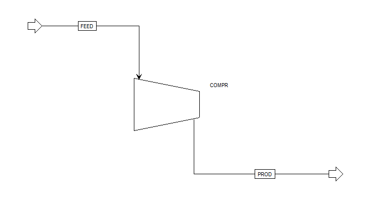 <br>**圖 3-10　例 3-3 流程圖**

**(2) 設置流股信息**

在**流股 | FEED | 輸入 | 混合**頁面輸入題目已知條件，如圖 3-11 所示。

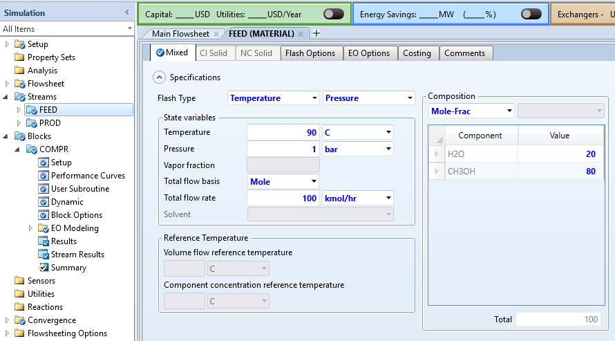 <br>**圖 3-11　進料流股設定**

**(3) 設置模塊操作參數**

如圖 3-12 所示，進入**模塊 | COMPR | 設置 | 規定**頁面，選擇壓縮機，類型為等熵。在出口規範中輸入排放壓力為 7 bar，輸入等熵效率（0.85）和機械效率（0.90）數值。

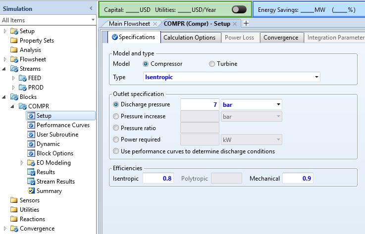 <br>**圖 3-12　Compr 模塊設置頁面**

**(4) 運行和查看結果**

運行模擬，進入**模塊 | COMPR | 結果**頁面查看結果，如圖 3-13 和圖 3-14 所示，壓縮機的指示功率為 241.96 kW，軸功率為 268.84 kW，功率損耗為 26.88 kW，物流出口溫度為 259.44°C，體積流量為 632.59 m³/h。

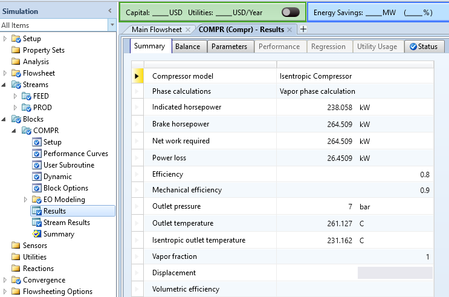 <br>**圖 3-13　Compr 計算結果（功率）**

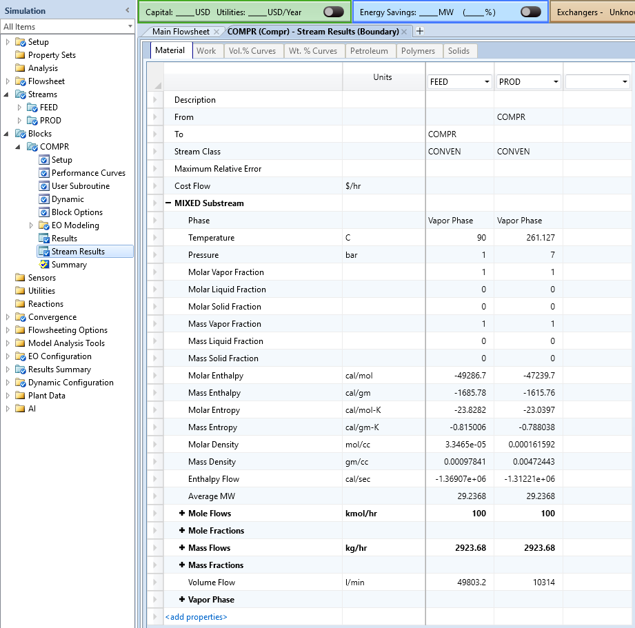 <br>**圖 3-14　Compr 計算結果（出口狀態）**

> **與例 3-1 比較（液相泵 vs 氣相壓縮機）**：兩例均以 100 kmol/h 甲醇水混合物從 0.1 MPa 升壓至 0.7 MPa（壓力比 7），但相態截然不同，軸功率相差約 **370 倍**（268.84 kW vs 0.724 kW）：
>
> | 比較項目 | 例 3-1（泵，液相，40°C）| 例 3-3（壓縮機，氣相，90°C）|
> |:--------:|:---------------------:|:--------------------------:|
> | 相態 | 液態（密度 ~750 kg/m³）| 氣態（密度 ~3–5 kg/m³）|
> | 體積流量 | ~3.7 m³/h（計算值）| 出口 632.59 m³/h |
> | 軸功率 / kW | 0.724 | 268.84 |
> | 出口溫度 | ~40°C（幾乎不變）| 259.44°C（大幅升高）|
>
> 液體近似不可壓縮，升壓時體積不變、溫度幾乎不變，所需功率極低（ $P = Q \cdot \Delta P$ 中 $Q$ 甚小）。氣體密度低，相同摩爾流量下體積流量龐大（出口超過 630 m³/h），且壓縮過程中體積持續縮小、溫度大幅升高（259.44°C），需持續對大體積氣體作功，故功耗遠大於液相泵送。

---

> **【例 3-4】** 進料條件與例 3-3 相同的情況下，通過一台二級多變壓縮機將物流壓力提高至 7 bar。二級壓縮機分別冷卻移走部分熱量，使得各級中間冷卻器出口溫度均為 150°C，冷卻過程壓降為 0。試求多級壓縮的總功率，冷卻器移走的熱量。

**本題模擬步驟如下：**

**(1) 建立流程圖**

新建 Aspen 模擬文件，參照例 3-1 輸入組分和物性方法。建立如圖 3-15 所示的流程圖。

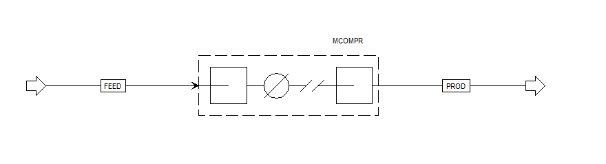 <br>**圖 3-15　例 3-4 流程圖**

**(2) 設置壓縮機配置**

如圖 3-16 所示，進入**模塊 | MCOMPR | 設置 | 配置**頁面，輸入壓縮級數（Number of stages）為 2（即二級壓縮），壓縮機類型選擇 ASME 方法多變，在規範類型中輸入排放壓力為 7 bar。

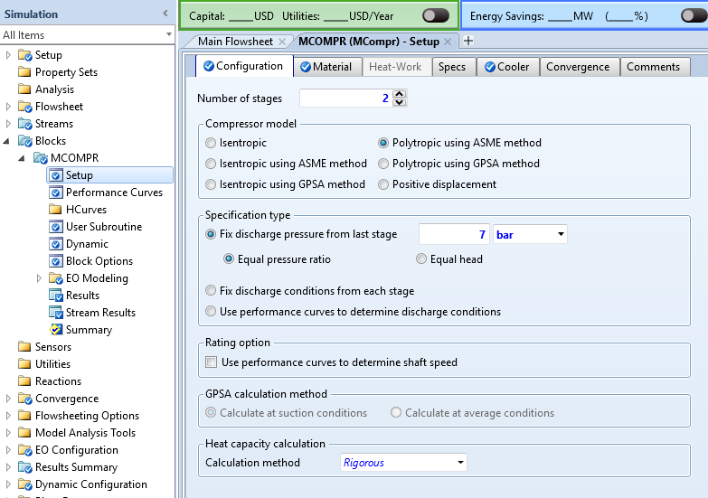 <br>**圖 3-16　Mcompr 配置頁面**

**(3) 設置冷卻器參數**

如圖 3-17 所示，進入**模塊 | MCOMPR | 設置 | 冷卻器**界面，第 1 級冷卻器出口溫度規定為 150°C，壓降默認值為 0；第 2 級設置相同。

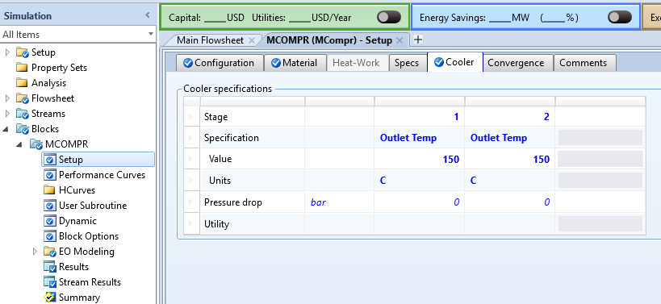 <br>**圖 3-17　Mcompr 冷卻器設置**

**(4) 運行和查看結果**

運行模擬，進入**模塊 | MCOMPR | 結果摘要**頁面，如圖 3-18 所示，可知壓縮機的總功率為 274.87 kW，總冷卻負荷為 195.25 kW。

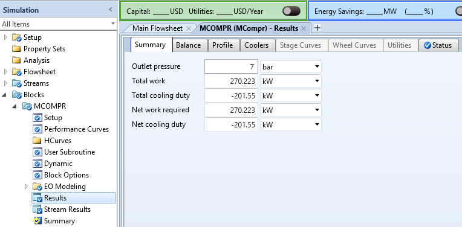 <br>**圖 3-18　Mcompr 結果摘要**

如圖 3-19 所示，進入**模塊 | MCOMPR | 結果 | 冷卻器**界面，第一級和第二級冷卻負荷分別為 47.98 kW 和 147.27 kW。

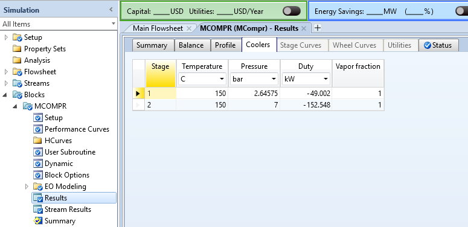 <br>**圖 3-19　Mcompr 各級冷卻器熱負荷**

> **與例 3-3 的比較（多級壓縮與中間冷卻節能分析）**：本例二級多變壓縮（274.87 kW）與例 3-3 單級等熵壓縮（268.84 kW）功耗相近，看似多級壓縮未能節能，需從三個面向理解：
>
> 1. **計算方法不同，不宜直接比較**：例 3-3 採用「等熵（Isentropic）」方法，例 3-4 採用「ASME 多變（Polytropic）」方法，兩者效率基準不同，絕對功率數值不具直接可比性。
>
> 2. **中間冷卻溫度偏高，效益有限**：冷卻器出口設為 150°C，而進料入口僅 90°C。第二級壓縮進口溫度（150°C）遠高於第一級進口（90°C），中間冷卻效果有限。若將冷卻器出口溫度降至進料溫度 90°C（理論最優），各級壓力比等分為 $r = \sqrt{7} \approx 2.65$，總功耗可顯著低於單級結果。
>
> 3. **冷卻負荷分布反映壓縮熱分配**：第一級冷卻負荷（47.98 kW）遠小於第二級（147.27 kW），原因是第二級入口溫度更高（150°C），壓縮後出口溫度更高，需移走更多熱量。總冷卻負荷（195.25 kW）相當於壓縮軸功率的 71%，工業設計中須配置相應的冷卻水系統。


---

### 例題組 3-5：氮氣壓縮三方案比較

> **【例題組 3-5】** 需要將一股純氮氣（N₂）從 200°C、1.2 bar 壓縮並冷卻，最終提供出口條件 80°C、6.0 bar 之產品物流，進料流量為 1 kmol/h。物性方法採用 IDEAL（氮氣在此操作條件下可視為理想雙原子氣體， $C_p = 3.5R$ ， $\gamma = 1.4$ ）；各方案壓縮機均採等熵模式，等熵效率 $\varepsilon = 70\%$，不另考慮機械損耗；所有設備間及冷卻器壓降均設為 0。試依下列三種方案分別模擬，求各方案的壓縮軸功率與冷卻負荷，並指出各方案有無特殊的操作條件：
>
> - **方案 A**：先進行單級壓縮（200°C、1.2 bar → 6 bar），再冷卻至 80°C。
> - **方案 B**：先冷卻進料至 80°C，再進行單級壓縮（80°C、1.2 bar → 6 bar），最後冷卻至 80°C。
> - **方案 C**：先冷卻進料至 80°C，再進行二級等壓力比中間冷卻壓縮（各級進口均冷卻至 80°C），最終冷卻至 80°C。

三種方案的流程示意如圖 3-20 所示。

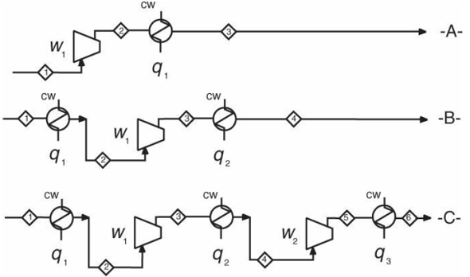 <br>
**圖 3-20　氮氣壓縮三方案流程示意（A：單級壓縮；B：預冷＋單級壓縮；C：預冷＋二級中冷壓縮）**

---

#### 例 3-5A：方案 A — 單級壓縮後冷卻

**本例模擬步驟如下：**

**(1) 設置組分與物性方法**

新建 Aspen Plus 模擬文件，在**組分 | 規定**頁面輸入純組分 N₂（NITROGEN）；在**方法 | 規定**頁面選擇物性方法為 IDEAL。氮氣在此操作條件下遠離臨界點（N₂ 的 $T_c = -147$ °C， $P_c = 33.9$ bar），可視為理想雙原子氣體（ $C_p = 3.5R$ ， $\gamma = 1.4$ ），使用 IDEAL 方法可使模擬結果與手算等熵公式直接對照驗證。
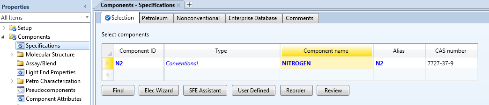 <br>
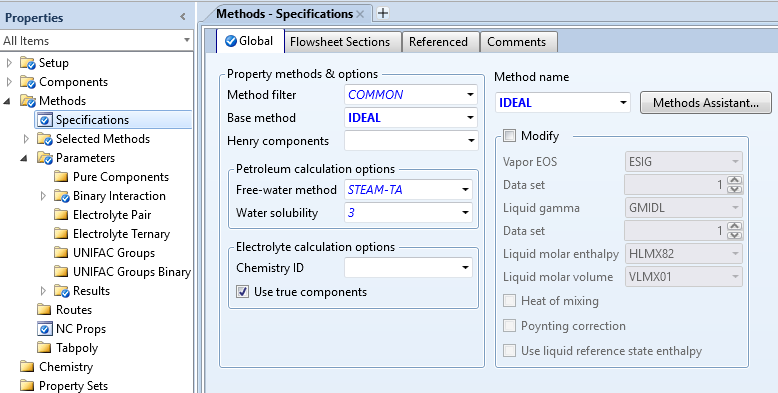 <br>
**圖 3-21　組分與物性方法設置**


**(2) 建立流程圖**

在**模型選項板 | 壓力變送設備**選取 `Compr` 模塊，在**換熱設備**選取 `Heater` 模塊，搭建如圖 3-21 所示流程：進料 FEED → 壓縮機 COMPR → 冷卻器 COOLER → 產品 PROD。

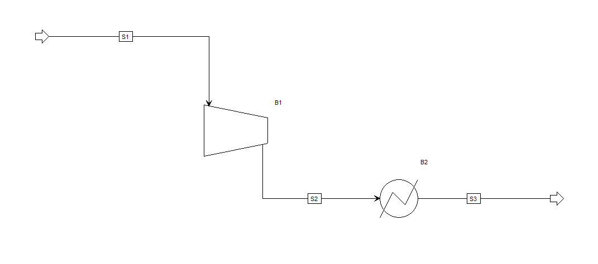 <br>
**圖 3-21　方案 A 流程圖（單級壓縮＋冷卻）**

**(3) 設置流股與模塊參數**

在**流股 | FEED | 輸入 | 混合**頁面設定進料：溫度 200°C，壓力 1.2 bar，以 Mole-Flow 模式設定 N₂ 摩爾流量為 1 kmol/h。進入**模塊 | COMPR | 設置 | 規定**，如圖 3-22 所示：選擇壓縮機，類型等熵，排放壓力 6 bar，等熵效率 0.70（不另設定機械效率）。進入**模塊 | COOLER | 輸入**：出口溫度 80°C，壓降 0。

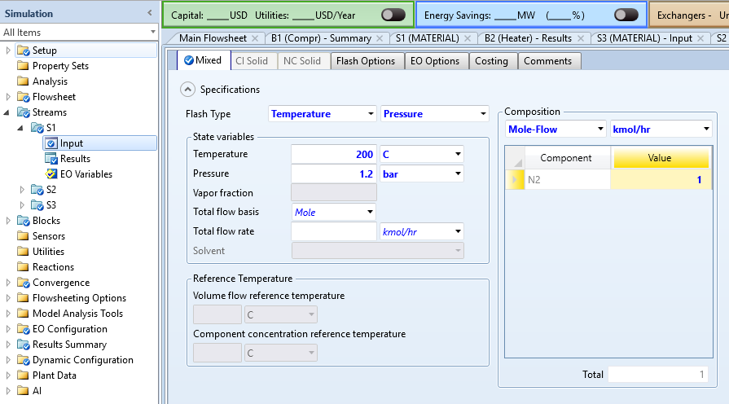 <br>
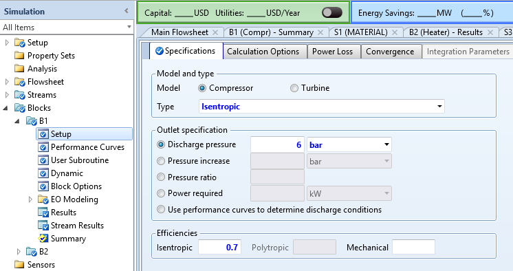 <br>
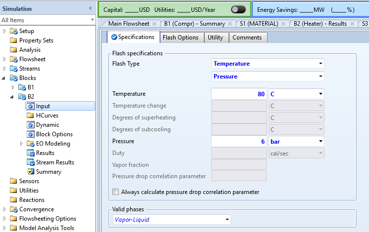 <br>
**圖 3-22　方案 A 模塊設置**

**(4) 運行並查看結果**

運行模擬，進入**模塊 | COMPR | 結果**與**模塊 | COOLER | 結果**，如圖 3-23 所示。壓縮機出口溫度 573.8°C（等熵出口溫度 464.7°C），軸功率 11.41 MJ/hr（≈ 3.17 kW）；冷卻器需移走 14.93 MJ/hr（≈ 4.15 kW）熱量。

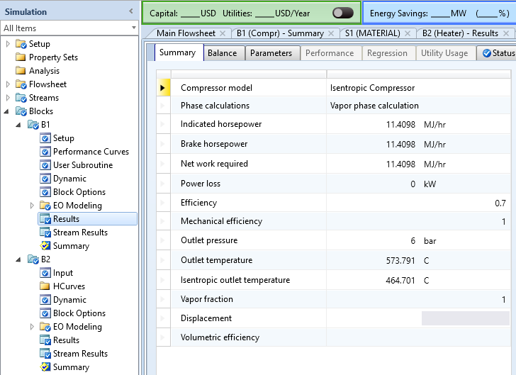 <br>
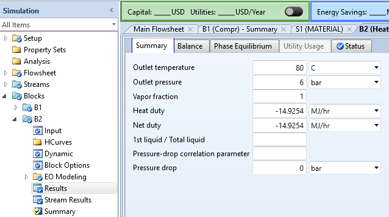 <br>
**圖 3-23　方案 A 計算結果（壓縮機出口溫度與冷卻負荷）**

> ⚠ **特殊操作條件**：壓縮機出口溫度 573.8°C，已超過大多數壓縮機密封件、潤滑油及管線材料的耐熱上限（通常低於 350°C），工業上不可採用此方案。

---

#### 例 3-5B：方案 B — 預冷後單級壓縮

本方案在壓縮前先將進料冷卻至 80°C，使壓縮機在較低入口溫度下運行，依據 $W_s \propto T_1$ 的比例關係可顯著降低所需功耗。

**(1) 建立流程圖**

在模型選項板新增一個 `Heater` 模塊（PRECOOL）作為預冷卻器，搭建如圖 3-24 所示流程：FEED → 預冷 PRECOOL → 壓縮機 COMPR → 冷卻器 COOLER → PROD。

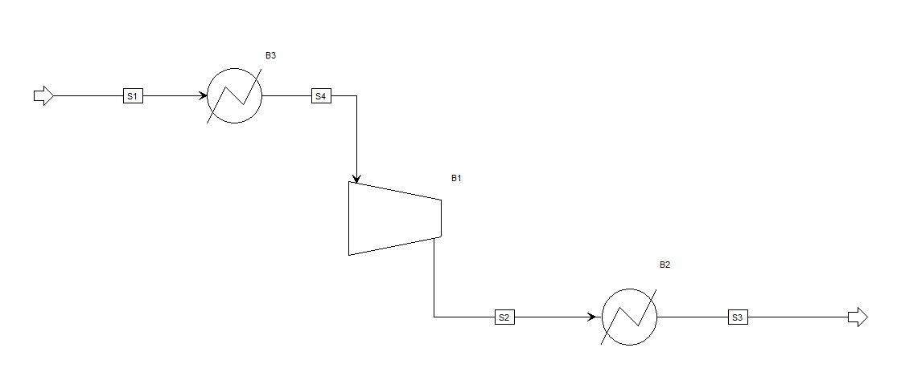 <br>
**圖 3-24　方案 B 流程圖（預冷＋單級壓縮＋冷卻）**

**(2) 設置模塊參數並運行**

- **PRECOOL**：出口溫度 80°C，壓降 0（移除進料顯熱，對應冷卻負荷 $q_1$）。
- **COMPR**：排放壓力 6 bar，等熵效率 0.70（不另設定機械效率）。
- **COOLER**：出口溫度 80°C，壓降 0（最終冷卻負荷 $q_2$）。

運行模擬，進入各模塊結果頁面，如圖 3-25 及圖 3-26 所示。預冷負荷 $q_1 = 3.516$ MJ/hr（≈ 0.977 kW）；壓縮機出口溫度 368.7°C（等熵出口溫度 283.4°C），軸功率 8.556 MJ/hr（≈ 2.38 kW）；最終冷卻負荷 $q_2 = 8.556$ MJ/hr（≈ 2.38 kW）。

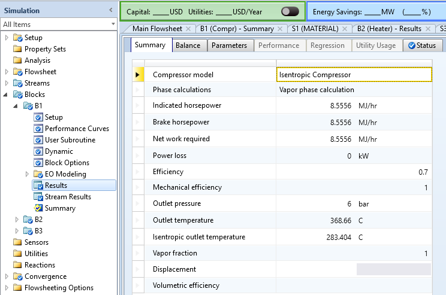 <br>
**圖 3-25　方案 B 壓縮機結果（出口溫度與軸功率）**

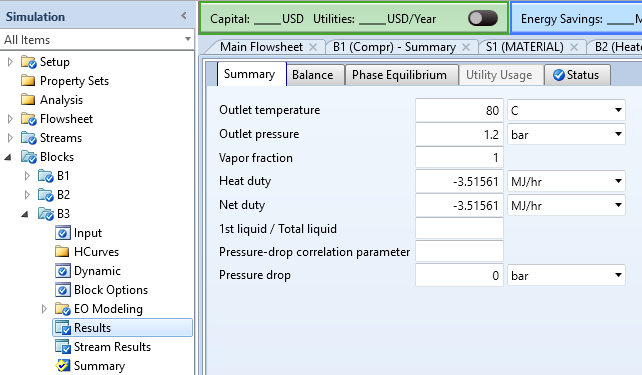 <br>
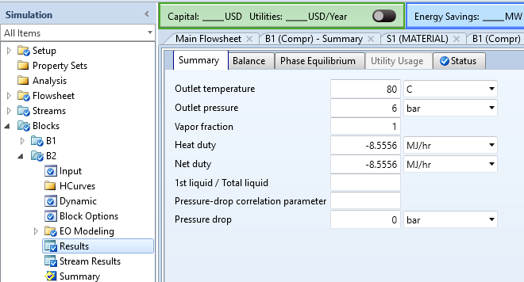 <br>
**圖 3-26　方案 B 各冷卻器熱負荷（預冷 $q_1$ 與最終冷卻 $q_2$）**

---

#### 例 3-5C：方案 C — 預冷後二級中間冷卻壓縮

本方案在方案 B 的預冷基礎上，進一步將壓縮拆成二級並設置中間冷卻器，充分應用式 (3-0f) 的等壓力比分配原則以最小化總壓縮功。

**中間壓力計算**：對 $N = 2$ 級，各級壓力比等分時功耗最低：

$$
r_{\text{stage}} = \left(\frac{P_{\text{final}}}{P_{\text{initial}}}\right)^{1/2} = \left(\frac{6.0}{1.2}\right)^{1/2} = \sqrt{5} \approx 2.236
$$

中間壓力 $P_{\text{mid}} = 1.2 \times 2.236 \approx 2.68$ bar。 `Mcompr` 模塊在指定出口壓力與級數後，會自動以等壓力比分配各級，無需手動計算。

**(1) 建立流程圖**

搭建如圖 3-27 所示流程：FEED → PRECOOL（ $q_1$，預冷）→ MCOMPR（含兩級壓縮及兩個內建冷卻器：中冷 $q_2$ 與最終冷卻 $q_3$）→ PROD。

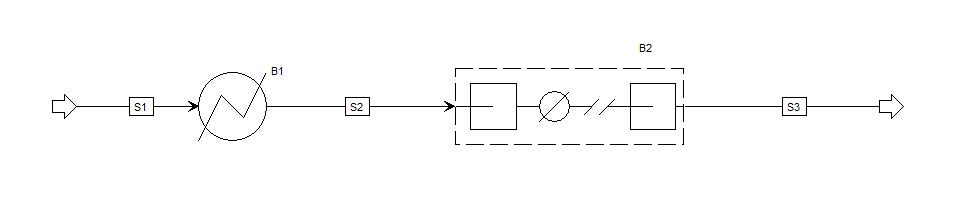 <br>
**圖 3-27　方案 C 流程圖（預冷＋ `Mcompr` 二級中冷壓縮＋最終冷卻）**

**(2) 設置 Mcompr 與周邊冷卻器**

如圖 3-28 所示：
- **MCOMPR | 配置**：壓縮級數 2，類型等熵，排放壓力 6 bar；等熵效率 0.70（不另設定機械效率）。
- **MCOMPR | 冷卻器**：第 1 級（中冷）出口溫度 80°C，壓降 0；第 2 級（最終冷卻）出口溫度 80°C，壓降 0。
- **PRECOOL**：出口溫度 80°C，壓降 0。

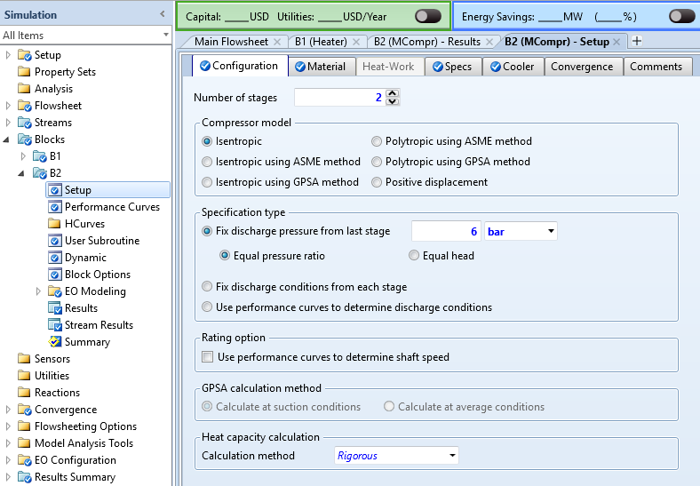 <br>
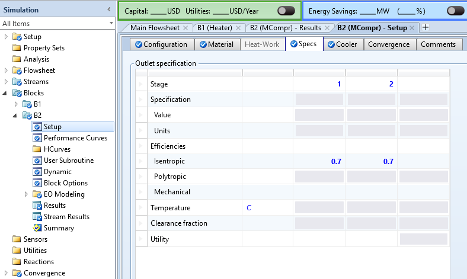 <br>
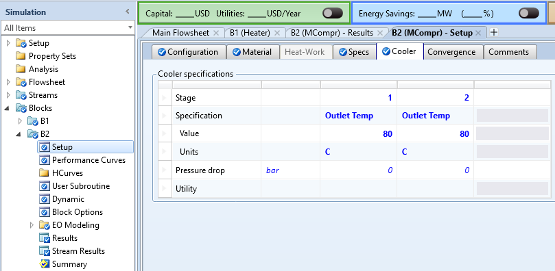 <br>
**圖 3-28　方案 C Mcompr 配置與冷卻器設置頁面**

**(3) 運行並查看結果**

運行模擬，進入**模塊 | MCOMPR | 結果摘要**及**冷卻器**頁面，如圖 3-29 所示。Mcompr 總軸功率 2.107 kW（各級各約 1.054 kW），中間壓力 2.683 bar；預冷 $q_1 = 3.516$ MJ/hr（≈ 0.977 kW），中冷 $q_2 = 3.793$ MJ/hr（≈ 1.054 kW），最終冷卻 $q_3 = 3.793$ MJ/hr（≈ 1.054 kW）（對稱壓力比確保 $q_2 = q_3$）。

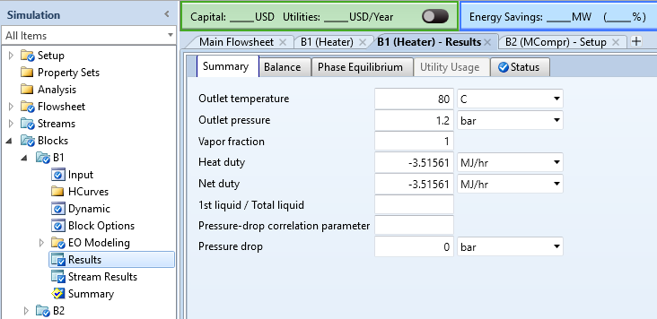 <br>
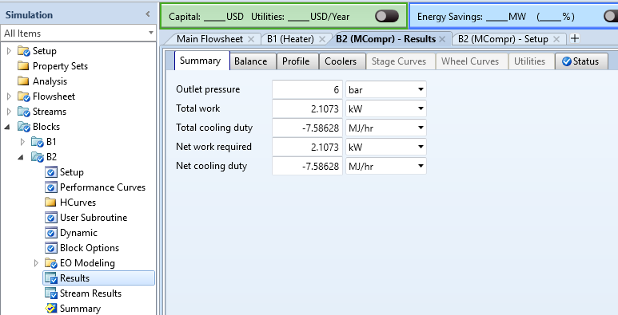 <br>
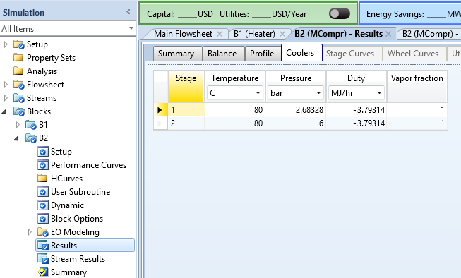 <br>
**圖 3-29　方案 C Mcompr 結果摘要**

---

#### 三方案結果彙整與比較

**表 3-4　氮氣壓縮三方案模擬結果彙整（進料 1 kmol/h N₂，等熵效率 $\varepsilon = 70\%$，IDEAL 物性方法）**

| 比較項目 | 方案 A（單級，200°C 入）| 方案 B（單級，80°C 入）| 方案 C（二級中冷，80°C 入）|
|:--------:|:----------------------:|:---------------------:|:--------------------------:|
| 壓縮機出口溫度 / °C | 573.8 ⚠ | 368.7 | ~211 |
| 壓縮機軸功率 / kW | 3.17 | 2.38（↓ 25%）| 2.11（↓ 33%）|
| 總冷卻負荷 / kW | 4.15 | 3.35 | 3.08 |
| 冷卻設備台數 | 1 | 2 | 3 |
| 特殊操作條件 | 出口溫 > 500°C，材料嚴苛 | 無 | 無 |

> **【三方案熱力學詮釋】**
>
> 1. **降低壓縮入口溫度（方案 B vs 方案 A）**：等熵功 $W_s \propto T_1 \left[\left(\frac{P_2}{P_1}\right)^{(\gamma-1)/\gamma} - 1\right]$ 與入口絕對溫度 $T_1$ 成正比。將 $T_1$ 由 473 K 降至 353 K（降幅 25.4%），軸功率相應降低約 25%，且出口溫度由 573.8°C 降至 368.7°C，消除超溫風險。
>
> 2. **採用多級中間冷卻（方案 C vs 方案 B）**：二級壓縮使每級壓力比由 5 降至 $\sqrt{5} \approx 2.24$，配合各級入口均冷卻至 80°C，每級等熵功均低於單級，相對方案 B 再節省約 11%（相對方案 A 總節能達 33%）。出口溫度進一步降至約 211°C。
>
> 3. **冷卻設備與壓縮功的替代關係**：方案 C 雖壓縮功最省，但需配置 3 個冷卻器（預冷、中冷、最終冷卻）。工業設計須進行**經濟評估**，判斷壓縮電費節省是否可抵回冷卻水費用與設備投資的增加。
>
> 4. **特殊操作條件（Condition of Special Concern）**：方案 A 出口溫 573.8°C，是本例中最值得注意的操作條件，工業上不可行。方案 B 與 C 有效解決此問題，而方案 C 在方案 B 的基礎上進一步提供最優的功耗水準。

---

#### 結果分析與討論

**（一）方案 A 的利與弊**

就**流程複雜度**而言，方案 A 僅需一台壓縮機與一個冷卻器，設備數最少，是三方案中最簡單的配置。然而，模擬結果顯示方案 A 存在三項重大缺點，不宜作為最終工業方案：

1. **最高電力需求**：軸功率 11.41 MJ/hr（約 11,410 kJ/kmol），為三方案中最高，若採電力驅動，電費最為昂貴。
2. **最高冷卻需求**：總冷卻負荷 14.93 MJ/hr（約 14,930 kJ/kmol），亦為三方案中最大。
3. **特殊操作條件（Condition of Special Concern）**：壓縮出口溫度 573.8°C，遠超 400°C 門檻。壓縮機為高速旋轉設備，高溫下材料強度劣化與熱膨脹問題尤為關鍵；適用於此溫度的設備採購成本將大幅躍升。此外，方案 A 的單級壓力比為 $6.0/1.2 = 5.0$，遠超工業通用準則所建議的 3:1 上限。

**（二）方案 B 的改善**

方案 B 增設預冷器，流程略為複雜，但有效消除超溫問題（壓縮出口溫度降至 368.7°C）。其電力（8.556 MJ/hr）與總冷卻負荷（12.07 MJ/hr）均明顯低於方案 A，結論是**方案 B 優於方案 A**。

**（三）方案 C 的進一步節能**

方案 C 採二級中間冷卻壓縮，在方案 B 的基礎上將電力進一步降至 7.59 MJ/hr（約 7,560 kJ/kmol）、總冷卻降至 11.10 MJ/hr（約 11,050 kJ/kmol），同時各級壓力比降至 2.24，符合 3:1 準則。**方案 C 的公用工程消耗在三方案中最低，優於方案 B。**

**（四）壓縮機設計啟發式原則**

上述結果印證了兩條廣泛引用的壓縮機設計啟發式原則（Turton et al., 2012, Table 6.4）：

> 1. **壓縮前先冷卻熱氣流（Cool a hot gas prior to compressing it）**：預冷可降低入口溫度、減少壓縮功並避免超溫操作，如方案 B 與 C 所示。
> 2. **壓力比宜低於 3:1（Keep the compression ratio less than 3:1）**：方案 A 單級壓力比為 5，方案 C 各級壓力比僅約 2.24，設備壽命與可靠度更佳。

**（五）最終方案選擇：需進行技術經濟評估**

熱力學分析顯示方案 C 公用工程消耗最低，然而最終方案選擇仍需對各競爭方案進行**技術經濟評估（Techno-Economic Analysis）**，同時衡量**資本投資**（設備採購、安裝）與**操作成本**（電費、冷卻水費）的年化總成本，方能作出最終決策。

---

**課程資訊**
- 課程名稱：化工程序模擬 (ChemE 1395)
- 課程單元：Unit 03 流體輸送與混合單元模擬
- 課程製作：逢甲大學 化工系 智慧程序系統工程實驗室
- 授課教師：莊曜禎 助理教授
- 更新日期：2026-09-22

**課程授權 [CC BY-NC-SA 4.0]**
- 本教材遵循 [創用CC 姓名標示-非商業性-相同方式分享 4.0 國際 (CC BY-NC-SA 4.0)](https://creativecommons.org/licenses/by-nc-sa/4.0/deed.zh) 授權。
