# Unit 06. 精餾塔分離單元模擬

## 導讀：本單元學習指南

精餾塔是化工廠中最核心的分離設備之一，從石油煉製、輕烴分離到製藥純化，幾乎所有需要高純度分離的製程都會用到精餾操作。本單元以**輕烴混合物分離**為實例，帶領學生從理論原理出發，逐步掌握 Aspen Plus 精餾塔模擬的完整流程——從初步設計的簡捷計算，到滿足嚴格分離規格的嚴格計算，建立系統化的模擬分析能力。

### 知識學習重點

**一、精餾原理與設計方法論**
- 理解精餾與蒸餾的概念區別，掌握精餾透過**回流**實現多次氣液接觸、達到高純度分離的原理
- 掌握**理論塔板**（Theoretical Stage）的物理意義，理解回流比 $R$ 與塔板數 $N$ 之間的設計權衡關係
- 理解**輕烴加壓精餾**的工程必要性：常壓沸點低於室溫的組分（C3、IC4、NC4）需升壓才能使用普通冷卻水冷凝

**二、Winn-Underwood-Gilliland（WUG）簡捷法**
- 掌握 **Winn/Fenske 方程**：在全回流條件下計算最小理論塔板數 $N_{min}$
- 掌握 **Underwood 方程**：在無限板條件下計算最小回流比 $R_{min}$ ，理解夾緊點（Pinch Point）的概念
- 掌握 **Gilliland 關聯式**（Molokanov 擬合）：由實際回流比估算實際所需塔板數 $N$
- 掌握 **Kirkbride 方程**：估算最佳進料板位置
- 釐清「最小值」（ $R_{min}$ 、 $N_{min}$ ）與「實際值」（ $R$ 、 $N$ ）的概念差異，避免混淆

**三、Aspen Plus 模擬操作技能**
- 學會使用 **Binary Analysis（Txy 圖）** 分析關鍵組分相平衡：確認無共沸點、量化相對揮發度、驗證物性方法適用性
- 學會設定 **DSTWU 模組**：輸入回流比倍數（負數輸入法）、關鍵組分回收率、冷凝器型式與壓力條件
- 學會解讀 DSTWU 計算結果，並從 $N$–$R$ **權衡曲線**（Trade-off Curve）進行設計方案比選
- 學會設定 **RadFrac 模組**：塔板數計算規則（計入冷凝器/再沸器）、進料板位置、進料慣例（On-Stage vs Above-Stage）
- 學會設定**設計規範（Design Specification）**與**調整變數（Manipulated Variable）**，使嚴格計算收斂至指定分離目標

**四、工程分析能力**
- 能從 Txy 相平衡圖讀取繫線，估算相對揮發度 $\alpha$ ，初步評估分離難度
- 能解讀 $N$–$R$ 曲線的工程意義，識別最佳設計區域（低邊際效益遞減區）
- 能進行自由度分析，正確配對設計規範數量與調整變數數量
- 能比較簡捷計算（誤差 10\%–30\%）與嚴格計算結果，判斷初步設計的可靠度

### 學習路徑建議

```
① 閱讀 6.1 理論背景（WUG 方程）
       ↓
② 例6-1 步驟(1)–(2)：完成 Txy 二元分析 → 建立流程圖
       ↓
③ 例6-1 步驟(3)–(5)：設定並執行 DSTWU → 解讀简捷計算結果
       ↓
④ 例6-1 步驟(6)：生成 N–R 曲線 → 理解設計空間
       ↓
⑤ 閱讀 6.2 理論背景（MESH 方程）
       ↓
⑥ 例6-2：以 RadFrac 進行嚴格計算（初始不收斂）
       ↓
⑦ 例6-2：加入設計規範 → 確認分離目標達成
```

> **先修知識**：建議學生已熟悉氣液相平衡基礎（相平衡常數 $K$ 值、相對揮發度 $\alpha$ ）、物料衡算、Aspen Plus 基本操作（流股輸入、物性方法選取）。

---

**前言：蒸餾與精餾**
 
**蒸餾（Distillation）** 是廣義總稱，泛指一切利用各組分**揮發度差異**進行氣化-冷凝分離的操作，包含簡單蒸餾 (Simple Distillation)、水蒸氣蒸餾 (Steam Distillation)、真空蒸餾 (Vacuum Distillation) 等。其中，設有**回流**的連續多級分離操作稱為**精餾（Rectification）**，是蒸餾的一個子類別，也是工業上最常見的蒸餾形式。

簡單蒸餾只進行一次蒸發-冷凝，分離效果有限；精餾透過回流使液相由塔頂流下、氣相由塔底上升，兩相在每一塊塔板上反覆接觸達到相平衡，等效於多次蒸餾，因此可達到高純度分離。

英文中 Distillation（及 Aspen Plus 中的模組名稱 DSTWU、RadFrac 等）習慣上泛指工業精餾塔，本章節沿用此慣例，後文「精餾」與「蒸餾」如無特別說明，均指**設有回流的連續精餾操作** （Distillation Column with Reflux）。

精餾（Rectification）是化工中最廣泛應用的分離操作，其核心原理是利用混合物中各組分**揮發性差異**（沸點不同），藉由氣液兩相在塔板或填料上的多次逆流接觸，達到組分的分離與富集。每一次氣液接觸可視為一個**理論塔板**（Theoretical Stage），在此板上氣液兩相達到相平衡，然後分道而行。精餾塔設計的核心問題是：在滿足分離規格的前提下，確定最適宜的**回流比** $R$ 與**理論塔板數** $N$ 。兩者相互制約：在固定分離規格下，回流比越大，所需理論板數越少；板數越多，可在較低回流比下達到相同分離目標。實際設計通常取最小回流比的 $(1.2 \sim 1.5)$ 倍，以平衡能耗與設備投資。

Aspen Plus 針對不同的設計階段與精度需求，在塔模組中提供了如圖6-1 所示的各類模組，各類塔器模組的介紹如表6-1 所示。其中，**簡捷法模組 Shortcut Method**（DSTWU、Distl）計算速度快，適合初步設計與方案篩選；**嚴格法模組 Rigorous Method**（RadFrac、MultiFrac、PetroFrac）以 MESH 聯立方程求解，計算精度高，適合詳細設計與操作校核。


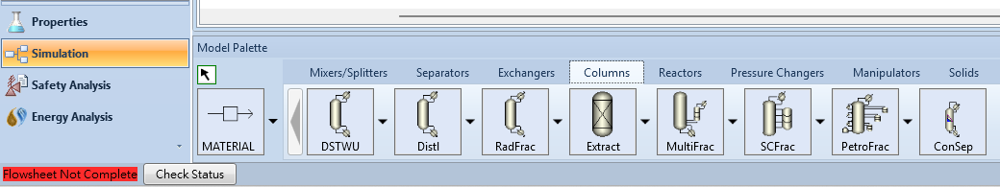  
圖6-1 塔器模組

表6-1 塔器模組介紹  

| 模組 | 說明 | 功能 |
|------|------|------|
| DSTWU | 以 Winn-Underwood-Gilliland（WUG）三步法為核心的**簡捷設計**模組；適用於兩關鍵組分、兩產品精餾塔的初步設計與方案篩選 | 計算最小回流比 $R_{min}$ 、最小理論板數 $N_{min}$ 、實際回流比 $R$ 、實際理論板數 $N$ 、進料板位置（Kirkbride 方程）及冷凝器與再沸器熱負荷 |
| Distl | 以 Edmister 法為核心的**簡捷校核**模組；在已知回流比與理論板數的前提下，反算各組分的分離結果 | 根據指定回流比、理論板數及餾出與進料比，計算各組分在塔頂與塔底的回收率及產品組成 |
| RadFrac | 單塔精餾**嚴格計算**模組；逐板求解 MESH 方程組；適用於兩相與三相體系、窄沸程及液相強非理想體系 | 嚴格計算產品組成與流量、塔板溫度/流量分布、冷凝器與再沸器熱負荷；支援設計規範（Design Specification）、靈敏度分析及側線採出 |
| Extract | 嚴格法**液液萃取**模組；基於 MESH 方程對液液兩相逆流接觸過程進行嚴格模擬 | 計算各組分在兩相中的分配比、萃取率及理論級數需求；可用於萃取劑選取與用量優化 |
| MultiFrac | 多塔聯立**嚴格計算**模組；可同時求解多塔間具有物流耦合或熱整合的複雜分離系統 | 適用於乙烯裂解分離、吸收-汽提聯合塔、石油煉製中多塔聯結等複雜流程的嚴格校核與設計計算 |
| SCFrac | 石油組分分餾單元**簡捷設計**模組；以分餾指標（Fractionation Index）描述各側線間的分離程度 | 根據分餾指標快速估算各側線產品的組成、流量、塔板數及再沸器/汽提蒸汽熱負荷，用於石油蒸餾初步設計 |
| PetroFrac | 石油蒸餾塔**嚴格計算**模組；專為原油常壓蒸餾、減壓蒸餾等含側線汽提塔的複雜石油煉製塔設計 | 嚴格模擬含側線汽提塔、抽出側線及泵回迴路的石油精餾塔；計算各切割餾分的收率、性質規格及各段熱負荷 |
| ConSep | Aspen 精餾合成模組；採用**邊界值逐板計算法（Boundary Value Method）**分析分離可行操作域 | 在給定進料條件與分離要求下，確定塔設計的可行操作窗口（回流比與塔板數的可行組合），用於精餾概念設計與方案評估 |

## 6.1 精餾塔簡捷計算

### 理論背景：Winn-Underwood-Gilliland 法

DSTWU 模組採用 Winn-Underwood-Gilliland（WUG）三步法進行簡捷設計計算：

**（一）Winn 方程——計算最小理論塔板數 $N_{min}$**

全回流（Total Reflux， $R \to \infty$ ）代表能耗無限大但板數最少的極限狀態。Fenske 方程（Winn 為其推廣形式，可處理非恆定相對揮發度的情況）給出：

$$
N_{min} = \frac{\ln\!\left[\left(\dfrac{x_{LK}}{x_{HK}}\right)_D \cdot \left(\dfrac{x_{HK}}{x_{LK}}\right)_B\right]}{\ln \bar{\alpha}_{LK,HK}}
$$

其中 $x_{LK}$ 、 $x_{HK}$ 為關鍵組分的摩爾分率，下標 $D$ 、 $B$ 分別表示塔頂餾出物與塔底產品， $\bar{\alpha}_{LK,HK}$ 為全塔幾何平均相對揮發度。

> **關鍵組分定義**：**關鍵輕組分（Light Key, LK）** 是指希望大部分出現在塔頂、但允許微量出現在塔底的組分；**關鍵重組分（Heavy Key, HK）** 則是希望大部分留在塔底、但允許微量出現在塔頂的組分。LK 與 HK 的回收率規格直接決定塔的設計要求。沸點低於 LK 的組分稱為**非關鍵輕組分**（Non-key Lights），幾乎全部進入塔頂；沸點高於 HK 的組分稱為**非關鍵重組分**（Non-key Heavies），幾乎全部留在塔底。

**（二）Underwood 方程——計算最小回流比 $R_{min}$**

最小回流比對應於無限多塔板時的極限操作狀態，此時操作線與平衡線在進料板附近相切，形成**夾緊點**（Pinch Point）。Underwood 方程分兩步求解：

*步驟一*：求解 Underwood 根 $\theta$ （根值介於 $\alpha_{HK}$ 與 $\alpha_{LK}$ 之間）：

$$
\sum_{i} \frac{\alpha_i \, z_{F,i}}{\alpha_i - \theta} = 1 - q
$$

其中 $z_{F,i}$ 為進料摩爾組成， $q$ 為進料熱狀態參數（泡點液體 $q=1$ ，飽和蒸氣 $q=0$ ，過冷液體 $q>1$ ，過熱蒸氣 $q<0$ ，氣液混合進料 $0<q<1$ ）。

*步驟二*：代入求最小回流比：

$$
R_{min} + 1 = \sum_{i} \frac{\alpha_i \, x_{D,i}}{\alpha_i - \theta}
$$

**（三）Gilliland 關聯式——估算實際理論塔板數**

給定實際回流比 $R$ （通常取 $R = (1.2 \sim 1.5) \times R_{min}$ ）後，利用 Gilliland 關聯（Molokanov 擬合公式）估算實際所需理論塔板數 $N$ ：

$$
Y = 1 - \exp\!\left[\frac{(1+54.4\,X)(X-1)}{(11+117.2\,X)\sqrt{X}}\right]
$$

其中無因次參數定義為：

$$
X = \frac{R - R_{min}}{R + 1}, \qquad Y = \frac{N - N_{min}}{N + 1}
$$

進料塔板位置則由 Kirkbride 方程估算：

$$
\log\!\left(\frac{N_{上}}{N_{下}}\right) = 0.206 \log\!\left[\frac{B}{D} \cdot \left(\frac{z_{F,HK}}{z_{F,LK}}\right) \cdot \left(\frac{x_{B,LK}}{x_{D,HK}}\right)^2\right]
$$

其中 $N_{上}$ 、 $N_{下}$ 分別為進料板以上與以下的塔板數， $B$ 、 $D$ 為塔底與塔頂的摩爾流量。

---

精餾塔簡捷計算模組可用於計算最小回流比、最小理論板數、實際回流比、實際理論板數、進料位置、餾出比、冷凝器和再沸器熱負荷等參數。簡捷計算的精度相對較低（誤差約 10%～30%），一般用於精餾初步設計，所得計算結果可為精餾塔嚴格計算提供初值。

> **解析：「最小值」與「實際值」的區別**
>
> WUG 三步法計算中出現兩對容易混淆的設計參數——**極限值**（對應某種理想假設，無法直接用於真實塔設計）與**實際值**（工程上實際選用的操作條件）：
>
> | 參數 | 符號 | 對應的極限假設 | 工程意義 |
> |------|------|------|------|
> | **最小回流比** | $R_{min}$ | 理論板數 $N \to \infty$ （無限多板）| 能耗的**下限**； $R < R_{min}$ 時，無論板數多少，指定分離目標都**無法達成** |
> | **實際回流比** | $R$ | 無（設計者主動選定）| 工程上實際操作的回流比，通常取 $R = (1.2 \sim 1.5) \times R_{min}$ ，以平衡能耗與設備投資 |
> | **最小理論塔板數** | $N_{min}$ | 全回流（ $R \to \infty$ ，能耗無限大）| 板數的**下限**； $N < N_{min}$ 時，無論回流比多大，指定分離目標都**無法達成** |
> | **實際理論塔板數** | $N$ | 無（由 Gilliland 關聯計算得出）| 在選定實際回流比 $R$ 下所需的板數，通常 $N \approx (1.5 \sim 2.0) \times N_{min}$ |
>
> **簡記口訣**（避免混淆的關鍵）：
> - $R_{min}$ 對應「 $N$ 趨近無窮大」：板數無限多時，回流比才能降到極限最低值
> - $N_{min}$ 對應「 $R$ 趨近無窮大（全回流）」：回流比無限大時，板數才能降到極限最少值
> - 兩個「最小值」都是**理論極限，皆不可直接用於實際塔設計**
>
> **WUG 計算順序**：① Winn 方程求 $N_{min}$ （全回流極限）→ ② Underwood 方程求 $R_{min}$ （無限板極限）→ ③ 工程選定 $R = (1.2 \sim 1.5) \times R_{min}$ → ④ Gilliland 關聯求實際 $N$ 。


---
### 【例6-1】C4/C5分離塔模擬與理論板數計算
現有一烷烴混合物，進料流量為  $5\mathrm{t / h}$ ，壓力  $0.60\mathrm{MPa}$ ，溫度  $30^{\circ}C$ ，物料組分和含量如表6-2所示，塔頂為全冷凝，冷凝壓力為  $0.59\mathrm{MPa}$ ，塔釜再沸器壓力為  $0.60\mathrm{MPa}$ ，迴流比為最小回流比的1.3倍。要求塔頂產品中正丁烷回收率為  $99\%$ ，塔頂2-甲基丁烷回收率 $1\%$ 。物性方法採用`PENG-ROB`。求最小回流比、最小理論板數、實際迴流比、進料位置和塔頂溫度。

表6-2 烷烴混合物組成 (Mass Fraction) 

| 組分 | 丙烷 <br> (Propane, C3) | 異丁烷 <br> (Isobutane, IC4) | 正丁烷 <br> (n-Butane, NC4) | 2-甲基丁烷 <br> (2-Methylbutane, IC5) | 正戊烷 <br> (n-Pentane, NC5) | 正己烷 <br> (n-Hexane, NC6) |
|------|------|--------|-----------|--------|--------|--------|
| 質量分數 (Mass Fraction) | 0.1 | 0.2 | 0.2 | 0.2 | 0.2 | 0.1 |
| 沸點 (Boiling Point, °C) | -42.11 | -11.72 | -0.49 | 27.84 | 36.06 | 68.71 |

> **為什麼要在加壓（ $0.6\,\mathrm{MPa}$ ）下進行精餾，而不直接在常壓下操作？**
>
> 觀察表6-2 的常壓沸點可知：本混合物中有三個組分——C3（ $-42.1\,^{\circ}C$ ）、IC4（ $-11.7\,^{\circ}C$ ）、NC4（ $-0.5\,^{\circ}C$ ）——在**常壓與室溫條件下均為氣態**。若在常壓下操作精餾塔，塔頂蒸氣無法用一般冷卻水（約 $30\,^{\circ}C$ ）冷凝，整個塔的液相將無法維持，精餾無法正常運作。
>
> 升壓操作的原理是：根據克勞修斯–克拉佩龍方程（Clausius–Clapeyron Equation），提高壓力會使各組分的沸點**同步升高**。當系統壓力升至 $0.6\,\mathrm{MPa}$ 時：
>
> | 組分 | 常壓沸點 | $0.6\,\mathrm{MPa}$ 下沸點（估算）| 意義 |
> |------|------|------|------|
> | C3 | $-42.1\,^{\circ}C$ | 約 $25\,^{\circ}C$ | 升壓後接近室溫，可用冷卻水冷凝 |
> | IC4 | $-11.7\,^{\circ}C$ | 約 $51\,^{\circ}C$ | 升壓後高於室溫，液態穩定 |
> | NC4 | $-0.5\,^{\circ}C$ | 約 $58\,^{\circ}C$ | 升壓後高於室溫，液態穩定 |
> | IC5 | $+27.8\,^{\circ}C$ | 約 $91\,^{\circ}C$ | 原本常溫液體，升壓後更穩定 |
>
> 升壓後，塔頂蒸氣（富含 C3、IC4、NC4）的泡點提升至 $30 \sim 40\,^{\circ}C$ 左右，**可以直接用普通冷卻水（ $25 \sim 30\,^{\circ}C$ ）作為全冷凝冷凝器的冷媒**，不需昂貴的冷凍設備，大幅降低操作成本。
>
> **總結**：輕烴（C1–C4）精餾均需要加壓操作，目的是將各組分的沸點提升至可用冷卻水冷凝的溫度範圍（通常 $40 \sim 60\,^{\circ}C$ ）。操作壓力的選定原則是：**在冷凝器可用冷媒溫度的前提下，選取能使塔頂冷凝器正常運作的最低壓力**，以避免不必要的高壓操作（壓力越高，設備壁厚要求越嚴，造價越高，且相對揮發度會因壓力升高而略微下降，分離難度增加）。

#### 本題模擬步驟如下：

##### (1) 輸入組分

新建Aspen模擬檔案，進入如圖6-2所示的，Components | Specifications | Selection 頁面，在**Component name 欄位**輸入組分資訊。在 Methods | Specifications 頁面選擇物性方法為`PENG-ROB`。
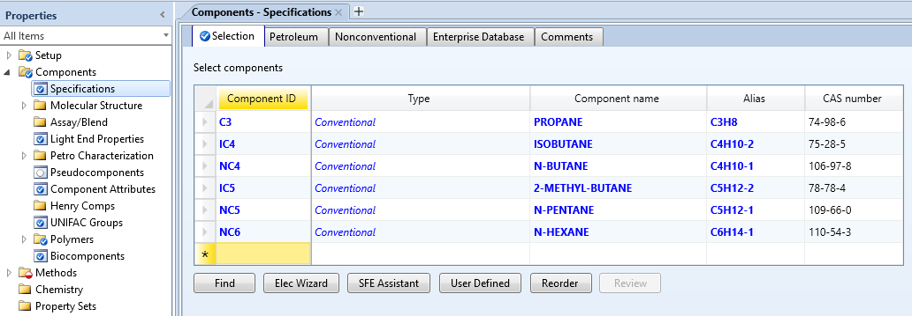 
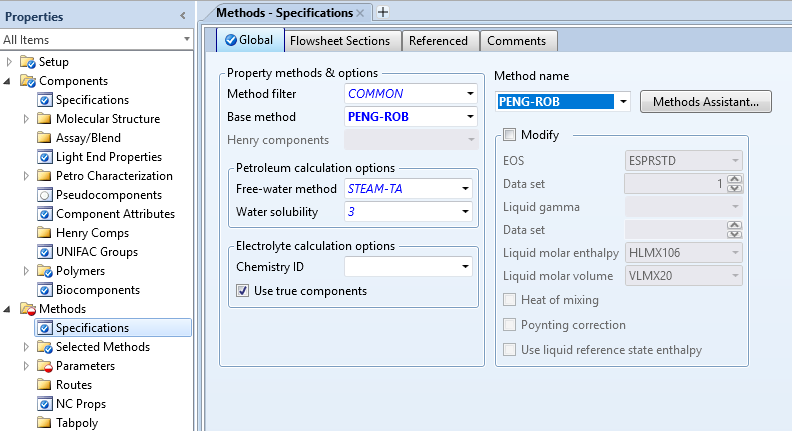  
圖6-2 簡捷精餾組分圖

**進行二元分析**：如圖6-3（上）在頂部功能區點選 **Binary** 分析按鈕，選擇 **Txy** 分析，操作壓力設為 $0.6\,\mathrm{MPa}$ （對應塔的操作壓力），組分選擇兩關鍵組分（正丁烷 NC4 與 2-甲基丁烷 IC5），點選 Run Analysis，得到如圖6-3（下）所示的 $T$–$x$–$y$ 相平衡圖。

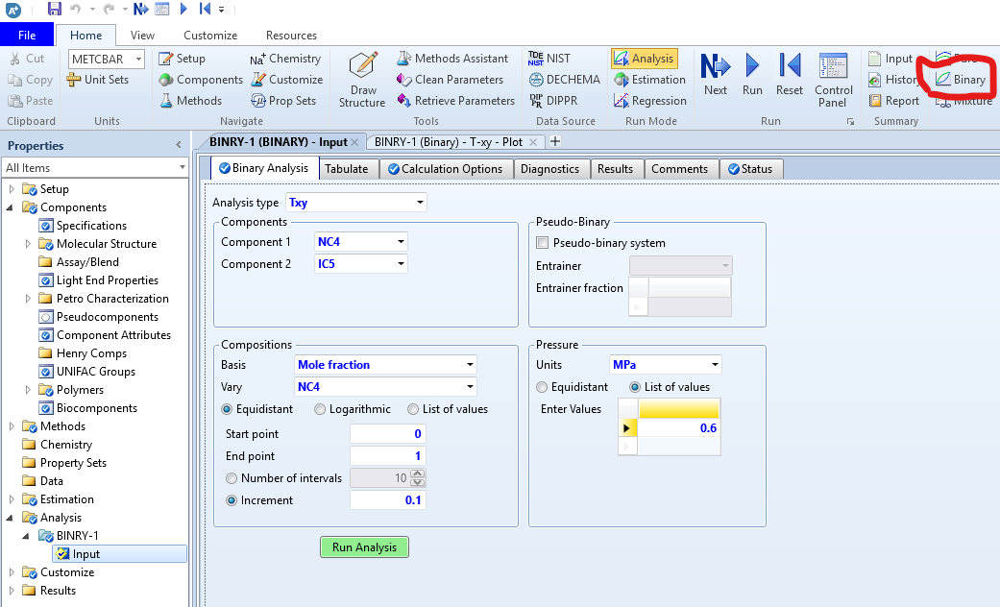
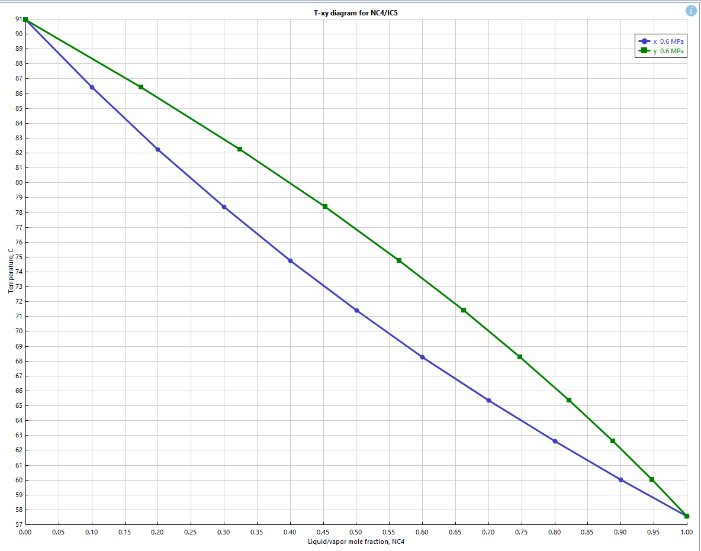
圖6-3 NC4–IC5 二元 $T$–$x$–$y$ 相平衡圖（ $P = 0.6\,\mathrm{MPa}$ ）

**Txy 圖解讀**：

由圖6-3 的 $T$–$x$–$y$ 相平衡圖（等壓相平衡圖）可知，橫軸為 NC4 的**摩爾分率**（Aspen Plus 圖表標示為 "Liquid/vapor mole fraction, NC4"，範圍 0 至 1），縱軸為溫度 $T$ （°C）。圖中有兩條曲線：

- **泡點線（Bubble Point Curve，藍色下方曲線）**：給定液相摩爾組成 $x_{NC4}$ 時，液相開始氣化的溫度（即泡點）
- **露點線（Dew Point Curve，綠色上方曲線）**：給定氣相摩爾組成 $y_{NC4}$ 時，氣相開始冷凝的溫度（即露點）

兩線之間的區域為**氣液兩相共存區**；兩線外側分別為過冷液相（低於泡點）與過熱氣相（高於露點）的單相區。

**關鍵特徵分析**：

1. **純組分沸點確認**：
   - 左端（ $x_{NC4} = 0$ ，純 IC5）：泡點與露點重合於約 **$91\,^{\circ}C$**，此為 IC5 在 $0.6\,\mathrm{MPa}$ 下的沸點（IC5 常壓沸點 $27.8\,^{\circ}C$ ，加壓至 0.6 MPa 後升至 91°C）；
   - 右端（ $x_{NC4} = 1$ ，純 NC4）：泡點與露點重合於約 **$57.5\,^{\circ}C$**，此為 NC4 在 $0.6\,\mathrm{MPa}$ 下的沸點（NC4 常壓沸點 $-0.5\,^{\circ}C$ ，加壓至 0.6 MPa 後升至 ~58°C）；
   - 兩端沸點差（ $\Delta T_{bp}$ ）約 **$33.5\,^{\circ}C$**，差距明顯，定性顯示兩組分在此壓力下有足夠的相對揮發度，可預期分離難度不高。

   > **注意**：步驟(5)中 DSTWU 計算所得塔頂溫度 $35.9\,^{\circ}C$ 是塔頂**多組分餾出物**（含 C3、IC4、NC4 等混合物）在 $0.59\,\mathrm{MPa}$ 下的泡點，並非純 NC4 的沸點，兩者不可混淆。

2. **繫線讀取（等溫相平衡組成）**：
   - 在 $T \approx 78\,^{\circ}C$ 作水平繫線（Tie Line），與兩條曲線的交點分別給出該溫度下的平衡組成：
     - 藍色泡點線（液相）： $x_{NC4} \approx 0.30$
     - 綠色露點線（氣相）： $y_{NC4} \approx 0.50$
   - 水平間距 $y - x \approx 0.20$ ；間距越大，一次氣液接觸的分離效果越好；
   - 在 $x_{NC4} = 0.50$ 處，藍色泡點約 $71.5\,^{\circ}C$ ，綠色露點約 $78\,^{\circ}C$ ，兩線垂直間距約 **$6.5\,^{\circ}C$**，代表兩相共存區的「厚度」。

3. **相對揮發度估算**：由上述繫線直接代入計算：

$$
\alpha_{NC4/IC5} = \frac{y_{NC4} / x_{NC4}}{y_{IC5} / x_{IC5}} = \frac{y_{NC4} / x_{NC4}}{(1-y_{NC4}) / (1-x_{NC4})} = \frac{0.50/0.30}{0.50/0.70} \approx 2.3
$$

   相對揮發度 $\alpha \approx 2.3 > 1.5$ ，代表可利用普通精餾有效分離；最小回流比預期不高（後續步驟(5)計算結果 $R_{min} = 0.956$ 與此預判一致）。

4. **無共沸點確認**：泡點線與露點線在圖中**未出現交叉**（除兩端純組分外），確認 NC4–IC5 體系**不形成共沸物**，可直接用普通精餾達到任意純度的分離，不需要萃取精餾或其他特殊操作。

5. **曲線形態與 Peng-Robinson 方程式的適用性**：兩條曲線均呈平滑單調趨勢，無任何突變或異常彎曲，表明 `PENG-ROB` 物性方法對此**非極性烷烴體系**的預測合理，可信任後續模擬結果。

> **進行二元分析的工程意義**：在進行精餾模擬之前，先對關鍵組分進行 Txy 分析是一個重要的**前置驗證步驟**，目的在於：(1) 確認無共沸點，確保普通精餾的可行性；(2) 視覺化評估分離難度，初步判斷 $R_{min}$ 的量級；(3) 驗證所選物性方法對此體系的適用性。如遇到 Txy 曲線出現共沸點或極端非理想行為，應考慮更換物性方法或採用不同的分離策略。

##### (2) 建立流程圖

搭建DSTWU流程，選擇模擬，在Model Palette | 塔選擇DSTWU模組，搭建如圖6-4所示的具有一個進料和兩個出料的流程圖。

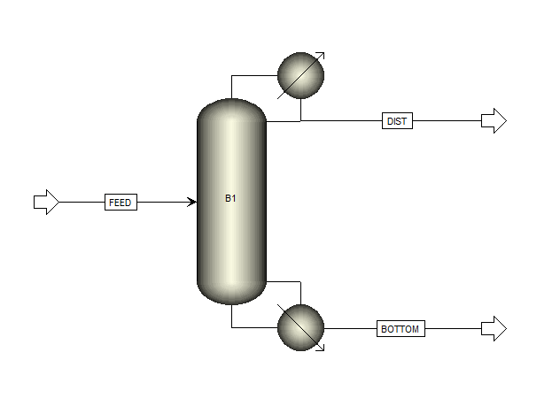  
圖6-4 簡捷精餾流程

##### (3) 設定流股資訊

輸入流股資訊, 如圖6-5 所示, 在 Simulation | Streams | FEED | Mixed 頁面輸入題目已知的流股條件。

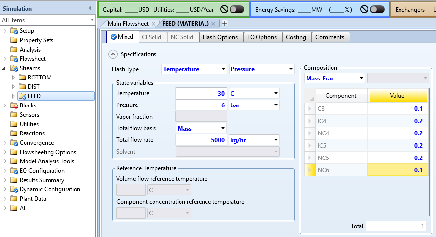  
圖6-5 簡捷精餾進料輸入


##### (4) 設定模組操作參數

如圖6-6所示，在 Blocks | DSTWU | Input | Specifications 頁面輸入塔參數，主要設定項說明如下：

- **Reflux ratio（回流比）**：塔板數與回流比只需規定一項，另一項由程式計算。輸入**負數**（如 $-1.3$ ）代表實際回流比等於最小回流比的 1.3 倍（ $R = 1.3 \times R_{min}$ ）；輸入**正數**（如 $1.3$ ）則直接指定 $R = 1.3$ 。本例輸入 $-1.3$ 。
- **Light key recovery in distillate（LK 塔頂回收率）**：LK（正丁烷，NC4）在塔頂餾出物的回收率，本例為 $0.99$ （即 $99\%$ ）。
- **Heavy key recovery in bottoms（HK 塔底回收率）**：HK（2-甲基丁烷，IC5）在塔底產品的回收率，本例為 $0.99$ （即塔頂 HK 回收率為 $1\%$ ）。
- **Condenser type（冷凝器型式）**：`Total`（全冷凝，塔頂為純液相出料）或 `Partial-V`（部分冷凝，塔頂有氣相出料）。本例選 `Total`。
- **Condenser / Reboiler Pressure（操作壓力）**：分別輸入冷凝器壓力（ $0.59\,\mathrm{MPa}$ ）和再沸器壓力（ $0.60\,\mathrm{MPa}$ ）。

本題以正丁烷（NC4，沸點 $-0.5^{\circ}C$ ）作為 LK，以 2-甲基丁烷（IC5，沸點 $27.8^{\circ}C$ ）作為 HK。沸點低於 LK 的丙烷（C3， $-42.1^{\circ}C$ ）和異丁烷（IC4， $-11.7^{\circ}C$ ）為**非關鍵輕組分**，將幾乎全部出現在塔頂；沸點高於 HK 的正戊烷（NC5， $36.1^{\circ}C$ ）和正己烷（NC6， $69^{\circ}C$ ）為**非關鍵重組分**，將幾乎全部留在塔底。

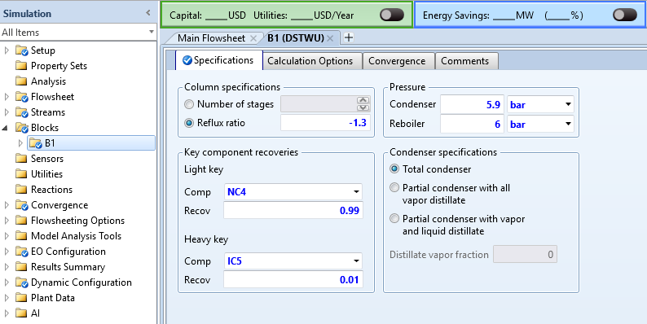  
圖6-6 簡捷精餾塔條件

##### (5) 執行和檢視結果

資料輸入完畢以後，初始化並執行，得到如圖6-7所示的計算結果。

| 參數 | 值 | 單位 | 說明 |
|------|------|------|------|
| Minimum reflux ratio | 0.95634334 | — | 最小回流比 $R_{min}$ ，對應無限多塔板時的極限操作；實際操作回流比不得低於此值 |
| Actual reflux ratio | 1.24324634 | — | 實際回流比 $R = 1.3 \times R_{min} = 1.3 \times 0.9563 = 1.2432$ ，由題目條件指定 |
| Minimum number of stages | 13.4765437 | — | 最小理論塔板數 $N_{min}$ ，對應全回流（ $R \to \infty$ ）的極限；板數不足此值則分離目標無法達成 |
| Number of actual stages | 26.2365156 | — | 在實際回流比 $R = 1.2432$ 下所需的實際理論塔板數；計入再沸器（佔 1 板），全塔有效板數約為 25.2 塊 |
| Feed stage | 13.6570192 | — | 最佳進料板位置（由 Kirkbride 方程估算），取整為第 **14** 板，用於後續嚴格計算初始設定 |
| Number of actual stages above feed | 12.6570192 | — | 進料板以上的塔板數（精餾段），約佔總塔板數的 48%，反映進料位置偏塔中段略偏上 |
| Reboiler heat duty | 157087.718 | cal/sec | 再沸器熱負荷 $Q_R \approx 157.1\,\mathrm{kW}$ ；為塔的主要能耗，後續可用於換熱器設計 |
| Condenser heat duty | −125483.878 | cal/sec | 冷凝器熱負荷 $Q_C \approx -125.5\,\mathrm{kW}$ （負號表示移除熱量）；需配合冷卻水用量計算 |
| Distillate temperature | 35.930432 | °C | 塔頂餾出物溫度（全冷凝後的液相出料溫度），接近 NC4 的常壓沸點，與全冷凝假設一致 |
| Bottom temperature | 100.930429 | °C | 塔底液體溫度，介於 NC5（ $36.1^{\circ}C$ ）與 NC6（ $68.7^{\circ}C$ ）沸點之上，符合塔底富含重組分的預期 |
| Distillate to feed fraction | 0.576729652 | — | 塔頂餾出物與進料的**摩爾流率比** $D/F = 0.5767$ ，即 57.67% 的進料摩爾流量由塔頂採出 |
| HETP | （空白） | — | 等板高度（Height Equivalent to a Theoretical Plate）僅對**填料塔**有物理意義，板式塔或簡捷設計模組不計算此值，故欄位空白 |

**結果解讀小結**：

1. **回流比倍數的意義**： $R_{min} = 0.9563$ 較低，說明此烷烴體系相對揮發度差異明顯，容易分離；以 $1.3 \times R_{min}$ 操作是工業上常見的保守選取，可在板數與能耗間取得合理平衡。

2. **板數的工程含義**：實際板數 $N \approx 26$ 與最小板數 $N_{min} \approx 13$ 之比約為 2，符合工業精餾塔設計中「實際板數約為最小板數 1.5～2 倍」的經驗法則。

3. **進料位置的選擇**：Kirkbride 方程給出的進料板為第 13.66 板，取整後輸入嚴格計算時應設為第 **14** 板（偏下取整可能使精餾段偏小，偏上取整可能使提餾段偏小，需在嚴格計算中驗證靈敏度）。

4. **餾出比 $D/F$ 的用途**： $D/F = 0.5767$ 與塔底採出比 $B/F = 1 - 0.5767 = 0.4233$ 將直接作為後續 RadFrac 嚴格計算「**摩爾餾出進料比**」操作規範的初值，以確保嚴格計算能順利收斂。

5. **熱負荷換算參考**： $Q_R \approx 157\,\mathrm{kW}$ 、 $Q_C \approx 126\,\mathrm{kW}$ ，兩者差值（約 31 kW）即為進料帶入塔的顯熱與相變熱，可作為後續熱整合評估的基礎數據。

> **注意**：DSTWU 為簡捷計算，所有結果均為分數值（不強制取整）。進行嚴格計算（RadFrac）時，塔板數需填入**整數**，建議將 26.24 取整為 **27**（含再沸器），進料板 13.66 取整為 **14**。

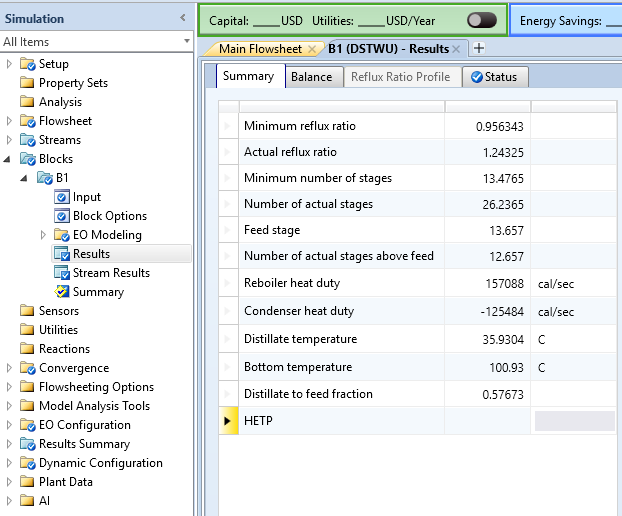  
圖6-7 簡捷精餾計算結果


**Stream Results**：

| | Units | Feed | BOTTOM | DIST |
|------|------|------|------|------|
| Description | | | | |
| From | | | B1 | B1 |
| To | | B1 | | |
| Stream Class | | CONVEN | CONVEN | CONVEN |
| Maximum Relative Error | | | | |
| Cost Flow | $/hr | | | |
| **MIXED Substream** | | | | |
| Phase | | Liquid Phase | Liquid Phase | Liquid Phase |
| Temperature | C | 30 | 100.930428630561 | 35.930431983591 |
| Pressure | bar | 6 | 6 | 5.9 |
| Molar Vapor Fraction | | 0 | 0 | 0 |
| Molar Liquid Fraction | | 1 | 1 | 1 |
| Molar Solid Fraction | | 0 | 0 | 0 |
| Mass Vapor Fraction | | 0 | 0 | 0 |
| Mass Liquid Fraction | | 1 | 1 | 1 |
| Mass Solid Fraction | | 0 | 0 | 0 |
| Molar Enthalpy | cal/mol | -37786.8846288522 | -39582.0708355223 | -33980.7434106483 |
| Mass Enthalpy | cal/gm | -599.075038000241 | -531.307083754452 | -621.32121014501 |
| Molar Entropy | cal/mol-K | -111.726958349657 | -123.374286789904 | -97.9611863407021 |
| Mass Entropy | cal/gm-K | -1.77132442847288 | -1.65604353539287 | -1.79117219740911 |
| Molar Density | mol/cc | 0.00920598951086173 | 0.00724984805471181 | 0.00976694676650068 |
| Mass Density | gm/cc | 0.58067127066846 | 0.540109492274338 | 0.534165109059227 |
| Enthalpy Flow | cal/sec | -832048.663889225 | -368913.031837438 | -431531.791780934 |
| Average MW | | 63.0753782614408 | 74.4994223600743 | 54.6911047873571 |
| **Mole Flows** | kmol/hr | 79.2702340884193 | 33.5527395757905 | 45.7174945126288 |
| **Mole Fractions** | | | | |
| **Mass Flows** | kg/hr | 5000 | 2499.6597169944 | 2500.3402830056 |
| **Mass Fractions** | | | | |
| C3 | | 0.1 | 7.48749790051174E-09 | 0.199972773578948 |
| IC4 | | 0.2 | 0.000249502334753048 | 0.399696127705943 |
| NC4 | | 0.2 | 0.00400054452692623 | 0.395946106507528 |
| IC5 | | 0.2 | 0.3960539081657 | 0.00399945562128817 |
| NC5 | | 0.2 | 0.399668811138809 | 0.000385536586291981 |
| NC6 | | 0.1 | 0.200027226346313 | 0 |
| Volume Flow | l/min | 143.512065333285 | 77.1343512364696 | 78.0139648646968 |
| **Liquid Phase** | | | | |

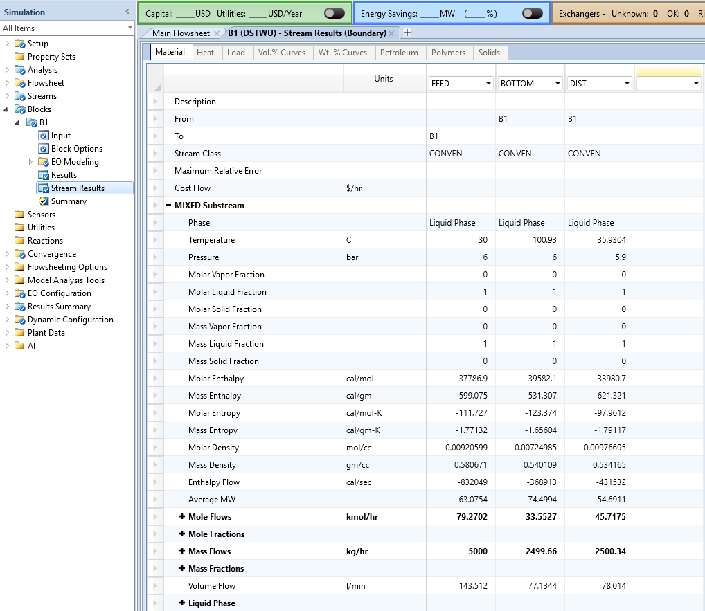 

**Stream Results 重點解讀**：

1. **質量守恆驗證**：進料總質量流量 $5000\,\mathrm{kg/hr}$ = 塔底 $2499.66\,\mathrm{kg/hr}$ + 塔頂 $2500.34\,\mathrm{kg/hr}$ ，誤差小於 $0.01\%$ ，確認全塔質量衡算封閉。

2. **分離效果確認**：

   | 組分 | 進料質量分率 | 塔底質量分率 | 塔頂質量分率 | 去向判斷 |
   |------|------|------|------|------|
   | C3 | 0.10 | $\approx 0$ （ $7.5\times10^{-9}$ ）| 0.200 | 幾乎全部出塔頂 ✓ |
   | IC4 | 0.20 | 0.000250 | 0.3997 | 幾乎全部出塔頂 ✓ |
   | NC4（LK）| 0.20 | 0.00400 | 0.3959 | 塔頂回收率 $\approx 99\%$ ✓ |
   | IC5（HK）| 0.20 | 0.3961 | 0.00400 | 塔底回收率 $\approx 99\%$ ✓ |
   | NC5 | 0.20 | 0.3997 | 0.000386 | 幾乎全部留塔底 ✓ |
   | NC6 | 0.10 | 0.2000 | 0 | 全部留塔底 ✓ |

   LK（NC4）塔頂回收率與 HK（IC5）塔底回收率均達 $99\%$ ，符合題目分離規格。非關鍵組分（C3、IC4 完全出塔頂；NC5、NC6 完全留塔底）也完全符合預期，說明兩關鍵組分之間的切割非常乾淨。

3. **溫度與相態**：三股物流均為純液相（Molar Vapor Fraction = 0，Molar Liquid Fraction = 1）。進料在 $30\,^{\circ}C$ ／ $6\,\mathrm{bar}$ 為過冷液體（ $q > 1$ ）；塔頂出料在 $35.9\,^{\circ}C$ ／ $5.9\,\mathrm{bar}$ 為全冷凝液相，與冷凝器型式設定（Total）一致；塔底出料在 $100.9\,^{\circ}C$ ／ $6\,\mathrm{bar}$ ，溫度高於重餾分的沸點，符合再沸器加熱後液相出料的預期。

4. **摩爾流量與平均分子量**：塔頂平均分子量（ $54.69\,\mathrm{g/mol}$ ）低於進料（ $63.08\,\mathrm{g/mol}$ ），塔底平均分子量（ $74.50\,\mathrm{g/mol}$ ）高於進料，符合輕組分富集塔頂、重組分富集塔底的精餾原理。塔頂摩爾流量（ $45.72\,\mathrm{kmol/hr}$ ）與塔底（ $33.55\,\mathrm{kmol/hr}$ ）之和等於進料（ $79.27\,\mathrm{kmol/hr}$ ），摩爾衡算封閉。

5. **體積流量比較**：進料體積流量（ $143.51\,\mathrm{L/min}$ ）大於塔頂（ $78.01\,\mathrm{L/min}$ ）加塔底（ $77.13\,\mathrm{L/min}$ ）之和（ $155.14\,\mathrm{L/min}$ ），差異源於各物流溫度與組成不同導致密度變化，並非守恆違反——體積不守恆而質量守恆，符合熱力學正確性。


##### (6) 生成迴流比隨理論板數變化曲線

DSTWU 不僅能計算單一操作點，還可以批次計算在不同塔板數下對應的最小回流比，產生完整的 **$N$–$R$ 權衡曲線（Trade-off Curve）**，協助工程師進行設計方案比選。

如圖6-8所示，在簡捷計算模組頁面 Blocks | DSTWU | Input | Calculate Table 中，勾選 **Generate table of reflux ratio vs. number of stages**，輸入點數（本例輸入 **21**）代表以本例實際塔板數 $N = 26$ 為中心，向兩側各取 10 個點，涵蓋板數範圍 $16 \sim 36$ 塊。

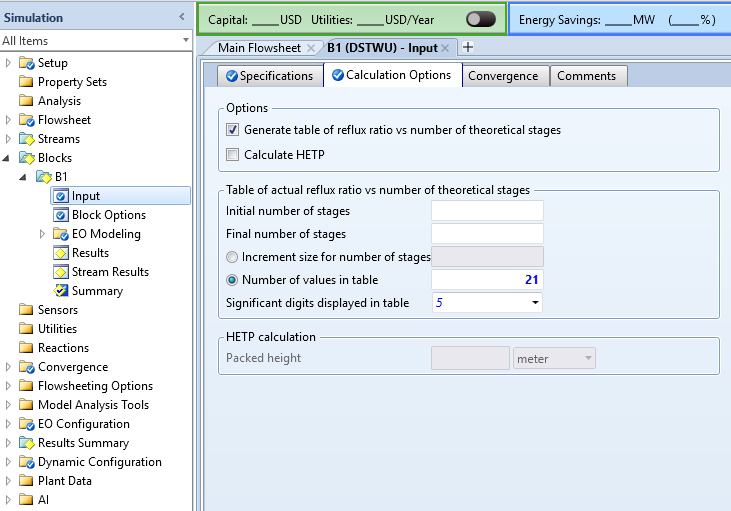  
圖6-8 理論板數和迴流比關係計算

初始化並執行後，在 Blocks | DSTWU | Results | Reflux Ratio Table 中得到如圖6-9 所示的數值結果表。
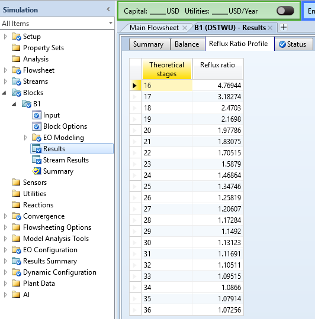  
圖6-9 理論板數和迴流比關係計算結果表

透過視窗右上角的圖示中的自定義畫圖，指定理論塔板數為橫座標，迴流比為縱座標，畫出如圖6-10所示的理論板數與迴流比關係曲線。

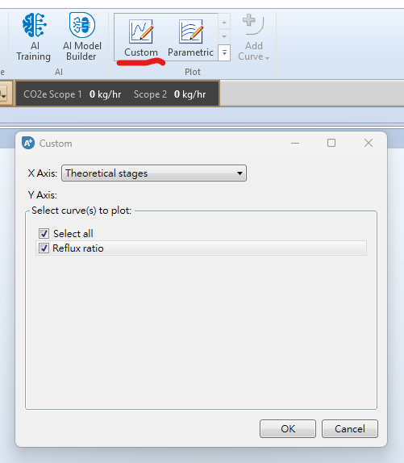
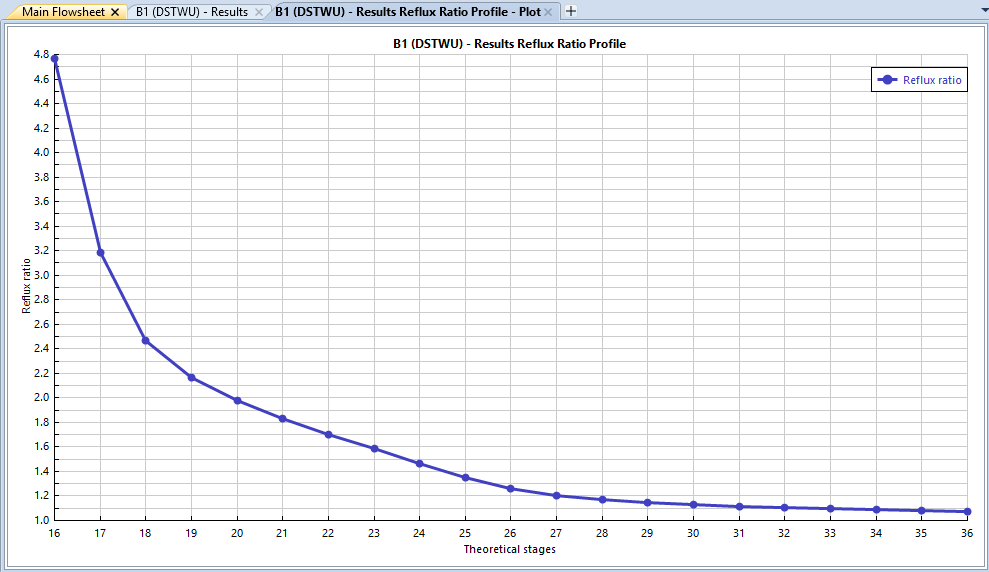  
圖6-10 理論板數和迴流比關係計算結果圖

**曲線解讀**：

由圖6-10 可觀察到 $N$–$R$ 曲線的幾個重要特徵：

1. **雙曲線型趨勢**：曲線呈雙曲線形狀，兩端分別趨近兩個極限值：
   - **左端（板數趨近 $N_{min}$ ）**：回流比急劇上升趨近無窮大（ $R \to \infty$ ），對應全回流極限；板數過少時，即使回流比再大也無法達到分離目標；
   - **右端（回流比趨近 $R_{min}$ ）**：板數急劇增多趨近無窮大（ $N \to \infty$ ），對應最小回流比極限；能耗最小但設備規模無限大。

2. **「中間彎折區」是最佳設計區域**：在
    - $R = (1.2 \sim 1.5) \times R_{min} = 1.1476 \sim 1.4345$
    - $N = (1.5 \sim 2.0) \times N_{min}$
的範圍內，曲線曲率最大，表示此區域內增加少量板數即可顯著降低回流比（節省能耗），是能耗與設備投資的最佳平衡帶。本例操作點（ $N = 26$ ， $R = 1.24$ ）即落在此最佳區域。

3. **設計決策的意涵**：
   - 若受制於塔高（板數上限），可在曲線上向左移動，以提高回流比（增加能耗）來補償板數不足；
   - 若以降低操作費用（能耗）為優先，可在曲線上向右移動，選用更多塔板數換取更低回流比；
   - 此曲線是「設備投資 vs. 操作費用」量化分析的核心工具，可結合設備製造成本與能源價格進行**最佳化設計（Optimal Design）**。

4. **本例操作點驗證**：由圖可確認 $N = 26$ 時對應 $R \approx 1.24$ ，與步驟(5)的計算結果吻合，說明設定正確、計算一致。此外，若板數增加至 36 塊，回流比可降至接近 $R_{min} = 0.96$ ，但板數增加 38%、相對電耗卻僅能節省約 20%，邊際效益遞減的現象在此明顯可見。


---
## 6.2 精餾塔的嚴格計算

### 理論背景：MESH 方程組

與簡捷法不同，嚴格計算模組 RadFrac 對每一塊理論塔板逐板建立聯立方程組——即 **MESH 方程**——確保質量衡算、相平衡、組成歸一化與能量衡算均嚴格滿足：

- **M（Material balance，質量衡算）**：對第 $j$ 板上每個組分 $i$ 列摩爾衡算：

$$
L_{j-1}\,x_{i,j-1} + V_{j+1}\,y_{i,j+1} + F_j\,z_{i,j} - (L_j + U_j)\,x_{i,j} - (V_j + W_j)\,y_{i,j} = 0
$$

- **E（Equilibrium，相平衡）**：每板上氣液兩相達到相平衡：

$$
y_{i,j} = K_{i,j}(T_j,\,P_j,\,\mathbf{x}_j,\,\mathbf{y}_j)\cdot x_{i,j}
$$

- **S（Summation，歸一化）**：氣液兩相組成均歸一：

$$
\sum_i x_{i,j} = 1, \qquad \sum_i y_{i,j} = 1
$$

- **H（Heat balance，能量衡算）**：對每板進行焓衡算，確定板溫 $T_j$ 和氣液流量 $V_j$ 、 $L_j$ 。

其中 $L_j$ 、 $V_j$ 為第 $j$ 板的液相和氣相摩爾流量， $U_j$ 、 $W_j$ 為側線液相和氣相採出量， $F_j$ 為第 $j$ 板的進料量， $K_{i,j}$ 為氣液平衡常數（由所選物性方法計算）。全塔共 $N(2C+2)$ 個方程（ $C$ 為組分數），Aspen Plus 預設採用 **Inside-Out 演算法**（Boston-Britt 法）求解，具有良好收斂性能；若收斂困難，可於 Convergence 頁面改用 Newton 法或 Sum-Rates 法。

精餾塔嚴格計算模組 RadFrac 可對普通精餾、共沸精餾、萃取精餾、吸收、再沸吸收、汽提、再沸汽提過程進行嚴格模擬計算。RadFrac 模組可用於兩相體系、三相體系、窄沸程體系、液相強非理想體系等。

在進出料方面，RadFrac 每一級可有任意數量的進料；每一級至多允許三股側線產品（一股氣相、兩股液相）；可設置虛擬產品物流（Pseudo-Streams）方便查看塔板的流量、組成和熱力學狀態，並可連接至其他單元模組而不影響塔內質量衡算。下面透過例6-2 介紹精餾塔嚴格計算模組的應用。

【例6-2】 精餾塔的嚴格計算（RadFrac模組）
在例6-1的基礎上，對該混合烷烴精餾塔進行嚴格計算，進料條件、操作壓力、冷凝方式和產品純度要求都同例6-1，再沸器採用釜式再沸器。根據例6-1的計算結果，利用嚴格計算模組計算是否可達到分離要求。

將例6-1 簡捷計算文件另存為新的文件，**刪除原有的 DSTWU 塔模組**，**拉入新的 RadFrac 模組，重新連接已有的物流線**。如圖6-11 所示，在 Blocks | COLUMN | Setup | Configuration 頁面設置塔的基本資訊，主要設定項說明如下：

- **Number of stages（塔板數）**：包含冷凝器（第 1 板）和再沸器（最後一板）在內的總平衡級數。例6-1 估算的實際板數約為 26（DSTWU 計入再沸器、但不計全冷凝冷凝器）。在 RadFrac 中，全冷凝冷凝器計為第 1 塊平衡板，因此總板數輸入 27。Aspen Plus 預設塔頂為第 1 板，塔底為最後一板（第 $N$ 板）。
- **Condenser type（冷凝器型式）**：`Total`（全冷凝，塔頂全液相出料）、`Partial-V`（部分冷凝，塔頂有氣相出料）或 `None`（無冷凝器，用於吸收塔）。本例選 `Total`。
- **Reboiler type（再沸器型式）**：`Kettle`（釜式再沸器，假設液氣兩相在再沸器內達到平衡，佔一個理論板）或 `Thermosyphon`（熱虹吸式，僅提供熱量，不計入理論板數）。本例選 `Kettle`。
- **Operating Specifications（操作規範）**：需規定 2 個獨立的操作條件以滿足自由度。本例選擇**摩爾回流比**（ $R = 1.2433$ ，取例6-1 的計算初值）和**摩爾餾出進料比**（ $D/F = 0.5767$ ）。後續若新增設計規範，這兩個操作規範需轉換為調整變數的對應類型（如 $B/F$ ）。

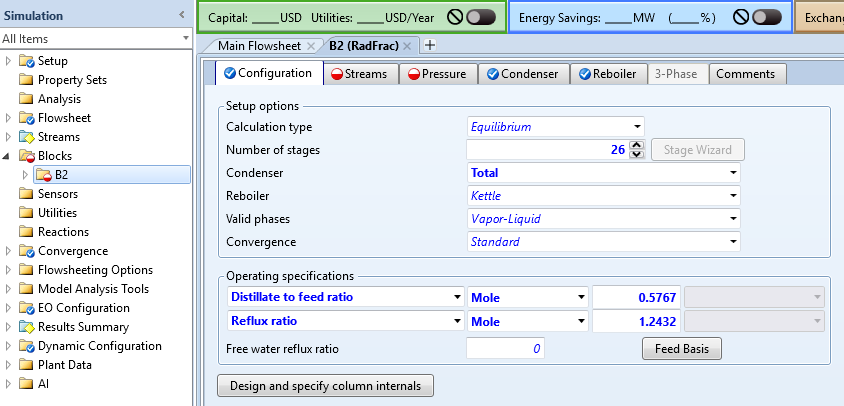  
圖6-11 嚴格法精餾模組引數

如圖6-12 所示，在 Blocks | COLUMN | Setup | Streams 頁面輸入進料位置，進料塔板數需輸入整數（例6-1 計算結果約第 13.66 板，取整後輸入第 14 板）。進料慣例（Feed Convention）有兩個選項：

- **塔板上（On-Stage）**：進料物流中的氣相和液相均直接進入指定進料板；
- **塔板上方（Above-Stage）**：進料物流中的液相進入指定進料板，氣相則進入指定進料板**上方**的一塊板（模擬更符合真實進料口的氣液分配方式）。

兩種進料慣例的物理差異如圖6-13 所示。對於**純液態進料**，兩種慣例的結果差異通常較小；對於**氣液混合進料**，`Above-Stage` 更接近實際情況，建議優先採用。

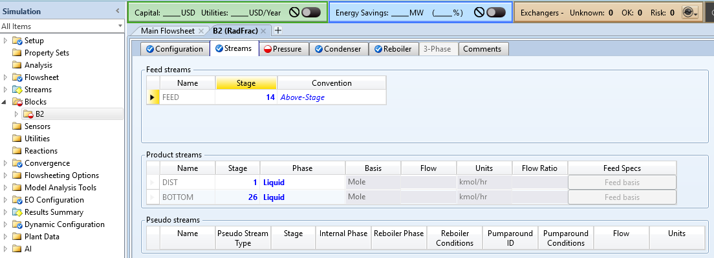  
圖6-12 輸入進料位置

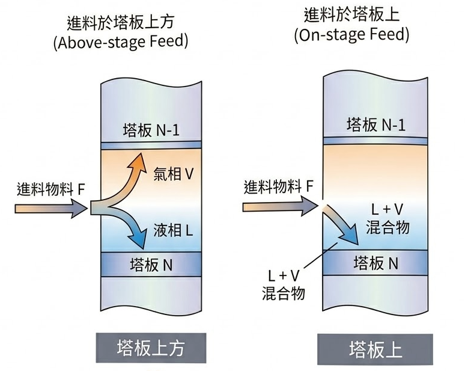  
圖6-13 兩種不同進料方式

壓力設定方式有三種，參考已知條件，本例題已知塔頂和塔底壓力，如圖6-14所示，塔頂壓力為 5.9 bar，塔釜壓力 6.0 bar，即全塔壓降為 0.1 bar（每塊板平均壓降約 3.8 mbar）。

> **壓力設定說明**：Aspen Plus 在 Blocks | COLUMN | Setup | Pressure 頁面提供三種壓力設定方式：(1) 指定塔頂壓力並輸入每塊板壓降；(2) 同時指定塔頂和塔底壓力，系統自動均分壓降至各板；(3) 手動輸入各板壓力分布（適用於已知壓力分布的情況）。對一般精餾計算，方式(1)或(2)即可。壓降會升高各板的泡點溫度，對沸點差較小的體系（如同分異構物分離）影響較顯著，應特別注意。

所有輸入完畢後，初始化程式並執行（點擊 Run | Run 或按 **F5**）。

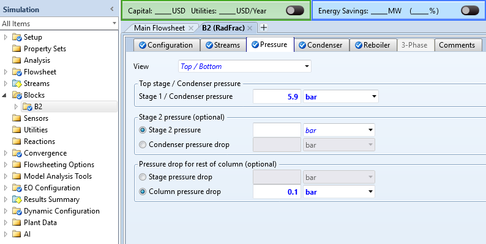  
圖6-14 嚴格法精餾塔壓力設定

所有輸入完畢後，初始化程式並執行，得到如圖6-15所示的分離結果，其中正丁烷在塔頂的回收率為0.9880，2-甲基丁烷在塔頂回收率為0.0122，**不滿足例6-1的初始分離要求**。

| 組分 | 塔頂回收率 | 塔底回收率 |
|------|------|------|
| C3 | 1 | 7.98867702E-08 |
| IC4 | 0.99903704 | 0.000962960288 |
| NC4 | 0.988005325 | 0.0119946751 |
| IC5 | 0.0122120168 | 0.987787983 |
| NC5 | 0.00147961824 | 0.998520382 |
| NC6 | 1.4604477E-09 | 1 |


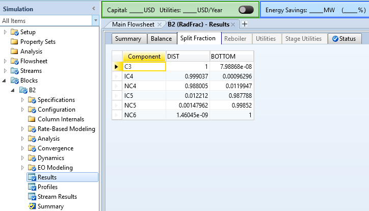  
圖6-15 嚴格法精餾塔分離結果

**初始結果偏差分析**：

將初始結果與目標規格比對，可以發現兩個關鍵組分的回收率均偏離目標，且偏差方向一致：

| 指標 | 目標值 | 初始計算值 | 偏差方向 | 偏差量 |
|------|------|------|------|------|
| NC4 塔頂回收率 | 0.9900 | 0.9880 | 偏低 | −0.002 |
| IC5 塔頂回收率 | 0.0100 | 0.0122 | 偏高 | +0.0022 |

兩者均偏向「IC5 跑到塔頂過多、NC4 留在塔底過多」的方向，說明分離切割點偏低（即分離力不足，輕、重組分之間的界線不夠銳利），需要提高回流比 $R$ 以增強分離驅動力。 $B/F$ 的初值（0.4233）則基本合理，不需大幅調整。

> **簡捷法 vs. 嚴格法差異的根本原因**：DSTWU 基於 Gilliland 關聯的假設包含：(1) 沿塔高**相對揮發度 $\alpha$ 恆定**；(2) **恆莫爾溢流**（各板液氣流量不隨熱效應變化）。實際上，隨塔高的溫度與組成梯度， $\alpha$ 值會沿塔變化，導致嚴格法計算所需回流比通常比簡捷法預測值略高。本例初值 $R = 1.2433$ 不足以達到 99% 的分離規格，需藉由設計規範迭代調升，這正是嚴格計算的核心價值所在。

在嚴格計算模組中可以新增**設計規範（Design Specification）**，使模擬結果收斂至指定的分離目標。其原理是：Aspen Plus 在外層建立一個迭代迴圈，持續調整指定的**操作變數（Manipulated Variable）**，直至分離指標（如回收率、純度）達到目標值，本質上是以 Wegstein 或 Broyden 加速法求解非線性方程組。

**自由度分析**：對一個無側線採出的兩產品精餾塔，在固定**塔板數、進料條件和操作壓力**後，系統剩餘兩個獨立自由度，可以且只能規定 2 個獨立的操作條件。若同時對 LK 和 HK 的回收率提出要求，則恰好需要 **2 個調整變數**與之對應——「 $N$ 個設計規範需要 $N$ 個調整變數」是 Aspen Plus 設計規範設置的基本原則。

以本題為例，規格要求：
- **設計規範 1**：塔頂 NC4（LK）回收率 $= 99\%$
- **設計規範 2**：塔頂 IC5（HK）回收率 $= 1\%$

對應調整變數選取：
- **調整變數 1：回流比 $R$**（初值 1.2433，搜索範圍 $1 \sim 10$ ）——回流比越大，塔頂餾出物純度越高，對 LK 和 HK 的分離均有直接影響。
- **調整變數 2：塔底採出與進料比 $B/F$**（初值 0.4233，搜索範圍 $0.40 \sim 0.50$ ）——決定兩產品間的切割位置，波動範圍小，便於設定初值。

> **設定注意事項**：(1) 無側線採出時， $D/F + B/F = 1$ ，兩者等價任選其一，優先選數值較小者（本例 $B/F = 0.4233 < D/F = 0.5767$ ）；(2) 若切換調整變數型別（如從 $D/F$ 改為 $B/F$ ），需同步修改 Configuration 頁中的操作規範類型，否則系統將報告一致性錯誤；(3) 調整變數的上下限**必須包含初值**，且不宜過寬，以避免求解過程發散；(4) 若設計規範無法收斂，可嘗試縮小搜索範圍、改善初值，或先停用部分設計規範進行分步求解。

輸入第一個設計規範要求，正丁烷在塔頂的質量回收率 0.99，如圖6-16所示，指定設計規範型別和相應目標值，再規定相應組分和流股，如圖6-17和圖6-18所示。

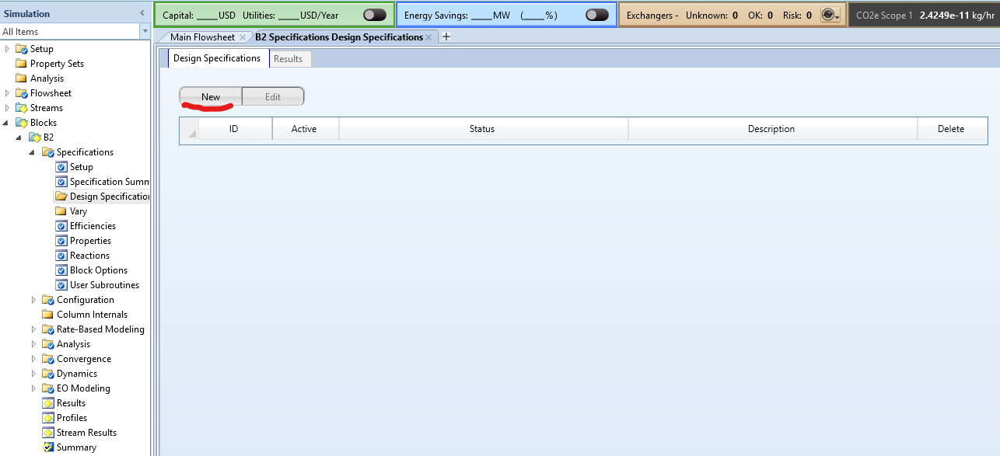  
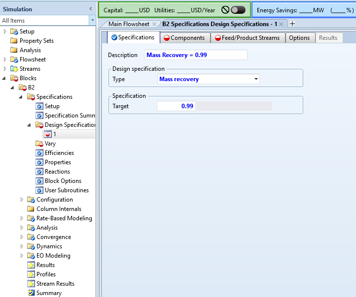  
圖6-16 設計規定1定義

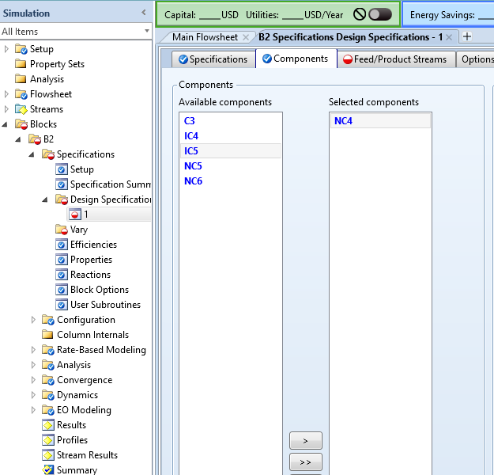  
圖6-16 設計規定1目標組分指定

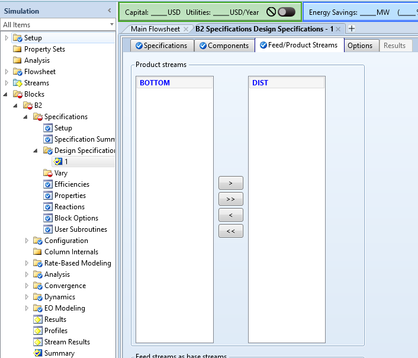  
圖6-17 設計規定1物流選擇

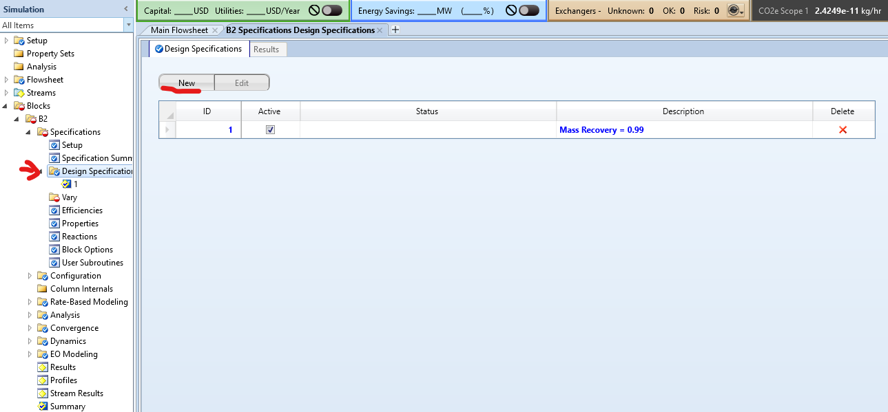  
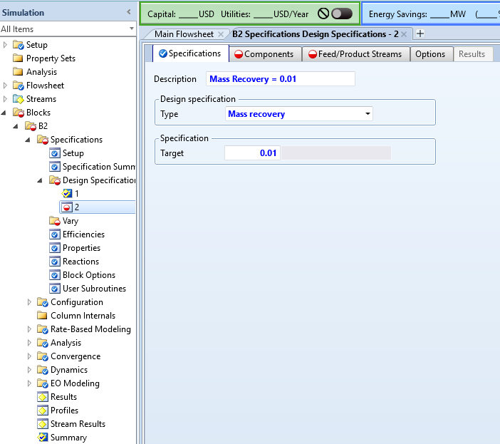  
圖6-18 設計規定2定義

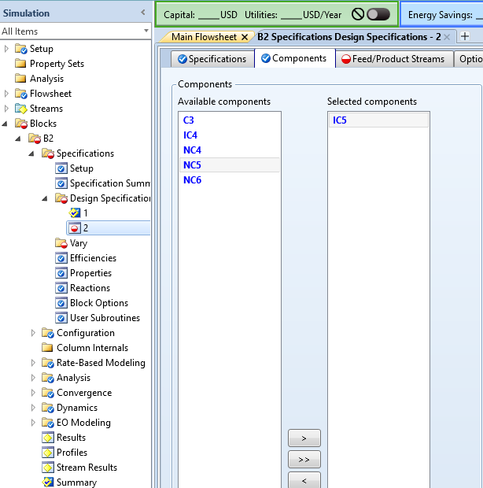  
圖6-19 設計規定2目標組分

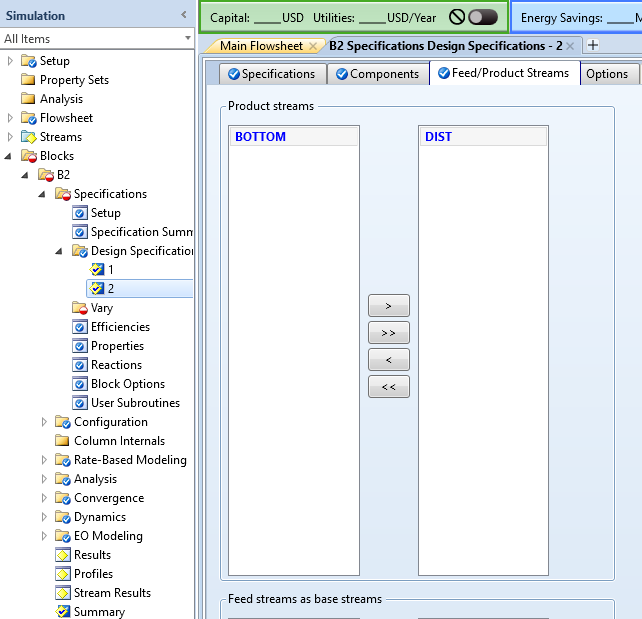  
圖6-20 設計規定2物流選擇

如圖6-19所示，按照類似的方法輸入第二個設計規範要求，2-甲基丁烷在塔頂回收率0.01，再規定相應組分和流股，如圖6-20和圖6-21所示。

最後輸入迴流比和塔底採出與進料比兩個調整變數的數值，其中迴流比的初值為1.2433，假設的下限和上限範圍要包含初值，此題設為1和10，如圖6-22所示。塔底採出與進料比初值為0.4233，當選擇該調整變數型別時，**由於此前模組的操作規範指定的是餾出物與進料比，軟體將提示一致性檢查存在問題，此時應該調整前述操作規範為塔底採出與進料比，並修改相應初值**。由於塔底採出與進料比的波動範圍相對較小，因而此題下限和上限分別選擇0.4和0.5，輸入如圖6-23所示。

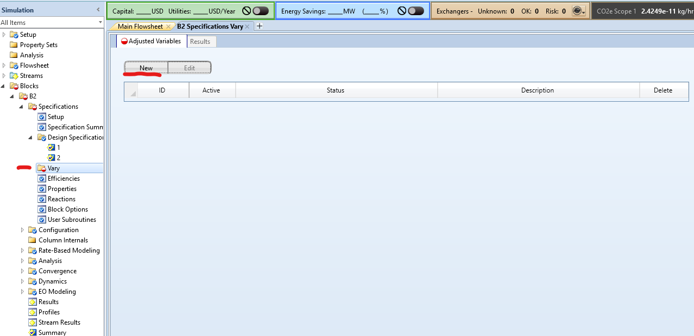  
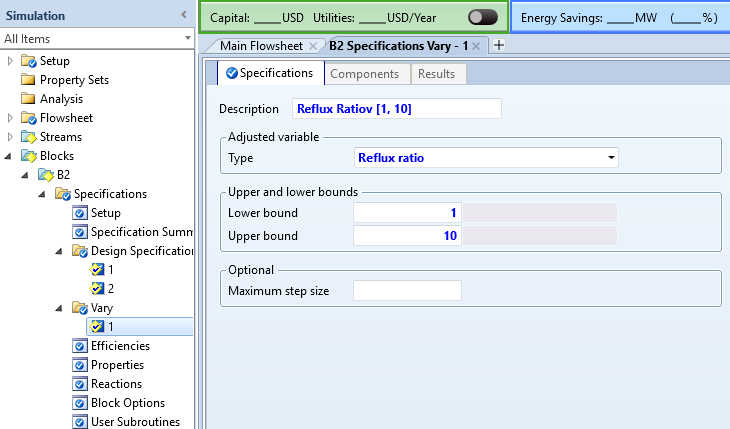  
圖6-22 定義調整變數1

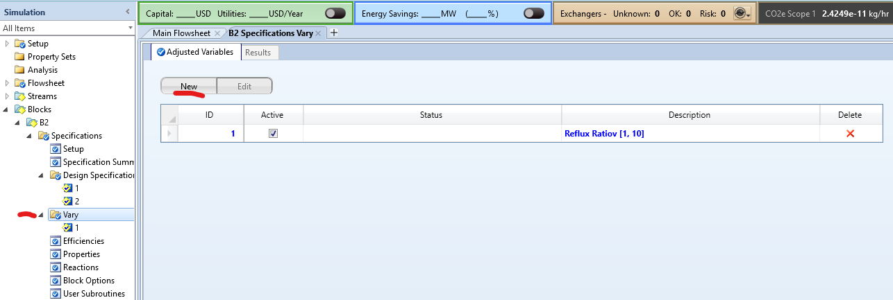  
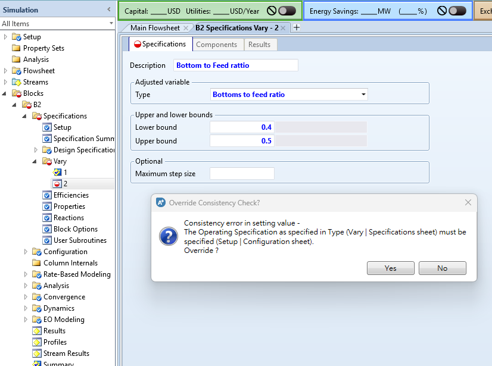  
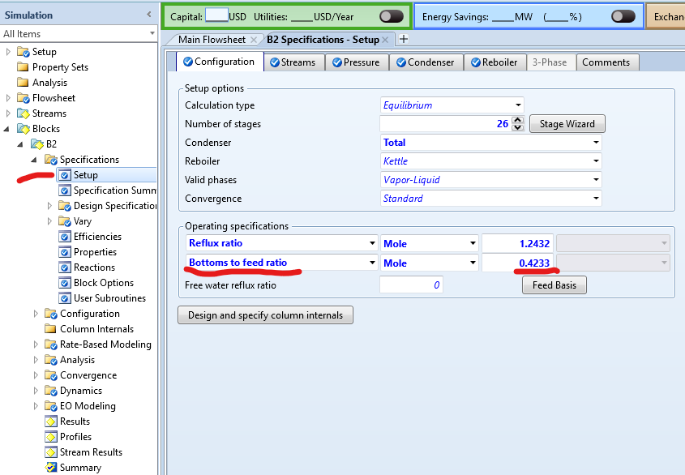  
圖6-23 定義調整變數2

輸入完畢後初始化並執行，結果如圖6-24 所示，切割分率滿足要求。

| 組分 | 塔頂回收率 | 塔底回收率 |
|------|------|------|
| C3 | 1 | 6.61434411E-08 |
| IC4 | 0.999202948 | 0.000797052434 |
| NC4 | 0.989999546 | 0.0100004535 |
| IC5 | 0.0100018774 | 0.989998123 |
| NC5 | 0.00117180026 | 0.9988282 |
| NC6 | 1.07673944E-09 | 1 |


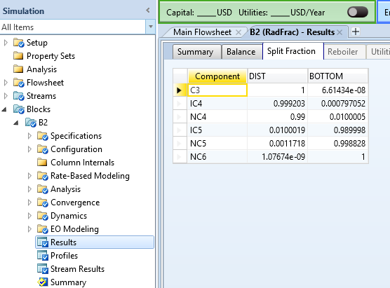  
圖6-24 重新計算的結果

也可以從規範摘要中檢視相應的回收率、迴流比和塔底採出與進料比的初值和新的計算值，如圖6-25所示，最終迴流比為1.2996，塔底採出與進料比為0.4233。

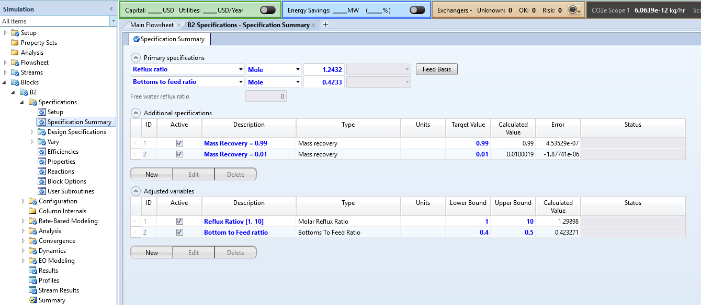  
圖6-25 收斂結果彙總

---

### 嚴格計算結果分析與討論

#### (一) 收斂操作條件解析

設計規範收斂後，兩個調整變數的最終值為：

| 調整變數 | 簡捷法初值（DSTWU）| RadFrac 初值（未加設計規範）| **收斂後最終值** |
|------|------|------|------|
| 回流比 $R$ | 1.2432 | 1.2433 | **1.2996** |
| 塔底採出與進料比 $B/F$ | 0.4233 | 0.4233 | **0.4233** |

**關鍵觀察**：

1. **回流比上調幅度約 4.5%**（ $1.2433 \to 1.2996$ ）：嚴格法需要比簡捷法預測值更高的回流比才能達到 99% 的分離規格，這反映出 Gilliland 關聯的系統性低估——簡捷法假設 $\alpha$ 沿塔恆定，而實際上精餾段溫度較低（NC4 端）、提餾段溫度較高（IC5 端），導致 $\alpha$ 沿塔高不均勻分布，分離難度整體偏高。

2. **$B/F$ 幾乎不變（0.4233）**：物料衡算切割點的估計非常準確，說明 DSTWU 在**物料分配**方面的預測已足夠可靠，誤差主要集中在操作能耗（回流比）的估算上。

3. **實際 $R$ 倍數驗算**：收斂後 $R = 1.2996$ ，換算為簡捷法最小回流比的倍數為：

$$
\frac{R}{R_{min}} = \frac{1.2996}{0.9563} \approx 1.36
$$

即實際上等效於使用 $1.36 \times R_{min}$ 操作，略高於原設定的 $1.3 \times R_{min}$ ，差距合理，工程上可接受。

#### (二) 分離效果詳細比對

收斂後各組分的塔頂（Distillate）與塔底（Bottoms）回收率彙整如下，並與分離目標及初始值進行對比：

| 組分 | 分離目標 | 初始計算（無設計規範）| **收斂後** | 達標？ |
|------|------|------|------|------|
| C3 | 儘量出塔頂 | 1.0000 | **1.0000** | ✓ |
| IC4 | 儘量出塔頂 | 0.9990 | **0.9992** | ✓ |
| NC4（LK）| 塔頂 ≥ 0.99 | 0.9880 | **0.9900** | ✓ |
| IC5（HK）| 塔頂 ≤ 0.01 | 0.0122 | **0.0100** | ✓ |
| NC5 | 儘量留塔底 | 0.9985 | **0.9988** | ✓ |
| NC6 | 全部留塔底 | ≈ 1.0000 | **≈ 1.0000** | ✓ |

**非關鍵組分行為解讀**：

- **C3 與 IC4**（非關鍵輕組分）：沸點遠低於 LK（NC4），相對揮發度遠大於 LK，在收斂條件下已幾乎 100% 出塔頂，分離極為乾淨。
- **NC5 與 NC6**（非關鍵重組分）：沸點遠高於 HK（IC5），相對揮發度遠小於 HK，幾乎 100% 留在塔底，塔底產品的重污染可忽略。
- **LK/HK 嚴格切割**：NC4（LK）在塔頂回收率恰好 0.990、IC5（HK）在塔頂恰好 0.0100，雙邊約束同時滿足，說明設計規範與調整變數的配對設置合理，收斂有效。

#### (三) 簡捷法與嚴格法計算結果比較

| 比較項目 | DSTWU 簡捷法 | RadFrac 嚴格法 | 差異與說明 |
|------|------|------|------|
| 實際回流比 $R$ | 1.2432 | **1.2996** | 嚴格法高出 4.5%；簡捷法低估因 $\alpha$ 沿塔非恆定 |
| 最小回流比 $R_{min}$ | 0.9563 | — | 嚴格法不直接輸出此值；簡捷法作為設計初值合理 |
| 理論板數 $N$ | 26.24 | 27（固定輸入）| 兩者一致（嚴格法以整數板數驗證）|
| 最佳進料板 | 第 13.66 板 | 第 14 板（固定）| 取整一致，簡捷法進料位置估算可信 |
| NC4 塔頂回收率 | 99%（設定）| **99.00%**（收斂）| 兩者吻合，分離目標均達成 |
| IC5 塔頂回收率 | 1%（設定）| **1.00%**（收斂）| 兩者吻合 |
| 塔底採出比 $B/F$ | 0.4233 | **0.4233** | 幾乎完全一致，物料衡算可靠 |
| 再沸器熱負荷 $Q_R$ | 157,088 cal/s | 略高（ $R$ 升高 4.5%）| 嚴格法能耗略高，需重新核算換熱器設計 |
| 冷凝器熱負荷 $Q_C$ | −125,484 cal/s | 略高（絕對值）| 回流量增大，冷凝負荷對應增加 |

> **結論**：簡捷法在**板數估算**和**物料分配**（ $B/F$ ）方面表現良好，可作為可信的初值來源；但在**操作能耗**（回流比）方面存在約 4.5% 的低估，這對後續熱整合與設備選型（換熱器面積）有一定影響，工程設計中應以嚴格法計算結果為準。

#### (四) 熱負荷分析與能耗含義

嚴格計算確定 $R = 1.2996$ 後，可估算塔的能耗狀況：

**再沸器估算**：再沸器熱負荷與塔內蒸氣流量 $V$ 成正比，而 $V = L + D = R \cdot D + D = (R+1) \cdot D$ 。從簡捷法到嚴格法， $R$ 從 1.2432 升至 1.2996， $D$ 因 $B/F$ 不變而基本恆定，故：

$$
\frac{Q_{R,\text{嚴格}}}{Q_{R,\text{簡捷}}} \approx \frac{R_{\text{嚴格}} + 1}{R_{\text{簡捷}} + 1} = \frac{1.2996 + 1}{1.2432 + 1} = \frac{2.2996}{2.2432} \approx 1.025
$$

即嚴格法再沸器熱負荷約比簡捷法高 **2.5%**，估算值為 $157,088 \times 1.025 \approx 161,000\,\mathrm{cal/s}$ （約 $674\,\mathrm{kW}$ ）。

**冷凝器估算**：類似地，冷凝器移除的熱量與回流液流量 $L = R \cdot D$ 成正比：

$$
\frac{Q_{C,\text{嚴格}}}{Q_{C,\text{簡捷}}} \approx \frac{R_{\text{嚴格}}}{R_{\text{簡捷}}} = \frac{1.2996}{1.2432} \approx 1.045
$$

冷凝器熱負荷（絕對值）約增加 4.5%，估算值約為 $125,484 \times 1.045 \approx 131,000\,\mathrm{cal/s}$ （約 $548\,\mathrm{kW}$ ）。

> **工程設計意涵**：再沸器和冷凝器的實際設計應以嚴格法計算的最終 $R$ 值為基準，並加入安全裕量（通常 10%～20%），以應對進料組成波動或操作條件變化所帶來的額外負荷。若使用簡捷法結果直接選型，換熱器面積將略微偏小，在高負荷工況下可能無法達到設計分離目標。

#### (五) 工程應用總結

透過本例 6-2 的模擬，以下幾點值得作為重要工程心得：

1. **簡捷法是必要的起點，不是終點**：DSTWU 快速提供了合理的初值（ $R$ 、 $N$ 、 $B/F$ 、進料板），使 RadFrac 能在幾步迭代內收斂至正確答案。若直接以任意初值進行 RadFrac 嚴格計算，收斂困難的機率大幅提高。「先簡捷、後嚴格」的兩步策略是精餾模擬的工業標準工作流程。

2. **設計規範（Design Specification）是強制達標的工程工具**：當模擬初值無法精確滿足分離規格時，正確設置設計規範與調整變數可讓 Aspen 自動收斂至目標值，取代人工反覆試誤，大幅提升設計效率。

3. **$B/F$ 的穩定性驗證了物料衡算的可靠性**：收斂前後 $B/F = 0.4233$ 完全不變，說明精餾的物料分配主要由進料組成與分離目標決定，對操作條件（回流比）的敏感度相對較低。

4. **回流比是分離精度的主要調節工具**：本例中回流比微幅上升 4.5% 即可將 NC4 回收率從 98.8% 拉升至 99.0%，說明在設計點附近，分離規格對回流比的靈敏度適中——這也是精餾操作彈性的體現，有利於日後操作調節。

5. **嚴格法是後續設備設計（水力設計、換熱器選型）的基礎**：板式塔水力計算、填料塔 HETP 估算、換熱器面積核算等，均需以嚴格法輸出的逐板溫度、流量、組成分布為輸入數據，簡捷法無法提供足夠細緻的塔內資訊。

---

**課程資訊**
- 課程名稱：化工程序模擬 (ChemE 1395)
- 課程單元：Unit 06 精餾塔分離單元模擬
- 課程製作：逢甲大學 化工系 智慧程序系統工程實驗室
- 授課教師：莊曜禎 助理教授
- 更新日期：2026-03-25

**課程授權 [CC BY-NC-SA 4.0]**
 - 本教材遵循 [創用CC 姓名標示-非商業性-相同方式分享 4.0 國際 (CC BY-NC-SA 4.0)](https://creativecommons.org/licenses/by-nc-sa/4.0/deed.zh) 授權。

---

