# Unit07 吸收與萃取單元

## 7.1 吸收單元

### 7.1.1 吸收操作概述

#### 基本概念與原理

**吸收（Absorption）** 是一種氣-液接觸傳質操作，通過選擇合適的液體溶劑（吸收劑），將氣體混合物中的一種或多種組分選擇性地溶解轉移至液相，從而達到氣體淨化、組分分離或有價值組分回收的目的。

操作中的關鍵名詞定義如下：

- **溶質（Solute）**：被吸收的目標組分
- **吸收劑（Solvent/Absorbent）**：用於吸收的液體，需對溶質具有良好選擇性與溶解能力
- **富液（Rich Solvent）**：吸收溶質後的液相出料
- **淨化氣（Clean Gas）**：吸收後殘餘的氣相出料

吸收塔如圖 7-0 所示，氣體自塔底進入向上流動，吸收劑自塔頂加入向下流動，兩相在塔內逆流接觸完成傳質。

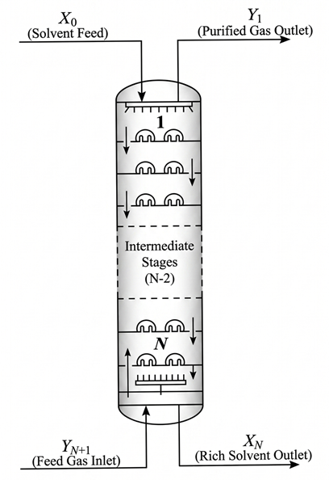 **圖7-0 逆流吸收塔示意圖**

#### 工業應用場景

吸收操作在化工、石化、環保及製藥等領域具有廣泛應用，典型實例如下：

| 應用領域 | 被吸收組分 | 吸收劑 | 目的 |
|:-------:|:--------:|:------:|:---:|
| 天然氣脫酸 | CO₂、H₂S | 醇胺類（MEA、DEA） | 氣體淨化 |
| 廢氣治理 | SO₂、HCl、NH₃ | 水 / 鹼液 | 環保達標排放 |
| 有機溶劑回收 | 苯、丙酮等有機蒸汽 | 水 / 礦物油 | 回收有用組分 |
| 合成氨流程 | CO₂ | 碳酸鉀溶液 | 脫除副產氣體 |
| 半導體製程 | HF、HCl 廢氣 | 鹼性水溶液 | 廢氣洗滌處理 |

#### 吸收與汽提（解吸）的耦合流程

工業上，吸收塔通常與**汽提塔（Stripper）**（又稱解吸塔）配套運作，形成吸收劑循環再生的閉環流程：

- **吸收塔**：溶質由氣相傳遞至液相，塔底排出富液（rich solvent）
- **汽提塔**：對富液加熱（或降壓），溶質由液相脫出至氣相，再生後的貧液（lean solvent）循環回吸收塔

當以水作吸收劑時，通常採用精餾方式再生，同時分離回收高濃度的溶質產品。

---

### 7.1.2 氣液平衡關係

設計吸收塔的先決條件是掌握溶質在氣液兩相間的分配規律，即**氣液相平衡（Vapor-Liquid Equilibrium, VLE）**。

#### 亨利定律（Henry's Law）

對於在液相中**微溶性氣體**（如 O₂、N₂、CO₂ 溶解於水），在稀溶液且溫度、壓力一定的條件下，溶質在氣相中的分壓 $p^{\ast}$ 與其在液相中的摩爾分率 $x$ 成正比：

$$
p^{\ast} = H \cdot x
$$

式中 $H$ 為**亨利係數**（Henry's Law Constant），其值隨溫度升高而增大（溶解度降低）。相應的氣液平衡常數 $K$ 值定義為：

$$
K = \frac{y^{\ast}}{x} = \frac{H}{P}
$$

式中 $P$ 為系統總壓， $y^{\ast}$ 為與液相濃度 $x$ 平衡的氣相摩爾分率。

> **物理意義**： $K$ 越大，溶質越傾向留在氣相（難吸收）； $K$ 越小，溶質越易溶入液相（易吸收）。苯酚、丙酮等極性有機物的 $K$ 值遠小於 N₂、O₂，因此在吸收操作中前者優先被水吸收。

#### 摩爾比濃度的引入

塔板計算中，由於溶質不斷由氣相傳入液相，塔內各板的氣、液相**總流量**沿塔高方向持續變化，導致直接以摩爾分率 $y$ 、 $x$ 計算物料衡算較為複雜。工程上採用以**惰性組分為基準的摩爾比（Mole Ratio）** 表示濃度，使塔內惰性載氣量 $G$ 和純溶劑量 $L$ 沿塔高方向保持不變：

$$
Y = \frac{y}{1 - y}, \qquad X = \frac{x}{1 - x}
$$

對應的逆轉換為 $y = Y/(1+Y)$ ， $x = X/(1+X)$ 。對於稀溶液（ $y,\, x \ll 1$ ），有 $Y \approx y$ ， $X \approx x$ 。

---

### 7.1.3 逆流吸收塔的物料衡算與操作線

#### 流股符號定義

逆流吸收塔中，塔板由頂至底編號為第 $1$ 至第 $N$ 板，各流股定義如下（圖 7-0）：

| 流股 | 符號 | 位置 |
|:---:|:---:|:----:|
| 氣體進塔（含溶質） | $Y_{N+1}$ | 第 $N$ 板下方（塔底） |
| 氣體出塔（淨化氣） | $Y_1$ | 第 $1$ 板上方（塔頂） |
| 溶劑進塔（貧液） | $X_0$ | 第 $1$ 板上方（塔頂） |
| 溶劑出塔（富液） | $X_N$ | 第 $N$ 板下方（塔底） |

#### 整塔物料衡算

對全塔作溶質物料衡算，以無溶質的惰性流量為基準：

$$
G\,(Y_{N+1} - Y_1) = L\,(X_N - X_0)
$$

式中 $G$ （kmol/hr）為惰性載氣摩爾流量， $L$ （kmol/hr）為純溶劑摩爾流量。整理得液氣比：

$$
\frac{L}{G} = \frac{Y_{N+1} - Y_1}{X_N - X_0}
$$

#### 操作線方程

對塔頂至第 $n$ 板之間的控制體積作物料衡算，得到任意位置的操作線方程：

$$
Y_{n+1} = \frac{L}{G}\,X_n + \left(Y_1 - \frac{L}{G}\,X_0\right)
$$

此方程在 $Y$ - $X$ 座標圖（圖 7-0-1）中為一條**直線**（操作線），其斜率為液氣比 $L/G$ ，通過端點 $(X_0,\, Y_1)$ 和 $(X_N,\, Y_{N+1})$ 。

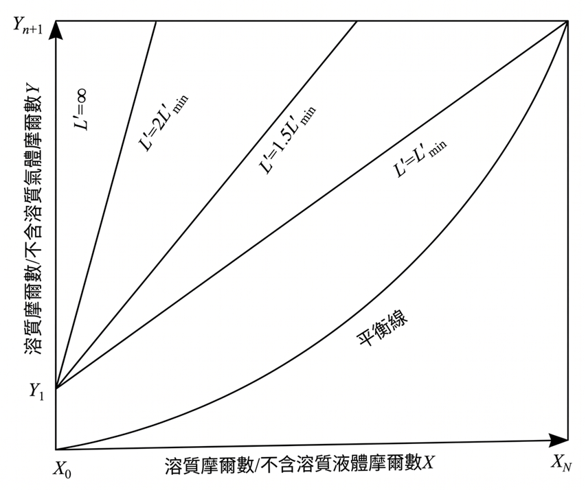 **圖7-0-1 吸收塔 Y-X 圖（操作線與平衡線）**

> **圖 7-0-1 解說**
>
> **① 座標軸定義**
>
> - **橫軸 $X$ （液相摩爾比）**：液體中溶質的濃度，定義為「溶質摩爾數 / 純溶劑摩爾數（不含溶質）」。
> - **縱軸 $Y$ （氣相摩爾比）**：氣體中溶質的濃度，定義為「溶質摩爾數 / 惰性載氣摩爾數（不含溶質）」。
>
> 採用摩爾比而非摩爾分率的原因：塔內純溶劑流量 $L$ 與惰性載氣流量 $G$ 沿塔高方向保持不變，以此為基準進行物料衡算，操作線在 $Y$ - $X$ 圖上嚴格為直線，方便圖解求取理論板數。
>
> **② 平衡線（Equilibrium Line）**
>
> 圖中向右上方彎曲的曲線，描述特定溫度與壓力下氣液兩相達到熱力學平衡時，氣相溶質濃度 $Y^{\ast}$ 與液相溶質濃度 $X$ 的對應關係。**進行吸收操作時，操作線必須始終位於平衡線上方**；兩線之間的垂直距離 $(Y - Y^{\ast})$ 即為傳質推動力——距離越大，推動力越強，完成相同分離所需的理論板數越少。
>
> **③ 操作線（Operating Lines）**
>
> 圖中自共同起點 $(X_0,\, Y_1)$ 呈放射狀向右上方延伸的直線族，斜率等於液氣比 $L/G$ （純溶劑摩爾流量 / 惰性載氣摩爾流量）。
>
> - **共同起點 $(X_0,\, Y_1)$**：代表塔頂操作狀態。 $X_0$ 為進塔溶劑中溶質的摩爾比（純溶劑時 $X_0 = 0$ ）； $Y_1$ 為塔頂排出淨化氣中溶質的摩爾比（即設計排放目標）。
> - **終點（對應水平線 $Y_{N+1}$ ）**：圖上方 $Y_{N+1}$ 水平線代表塔底進料氣的溶質濃度。操作線與該水平線的交點之橫座標即為塔底富液濃度 $X_N$ 。由整塔物料衡算可得：
>
> $$
> X_N = X_0 + \frac{G}{L}\,(Y_{N+1} - Y_1)
> $$
>
> 可見 $L$ 增大時 $G/L$ 減小， $X_N$ 隨之降低（交點左移），富液越稀；反之 $L$ 減小則 $X_N$ 增大，富液越濃。
>
> **④ 不同液氣比的物理意義與工程權衡**
>
> | 液氣比情況 | 操作線斜率 | 傳質推動力 | 所需理論板數 | 工程意義 |
> |:--------:|:---------:|:--------:|:----------:|:-------|
> | $L \to \infty$ | 趨近垂直（ $X \approx X_0$ 幾乎不變） | 最大 | 趨近 0 板 | 溶劑量無限大，理論極限，不具工程意義 |
> | $L = 2L_{\min}$ | 較陡 | 大 | 有限（板數較少） | 設備投資低，但溶劑循環量大、操作費用高 |
> | $L = 1.5L_{\min}$ | 適中（**工程推薦值**） | 適中 | 有限（合理） | 設備費與操作費的最佳經濟平衡點 |
> | $L = L_{\min}$ | 最平，夾緊點出現在 $Y_{N+1}$ 處 | 趨近 0 | **無限多** | 理論最小溶劑量，氣液達到平衡，無法實際操作 |
>
> 上表揭示了吸收塔設計的核心矛盾：增加溶劑用量（$L$ 增大）可縮短傳質距離、減少理論板數，降低塔體設備投資；但同時增大溶劑循環量與再生能耗，推高操作成本。工程設計通常取 $L = 1.2 \sim 2.0\, L_{\min}$ ，以兼顧兩者。
>
> **補充說明： $L \to \infty$ 時理論板數趨近 0**
>
> 上表第一列「趨近 0 板」可藉由稀溶液線性平衡條件下的 **Kremser 解析公式**定量驗證：吸收因子 $A = L/(KV)$ 趨近無窮大時，分母 $\ln A \to \infty$ 而分子趨有限值，故理論板數 $N \to 0$ 。 $A$ 的定義及完整推導詳見 **7.1.4 節**。

---

### 7.1.4 吸收因子與最小吸收劑用量

#### 吸收因子（Absorption Factor）

對第 $i$ 種組分定義**吸收因子** $A_i$ ：

$$
A_i = \frac{L}{K_i\,V}
$$

式中 $V$ （kmol/hr）為塔內氣相總摩爾流量， $K_i$ 為組分 $i$ 在塔平均溫度、壓力條件下的氣液平衡常數。

> **符號說明： $V$ 與 $G$ 的區別**
>
> 本節同時出現兩個氣相流量符號，請注意區分：
>
> | 符號 | 名稱 | 基準 | 適用場合 |
> |:---:|:----|:---:|:-------:|
> | $G$ | 惰性載氣摩爾流量 | **無溶質**（溶質已扣除） | 物料衡算、操作線、 $L_{\min}$（摩爾比框架，7.1.3 節） |
> | $V$ | 氣相**總**摩爾流量 | 含惰性氣 + 溶質 | 吸收因子 $A_i$ 、Kremser 公式（摩爾分率框架） |
>
> 兩者關係： $V = G\,(1 + Y)$ ，其中 $Y$ 為當地氣相溶質摩爾比。**稀溶液條件下**（ $Y \ll 1$ ），有 $V \approx G$ ，兩者可近似互換，此即本節 Kremser 公式與 $L_{\min}$ 推導能共同使用同一個 $L$ 的前提。

吸收因子的物理意義如下：

| 條件 | 說明 |
|:---:|:----|
| $A_i > 1$ | 操作線斜率 $>$ 平衡線斜率，吸收驅動力沿全塔存在，分離可行 |
| $A_i = 1$ | 操作線與平衡線平行；稀溶液**完全回收**（ $\eta \to 1$ ）時趨近需無限多塔板，一般回收率下屬有限板數 |
| $A_i < 1$ | 可能無法達到指定回收率（詳見本節 Kremser 公式分析） |

**工程設計建議**：關鍵組分（被吸收的主要組分）的吸收因子取 $A \approx 1.4$ ，在塔板數（設備投資）與溶劑用量（操作成本）之間取得合理平衡。

#### Kremser 解析公式（稀溶液線性平衡）

在**稀溶液**且**氣液平衡為線性**（ $y^{\ast} = Kx$ ，即 $K$ 為常數）的條件下，逆流吸收塔的理論板數 $N$ 可由 **Kremser 公式**直接解析計算，無需逐板圖解：

$$
N = \frac{\ln\left[\dfrac{y_{N+1} - Kx_0}{y_1 - Kx_0}\left(1 - \dfrac{1}{A}\right) + \dfrac{1}{A}\right]}{\ln A}
$$

式中吸收因子 $A = L/(KV)$ 與上節定義一致， $y_{N+1}$ 、 $y_1$ 、 $x_0$ 為摩爾分率（稀溶液下 $y \approx Y$ ， $x \approx X$ ）。令 $q = (y_{N+1} - Kx_0)\,/\,(y_1 - Kx_0)$ 為氣相濃縮比（ $q > 1$ ），Kremser 公式在不同 $A$ 値下的行為如下：

| $A$ 範圍 | 理論板數 $N$ | 數學分析 | 圖形意義 |
|:-------:|:-----------:|:----------:|:--------|
| $A \to \infty$ | $\to 0$ | 分母 $\ln A \to \infty$ ，分子趨有限值 | 操作線趨近垂直，推動力極大 |
| $A = 1$ | 有限值 $N = q - 1$ | 0/0 型，L'Hôpital 求極限 | 操作線與平衡線**平行**，不夾緊，分離仍可達成 |
| $A = A_{\min} = 1 - 1/q$ | $\to \infty$ | 對數內值 $\to 0$ ，即 $\ln 0 \to -\infty$ | 操作線與平衡線在塔底**相切**（夾緊點），即 $L = L_{\min}$ |
| $A < A_{\min}$ | 無實數解 | 對數內值為負，不可對數 | 溶劑量不足，無論幾塊塔板均無法達到目標 |

> **最小吸收因子與 $L_{\min}$ 的直接連結**
>
> 純溶劑進塔（ $x_0 = 0$ ）時， $A_{\min} = 1 - 1/q = (y_{N+1} - y_1)/y_{N+1} = \eta$ （設計回收率）。對比式 (7-3) 的 $L_{\min} = G\,K\,\eta$ ，將 $A_{\min}$ 代入 $A = L/(KV)$ ：
>
> $$
> A_{\min} = \frac{L_{\min}}{KV} \approx \frac{G\,K\,\eta}{K\,G} = \eta
> $$
>
> 兩者完全一致，驗證了摩爾分率框架（Kremser）與摩爾比框架（式 7-3）兩種推導對最小溶劑用量的定義在稀溶液條件下的等價性。

#### 最小吸收劑用量（Minimum Solvent Rate）

隨液氣比 $L/G$ 降低，操作線斜率減小，操作線逐漸向平衡線靠攏。當操作線碰觸平衡線時，出現**夾緊點（Pinch Point）**，傳質推動力為零，所需的理論板數趨近無窮大，此時的溶劑用量即為**最小吸收劑用量** $L_{\min}$ 。

夾緊點通常發生在塔底（進氣端）：塔底進入的氣體組成 $Y_{N+1}$ 與塔底排出液體組成 $X_N^{\ast}$ 達到氣液平衡。由平衡關係求解 $X_N^{\ast}$ ：

設氣液平衡為 $y^{\ast} = K_N\,x^{\ast}$ ，轉換為摩爾比形式：

$$
\frac{Y_{N+1}}{1 + Y_{N+1}} = K_N \cdot \frac{X_N^{\ast}}{1 + X_N^{\ast}}
$$

解出 $X_N^{\ast}$ ：

$$
X_N^{\ast} = \frac{Y_{N+1}}{Y_{N+1}(K_N - 1) + K_N}
$$

代入整塔物料衡算，即得最小吸收劑用量公式（式 7-1）：

$$
L_{\min} = \frac{G\,(Y_{N+1} - Y_1)}{\dfrac{Y_{N+1}}{Y_{N+1}(K_N - 1) + K_N} - X_0}
$$

式 (7-1) 各符號定義：

| 符號 | 說明 | 備注 |
|:----:|:----|:-----|
| $L_{\min}$ | 最小吸收劑摩爾流量（純溶劑基準） | kmol/hr |
| $G$ | 惰性載氣摩爾流量（無溶質基準） | kmol/hr |
| $Y_{N+1}$ | 塔底進料氣中關鍵組分摩爾比濃度 | mol 溶質 / mol 載氣 |
| $Y_1$ | 塔頂出口氣中關鍵組分摩爾比濃度 | 由回收率目標決定 |
| $X_0$ | 進口溶劑中溶質摩爾比濃度 | 純溶劑時 $X_0 = 0$ |
| $K_N$ | 關鍵組分在塔平均 $T$ 、 $P$ 下的氣液平衡常數 | — |

#### 稀溶液近似（式 7-2）

當溶質濃度較低（ $y_{N+1},\, x_0 \ll 1$ ）時， $Y \approx y$ ， $X \approx x$ ，式 (7-1) 可簡化為：

$$
L_{\min} = G \left( \frac{y_{N+1} - y_1}{\dfrac{y_{N+1}}{K_N} - x_0} \right)
$$

#### 進口溶劑不含溶質時的回收率公式（式 7-3）

若使用純溶劑（ $X_0 = 0$ ， $x_0 = 0$ ），式 (7-2) 可整理為：

$$
L_{\min} = G\,K_N\,\eta
$$

式中 $\eta = \dfrac{y_{N+1} - y_1}{y_{N+1}}$ 為關鍵組分的**被吸收分率（回收率）**。式 (7-3) 直觀表明：最小吸收劑用量與惰性氣流量、平衡常數及目標回收率三者成正比—— $K_N$ 越大（越難溶）或回收率要求越高，所需溶劑量越多。

**工程設計建議**：實際操作吸收劑用量取 $L = 1.5\,L_{\min}$ ，以確保操作線與平衡線之間維持足夠的傳質推動力。

---

### 7.1.5 Aspen Plus 吸收塔模擬方法

#### 嚴格模型選擇：RadFrac / ABSBR1

Aspen Plus 中，吸收塔採用 **RadFrac 模塊**（Rigorous Staged Distillation）進行嚴格模擬，並選用 **ABSBR1**（Absorber）配置，其特點為無冷凝器、無再沸器。

RadFrac 以**逐板 MESH 方程**為核心聯立求解，對每塊板同時滿足：

| 方程組 | 說明 |
|:---:|:----|
| **M**（Mass Balance） | 每組分的氣液相物料衡算 |
| **E**（Equilibrium） | 每組分的氣液相平衡 $y_i = K_i\,x_i$ |
| **S**（Summation） | 氣液相摩爾分率加和為 1 |
| **H**（Heat Balance） | 每板的能量衡算（含汽化潛熱） |

與精餾塔相比，吸收塔模擬的主要差異：

- **無再沸器**：塔底出料為液相富液，無部分汽化
- **無冷凝器**：塔頂出料為氣相淨化氣，無回流
- **進料方式（On-Stage）**：溶劑從第 1 板直接進入板面，氣體從第 $N$ 板直接進入，不另行進行進料閃蒸

#### 亨利組分的物理意義與設定

對於在液相中**微溶性氣體**（如 N₂、O₂、H₂、CH₄），其溶解度遠低於修正 Raoult 定律（ $y_i = \gamma_i x_i P_i^{sat}/P$ ）的預測範圍，必須改用**亨利定律**描述氣液平衡。

若不正確設定亨利組分，Aspen 將套用一般 VLE 模型計算 N₂、O₂ 的溶解度，導致：(a) 嚴重高估這些組分在液相中的含量；(b) 塔底富液組成失真；(c) 收斂困難。

Aspen Plus 設定步驟：
1. 在「組分 | Henry 組分」頁面新建亨利組分表（如 HC-1）
2. 將 N₂、O₂ 等微溶組分指定至 HC-1
3. 在物性方法頁面選取 HC-1，確認啟用亨利常數

Aspen 資料庫已內建常見組合（如 N₂-H₂O、O₂-H₂O）的亨利常數及其溫度相關係數，可直接調用。

#### NRTL-RK 物性方法

本節例題選用 **NRTL-RK** 複合物性方法，由兩部分組成：

| 模型組件 | 適用相態 | 作用 |
|:-------:|:-------:|:---:|
| **NRTL**（Non-Random Two-Liquid） | 液相 | 計算極性體系（有機物-水）的活度係數 $\gamma_i$ |
| **Redlich-Kwong（RK）** 狀態方程 | 氣相 | 計算中低壓氣相逸度係數 $\hat{\phi}_i$ |

NRTL-RK 能同時處理：
- 苯酚、丙酮與水之間的強非理想液相互作用（NRTL 二元交互作用參數）
- N₂、O₂ 的亨利溶解度（Henry 常數）
- 中等壓力下（< 10 atm）氣相的非理想性（RK 方程）

---

### 【例 7-1】 水吸收尾氣中的丙酮

**題目背景：**
工廠排放的尾氣中含苯酚（C₆H₆O）與丙酮（C₃H₆O）等有機蒸汽，兩者均具有毒性或回收價值，須經吸收處理後方可排放。本例以水為吸收劑，利用 Aspen Plus 嚴格模擬吸收塔的操作，預測吸收後淨化氣的組成。

**操作條件彙整：**

| 項目 | 尾氣 (GAS-IN) | 吸收用水 (H2O-IN) |
|:---:|:---:|:---:|
| 溫度 | 50 ℃ | 30 ℃ |
| 壓力 | 1.2 kgf/cm² | 2.0 kgf/cm² |
| 質量流量 | 2000 kg/h | 2000 kg/h |

**表 7-1 尾氣組成（摩爾分率）**

| 組分 | 苯酚 C₆H₆O | 丙酮 C₃H₆O | N₂ | O₂ |
|:----:|:----------:|:----------:|:---:|:---:|
| 摩爾分率 | 0.289 | 0.217 | 0.391 | 0.103 |

**吸收塔規格**：13 塊理論板，無再沸器與冷凝器，NRTL-RK 物性方法，N₂ 與 O₂ 設為 Henry 組分，塔頂壓力 1.1 kgf/cm²，塔壓降 0.1 kgf/cm²。

**求**：吸收後淨化氣（GAS-OUT）的組成。

**本題模擬步驟如下：**

#### （1）輸入組分

進入「組分 | 選擇」界面，輸入各組分（C₆H₆O、C₃H₆O-1、N₂、O₂、H₂O），見圖 7-1。

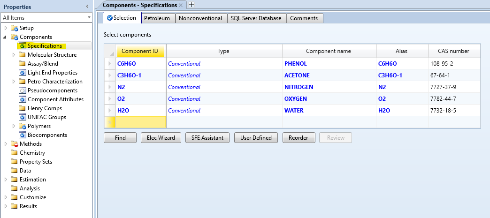 
**圖7-1 輸入各組分**

> **注意**：Aspen 資料庫中丙酮（Acetone）的組分 ID 為 **C₃H₆O-1**，以區別丙烯（Propylene，C₃H₆O-2 或 C₃H₆）。輸入時應確認組分名稱與 CAS 號正確對應。

指定 Henry 組分，在「組分 | Henry 組分」頁面上點擊 **New** 添加 Henry 組分表，見圖 7-2。默認 ID 為 HC-1，點擊確定；在 HC-1 表中指定 N₂、O₂ 為亨利組分，見圖 7-3。

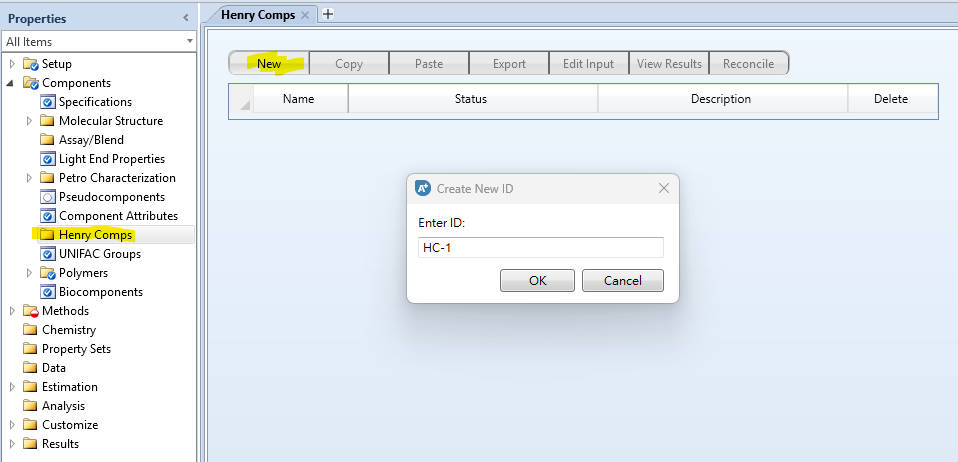 
**圖7-2 建立亨利組分表 HC-1**

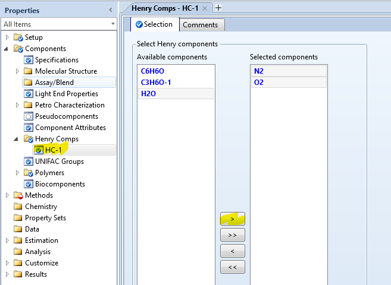 
**圖7-3 指定 N₂、O₂ 為亨利組分**

> **關鍵設定說明**：若省略此步驟，Aspen 將以修正 Raoult 定律計算 N₂、O₂ 的氣液平衡，大幅高估其在水中的溶解度，導致塔底富液組成嚴重失真，模擬結果不可信。

採用 **NRTL-RK** 物性方法，並在 Henry 組分欄中選入 HC-1，見圖 7-4。此時 Henry-1 與 NRTL-1 參數項目以紅色標示，提示使用者確認相關參數已載入。系統自動讀取資料庫中 H₂O 與 C₃H₆O、N₂、O₂ 之間的 Henry 常數，見圖 7-5；NRTL 二元交互作用參數由資料庫提供，此處從略。

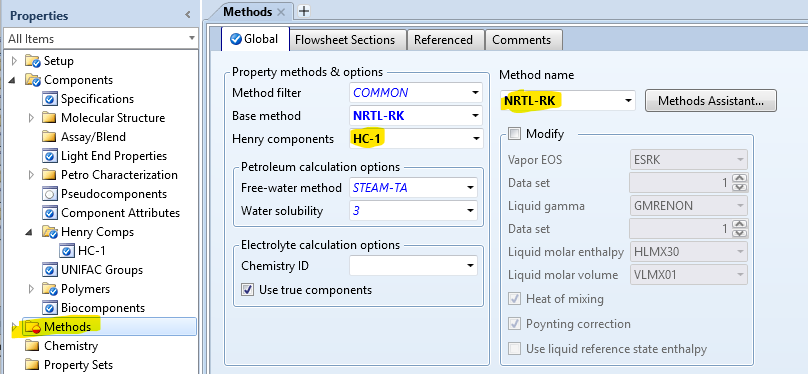 
**圖7-4 選擇 NRTL-RK 物性方法並啟用亨利組分**

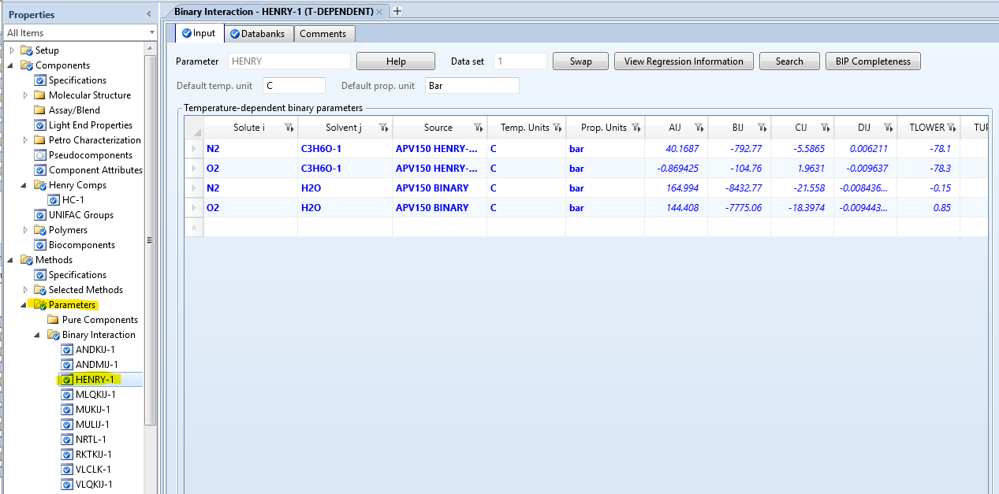
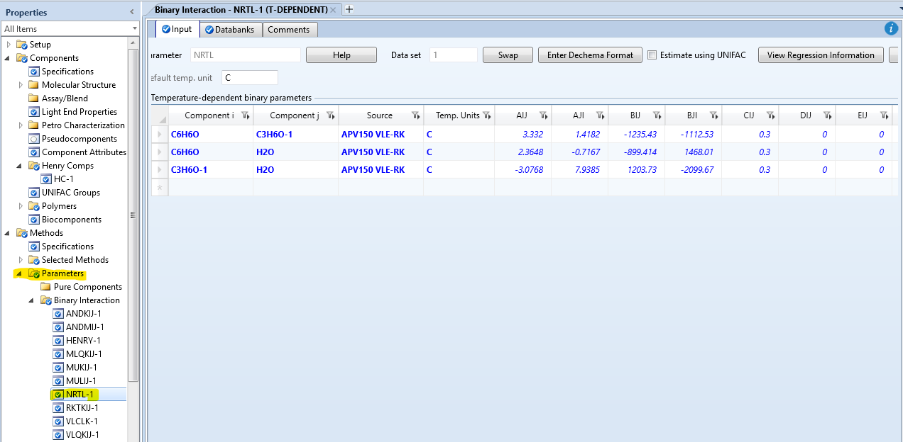 
**圖7-5 資料庫中 Henry 常數確認**

#### （2）建立流程圖

在模擬環境的主工藝流程頁面，建立如圖 7-6 所示的吸收塔流程，COLUMN 模塊採用 **RadFrac / ABSBR1** 模型。左側進料箭頭可以滑鼠左鍵選中後上下拖動，調整進料板位置。

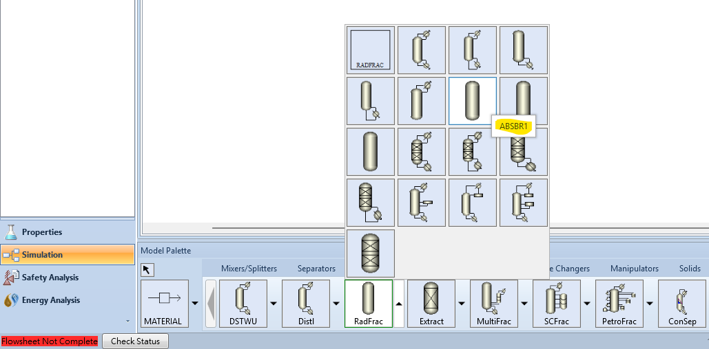
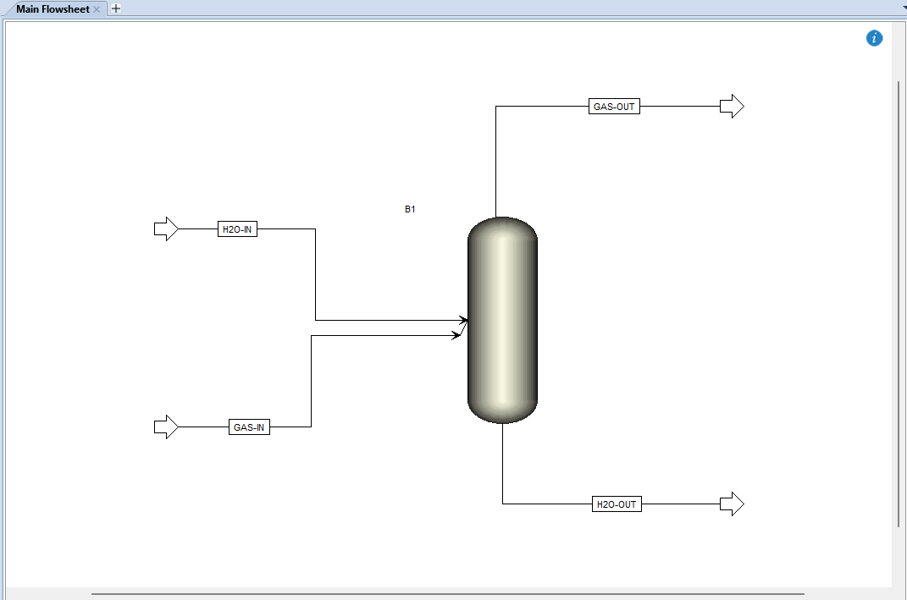 
**圖7-6 吸收塔模擬流程圖**

> **模型選擇說明**：ABSBR1 為 RadFrac 的吸收塔預設配置，系統自動設定冷凝器（Condenser）= 無、再沸器（Reboiler）= 無，塔頂為氣相出口，塔底為液相出口，符合吸收操作特徵。

#### （3）設置流股信息

指定尾氣（GAS-IN）進料條件（圖 7-7）：閃蒸計算類型設為「溫度-壓力」，狀態變量填入溫度 50℃、壓力 1.2 kgf/cm²，總流量基準選「質量」，總流率 2000 kg/h，組成輸入摩爾分率如表 7-1。

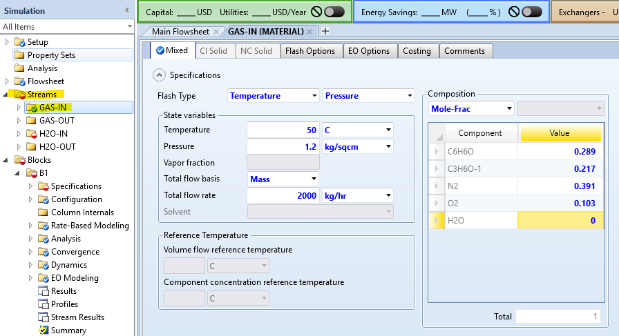 
**圖7-7 尾氣（GAS-IN）進料條件設定**

指定水（H2O-IN）進料條件（圖 7-8）：溫度 30℃，壓力 2.0 kgf/cm²，總質量流量 2000 kg/h，組成為純水（H₂O 摩爾分率 = 1）。

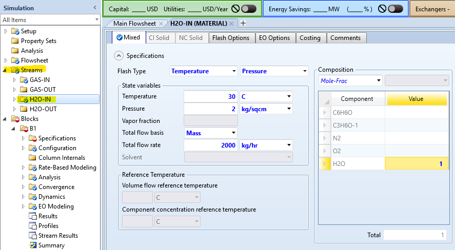 
**圖7-8 吸收劑（H2O-IN）進料條件設定**

> **壓力差說明**：水的進料壓力（2.0 kgf/cm²）高於塔頂操作壓力（1.1 kgf/cm²），這是正常的。Aspen 會在進料板前對進入流股進行閃蒸計算，確認其熱力學狀態後再送入塔板，不影響計算正確性。

#### （4）設置模塊操作參數

在 COLUMN 模塊的「配置」頁面，指定：13 塊理論板，計算類型選「平衡」（Equilibrium Stages），冷凝器與再沸器均設為「無」，見圖 7-9。

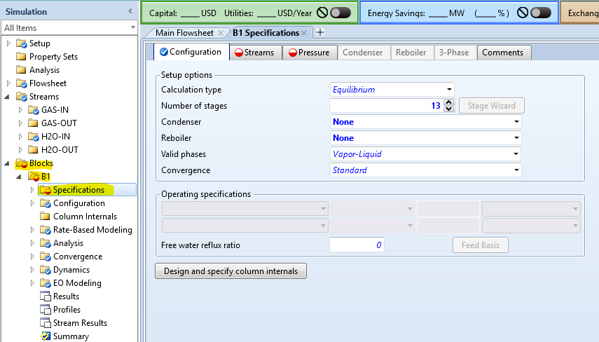 
**圖7-9 吸收塔塔板數與基本配置**

在「流股」頁面（圖 7-10），設定進出料位置：
- **H2O-IN**（水，液相吸收劑）→ 第 1 板進料（On-Stage），即從塔頂板面直接進入
- **GAS-IN**（尾氣，氣相進料）→ 第 13 板進料（On-Stage），相當於從塔底板底部送入
- **GAS-OUT**（淨化氣）→ 第 1 板氣相出料（塔頂）
- **H2O-OUT**（富液）→ 第 13 板液相出料（塔底）

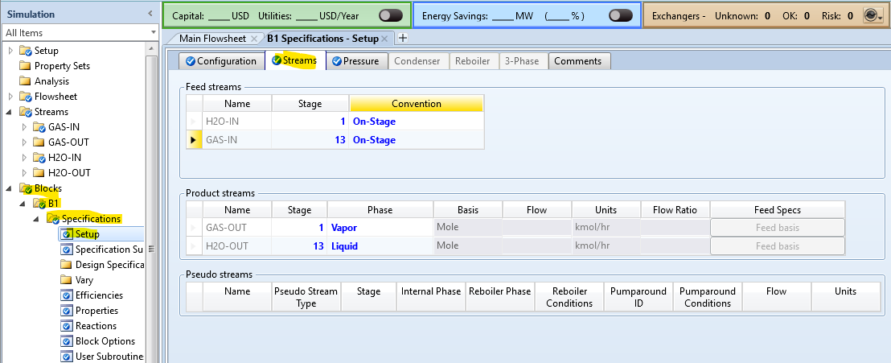 
**圖7-10 進出料位置設定**

> **On-Stage 進料模式說明**：On-Stage 表示進料流股直接與指定塔板上的液相和氣相充分混合，省略進料板前的預閃蒸步驟。對於氣體進料至塔底板（第 13 板），此模式等效於實際設備中氣體從塔底鼓泡進入液層的操作方式。

在「壓力」頁面（圖 7-11），設定塔頂（第 1 板）壓力為 1.1 kgf/cm²，塔壓降（Pressure Drop）為 0.1 kgf/cm²，Aspen 將自動依線性分佈計算各板壓力（每板壓降約 0.0077 kgf/cm²）。

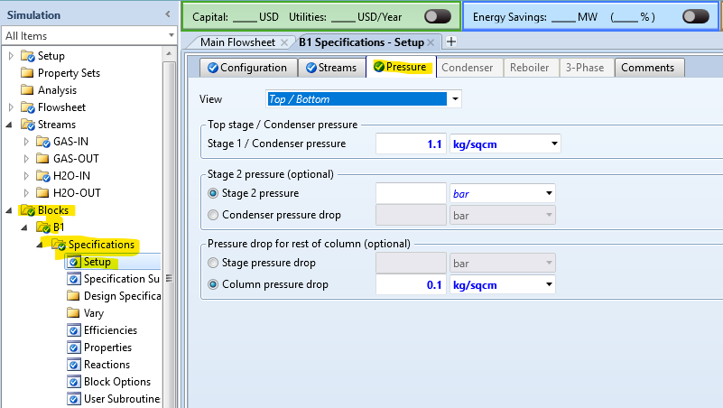 
**圖7-11 壓力分佈設定**

#### （5）運行和查看結果

完成所有輸入後，點擊執行（Run）啟動模擬。收斂後查看結果，見圖 7-12。

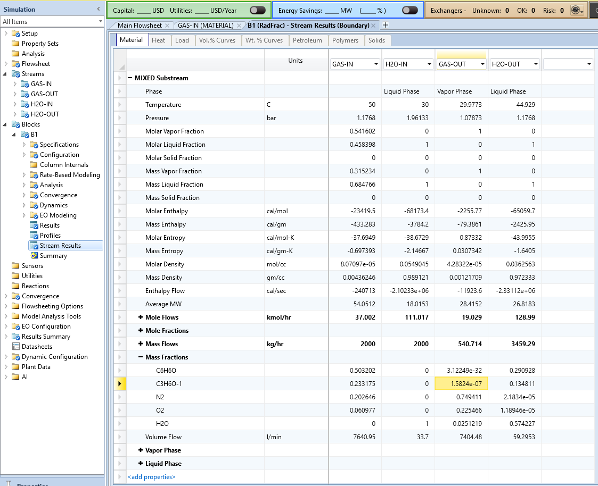 
**圖7-12 吸收塔模擬運行結果**

**模擬結果分析：**

模擬收斂後，GAS-OUT 中丙酮的質量分率為 $\mathbf{1.5824 \times 10^{-7}}$ ，表明丙酮吸收率達到 $99.99\%$ 以上，吸收效果極為顯著。綜合各組分的結果分析如下：

1. **丙酮（C₃H₆O）被高效吸收**：其 $K$ 值（氣液平衡常數）在操作溫度下遠小於 1，水對丙酮的溶解能力強。13 塊理論板配合 1:1 的質量液氣比（水/尾氣 = 2000/2000），提供了充足的傳質推動力，出口氣相中丙酮含量極低。

2. **苯酚（C₆H₆O）同樣幾乎完全被吸收**：苯酚沸點（181.7℃）遠高於丙酮（56.1℃），揮發性更低， $K$ 值更小，在相同操作條件下吸收效率更高，GAS-OUT 中苯酚濃度趨近於零。

3. **N₂、O₂ 主要由 GAS-OUT 排出**：兩者為 Henry 組分，在水中溶解度極低（常溫下亨利係數 $H_{\mathrm{N_2}} \approx 8.65 \times 10^9$ Pa， $H_{\mathrm{O_2}} \approx 4.26 \times 10^9$ Pa），GAS-OUT 中 N₂ 與 O₂ 合計摩爾分率接近其進料值，吸收塔對惰性組分的選擇性極佳。

4. **H₂O 的汽相夾帶**：GAS-OUT 中存在微量水蒸氣（飽和蒸汽壓對應值），此為吸收塔出口氣體的正常現象，實際工程中可在下游設置冷卻冷凝或除霧設備加以處理。

---

## 7.2 萃取單元

### 7.2.1 萃取操作概述

#### 基本概念與原理

**萃取（Extraction）** 是利用混合物中各組分在兩種互不相溶（或部分互溶）溶劑中溶解度的差異，將目標溶質選擇性地從一相轉移至另一相的液液傳質分離操作。與精餾、吸收等氣液操作不同，萃取兩相均為液態，不依賴揮發度差異，因而特別適用於：

- **熱敏性物質**（如生化產品、天然香料）的低溫分離
- **沸點相近或形成共沸體系**的混合物分離（精餾無法有效分離時）
- **超低濃度溶質回收**（如廢水中痕量有機污染物）
- **需要避免高溫分解**的物質（如抗生素、藥物中間體）

操作中的核心名詞定義：

- **進料（Feed, F）**：含溶質的原料液，由**稀釋劑（Diluent）**（或稱載體溶劑）與目標**溶質（Solute）**組成
- **萃取劑（Extractant/Solvent, S）**：對溶質具有選擇性溶解能力的液體，需與稀釋劑不互溶（或部分互溶）
- **萃取相（Extract, E）**：萃取劑富含溶質的出料（靠近萃取劑進塔端）
- **萃余相（Raffinate, R）**：稀釋劑中溶質濃度降低後的出料（靠近進料端出口）

萃取分離後，通常需要將萃取劑與溶質分離（如精餾或降壓閃蒸），使萃取劑循環再生，形成閉環流程。

#### 工業應用場景

| 應用領域 | 典型體系（稀釋劑－溶質－萃取劑） | 目的 |
|:-------:|:----:|:---:|
| 石油精製 | 烷烴－芳烴－環丁碸 / 糠醛 | BTX 芳烴提純 |
| 核燃料處理 | 硝酸溶液－鈾 / 釷－磷酸三丁酯（TBP） | 核素分離 |
| 生物製藥 | 發酵液－青黴素－醋酸丁酯 | 抗生素提取與純化 |
| 食品工業 | 水溶液－咖啡因 / 天然香精－超臨界 CO₂ | 天然產物無毒萃取 |
| 濕法冶金 | 硫酸浸液－銅 / 鎳－有機萃取劑 | 有色金屬提取 |

#### 超臨界流體萃取（SFE）概述

當純物質的溫度與壓力**同時超過其臨界點**時，氣液界面消失，形成兼具液體高溶解能力與氣體低黏度特性的**超臨界流體（Supercritical Fluid, SCF）**。CO₂ 臨界條件溫和（ $T_c = 31.1^{\circ}\mathrm{C}$ ， $P_c = 73.8\,\mathrm{bar}$ ），且無毒、不可燃、廉價易得，是食品與藥品工業中最重要的超臨界萃取劑。

| 物性 | 氣體（常壓） | 超臨界 CO₂（~100 bar, 35°C） | 液體 |
|:---:|:---:|:---:|:---:|
| 密度 / g·cm⁻³ | ~0.001 | 0.3～0.9（壓力可調） | 0.6～1.6 |
| 黏度 / mPa·s | ~0.01 | 0.01～0.1 | 0.2～3.0 |
| 擴散係數 / cm²·s⁻¹ | ~0.1 | ~$10^{-3}$ | ~$10^{-5}$ |

超臨界 CO₂ 最大優勢在於**可藉由壓力連續調控溶解能力**。萃取後只需降壓即可使 CO₂ 汽化與溶質分離，無溶劑殘留，特別適用於食品與藥物等對溶劑安全性有嚴格限制的領域。

---

### 7.2.2 液液相平衡與分配係數

#### 相平衡熱力學基礎

液液萃取的熱力學基礎是溶質在兩液相達到**化學位相等**的條件：

$$
\mu_i^{\mathrm{I}} = \mu_i^{\mathrm{II}} \quad \Rightarrow \quad \gamma_i^{\mathrm{I}}\,x_i^{\mathrm{I}} = \gamma_i^{\mathrm{II}}\,x_i^{\mathrm{II}}
$$

式中 $\gamma_i^{\mathrm{I}}$ 、 $\gamma_i^{\mathrm{II}}$ 為組分 $i$ 分別在相 I（萃余相）與相 II（萃取相）中的液相活度係數， $x_i^{\mathrm{I}}$ 、 $x_i^{\mathrm{II}}$ 為對應的摩爾分率。

#### 液液分配係數（KLL）

在固定溫度與壓力下，**液液分配係數（KLL）**定義為組分 $i$ 在兩液相中摩爾分率之比：

$$
KLL_i = \frac{x_i^{\mathrm{II}}}{x_i^{\mathrm{I}}} = \frac{\gamma_i^{\mathrm{I}}}{\gamma_i^{\mathrm{II}}}
$$

Aspen Plus 中，相 I 通常為以稀釋劑（如水）為主的萃余相，相 II 為以萃取劑為主的萃取相。

- $KLL_i > 1$ ：組分 $i$ 優先分配至萃取相（易萃取）
- $KLL_i < 1$ ：組分 $i$ 優先留在萃余相（難萃取）
- $KLL_i \gg 1$ 或 $KLL_i \ll 1$ ：幾乎完全偏向其中一相

#### 選擇性（Selectivity）

萃取分離兩組分 A 與 B 的能力由**選擇性 $\beta_{AB}$** 衡量：

$$
\beta_{AB} = \frac{KLL_A}{KLL_B}
$$

$\beta_{AB} > 1$ 表示萃取劑對組分 A 具有選擇性， $\beta_{AB}$ 越大，分離越容易，所需理論板數越少。選擇性是選擇萃取劑的首要判據，通常須兼顧選擇性、溶劑回收成本及安全性。

#### KLL 溫度關聯式

KLL 值隨溫度變化，Aspen Plus EXTRACT 模塊採用以下四參數經驗關聯式：

$$
\ln(KLL_i) = a_i + \frac{b_i}{T} + c_i \ln T + d_i\,T
$$

式中 $T$ 為絕對溫度（K）。等溫操作（萃取塔近似假設）下，關聯式退化為常數：

$$
KLL_i = e^{a_i}, \qquad b_i = c_i = d_i = 0
$$

因此，只需設定 $a_i = \ln(KLL_{i,\text{exp}})$ ，即可精確輸入由實驗回歸的分配係數，無需完整的熱力學參數庫。

---

### 7.2.3 逆流萃取塔的物料衡算

#### 流股定義與符號

逆流萃取塔板號自頂至底為第 $1$ 至第 $N$ 板。進料液（第一液相，F 相）自塔頂進入，萃取劑（第二液相，S 相）自塔底進入，逆流接觸。以**無溶質稀釋劑流量 $F'$** 和**純萃取劑流量 $S'$** 為不變基準，定義溶質摩爾比濃度：

$$
X_n = \frac{x_{A,n}^{\mathrm{I}}}{1 - x_{A,n}^{\mathrm{I}}}, \qquad Y_n = \frac{x_{A,n}^{\mathrm{II}}}{1 - x_{A,n}^{\mathrm{II}}}
$$

| 符號 | 說明 |
|:---:|:----|
| $X_F$ | 進料液溶質摩爾比（塔頂進入） |
| $X_R$ | 萃余相出口溶質摩爾比（塔底出口） |
| $Y_E$ | 萃取相出口溶質摩爾比（塔頂出口） |
| $Y_S$ | 進口萃取劑溶質摩爾比（塔底進入，純萃取劑時 $Y_S = 0$ ） |

#### 整塔物料衡算

對全塔溶質作衡算：

$$
F'\,(X_F - X_R) = S'\,(Y_E - Y_S)
$$

整理得**溶劑比**（溶劑流量與進料流量之比）：

$$
\frac{S'}{F'} = \frac{X_F - X_R}{Y_E - Y_S}
$$

#### 操作線方程

對塔頂至第 $n$ 板控制體積作溶質衡算，得逆流萃取操作線方程：

$$
Y_{n+1} = \frac{F'}{S'}\,X_n + \left(Y_E - \frac{F'}{S'}\,X_F\right)
$$

此方程在 $Y$-$X$ 座標圖（萃取相濃度 $Y$ vs. 萃余相濃度 $X$ ）中為直線，斜率為 $F'/S'$ ，通過端點 $( X_F,\, Y_E )$ 與 $( X_R,\, Y_S )$ 。

> **操作線位置辨析**
>
> | 操作類型 | 操作線相對平衡線的位置 | 推動力方向 |
> |:-------:|:-------------------:|:--------:|
> | **吸收** | 操作線在**上方** | 氣相溶質 $Y > Y^{\ast}$ ，溶質由氣相轉入液相 |
> | **萃取** | 操作線在**下方** | 萃余相 $X > X^{\ast}$ ，溶質由萃余相轉入萃取相 |
>
> 這一差異源於兩者中「推動溶質轉移的相」不同：吸收中液相為接收相（高濃度在氣側），萃取中萃取相為接收相（高濃度在萃余相側）。

#### 萃取因子與 Kremser 解析公式

對稀溶液線性平衡 $Y^{\ast} = m\,X$（ $m = KLL$ 為常數），定義**萃取因子（Extraction Factor） $E$**：

$$
E = \frac{m\,S'}{F'}
$$

萃取因子 $E$ 與吸收因子 $A = L/(KV)$ 完全對偶——吸收中 $K$ 為氣液平衡常數（趨向離開液相），萃取中 $m = KLL$ 為液液分配係數（趨向進入萃取相）。理論板數由 Kremser 公式解析計算：

$$
N = \frac{\ln\!\left[\dfrac{X_F - Y_S/m}{X_R - Y_S/m}\left(1 - \dfrac{1}{E}\right) + \dfrac{1}{E}\right]}{\ln E}
$$

| $E$ 範圍 | 理論板數 $N$ | 工程意義 |
|:-------:|:-----------:|:--------|
| $E \to \infty$ | $\to 0$ | 溶劑量無限大，理論極限 |
| $E = 1$ | 有限值 $N = q - 1$ | 操作線與平衡線平行，仍可達成指定分離 |
| $E = E_{\min} = \eta$ | $\to \infty$ | 夾緊點，對應最小萃取劑用量 |
| $E < E_{\min}$ | 無實數解 | 目標回收率不可達 |

工程設計推薦 $E \approx 1.4 \sim 1.7$ 。

---

### 7.2.4 最小萃取劑用量

與吸收操作對稱，萃取塔夾緊點（Pinch Point）發生在進料端：進料液濃度 $X_F$ 與萃取相出口濃度 $Y_E^{\ast}$ 達到相平衡 $Y_E^{\ast} = m\,X_F$ ，傳質推動力為零，理論板數 $N \to \infty$ 。代入整塔物料衡算：

$$
S'_{\min} = \frac{F'\,(X_F - X_R)}{m\,X_F - Y_S}
$$

純萃取劑進塔（ $Y_S = 0$ ）且稀溶液近似（ $X \approx x$ ）時，式 (7-4) 化簡為：

$$
S'_{\min} = \frac{F'}{m}\,\eta
$$

式中 $\eta = (X_F - X_R)/X_F$ 為溶質的**萃取回收率**。

> **與吸收最小溶劑公式（式 7-3）的對比**
>
> | 操作 | 最小溶劑公式 | 物理意義 |
> |:---:|:----------:|:-------:|
> | 吸收 | $L_{\min} = G\,K\,\eta$ | $K$ 越大（越難溶入液相），需越多吸收劑 |
> | 萃取 | $S'_{\min} = F'\,\eta\,/\,m$ | $m = KLL$ 越小（溶質越傾向留在稀釋劑相），需越多萃取劑 |
>
> 兩式在結構上完全對稱，揭示了吸收與萃取在傳質理論框架上的深層等價性。

工程設計取 $S' = 1.5 \sim 2.0\,S'_{\min}$ ，以平衡萃取劑用量（操作費）與理論板數（設備費）。

---

### 7.2.5 Aspen Plus 萃取塔模擬方法

#### EXTRACT 模塊特性

Aspen Plus 中，液液萃取塔採用 **EXTRACT 模塊**（Rigorous Liquid-Liquid Extractor）進行嚴格逐板計算。與 RadFrac（蒸餾/吸收）的主要差異如下：

| 特性 | 吸收/蒸餾塔（RadFrac） | 萃取塔（EXTRACT） |
|:---:|:---:|:---:|
| 操作相態 | 氣－液 | 液－液（雙液相） |
| 相變化 | 有（汽化 / 冷凝） | **無** |
| 熱效應 | 顯著，須求解能量方程（H） | 近似等溫，可忽略 |
| 操作規定 | 需指定回流比、再沸比等 | **無需**額外操作規定 |
| 收斂特性 | MESH 四方程組，收斂較難 | MES 三方程組，省略 H，收斂快速 |

EXTRACT 逐板求解**省略能量方程的 MES 方程組**：

**（M）物料衡算：**

$$
F_{i,n} + L_{n-1}^{\mathrm{I}} x_{i,n-1}^{\mathrm{I}} + L_{n+1}^{\mathrm{II}} x_{i,n+1}^{\mathrm{II}} = L_n^{\mathrm{I}} x_{i,n}^{\mathrm{I}} + L_n^{\mathrm{II}} x_{i,n}^{\mathrm{II}}
$$

**（E）相平衡：**

$$
x_{i,n}^{\mathrm{II}} = KLL_{i,n}\,x_{i,n}^{\mathrm{I}}
$$

**（S）加和：**

$$
\textstyle\sum_i x_{i,n}^{\mathrm{I}} = 1, \quad \textstyle\sum_i x_{i,n}^{\mathrm{II}} = 1
$$

由於省略了能量方程，EXTRACT 的計算自由度恰好等於方程數，**無需額外操作規定**（如回流比），模擬設置更為簡潔，收斂速度亦快於蒸餾計算。

#### 關鍵設定要點

**① 指定溫度分布**：在「設置 | 熱選項」中勾選「指定溫度分布」，輸入各板溫度。等溫操作時只需設定頂板溫度即可，Aspen 自動套用至全塔。

**② 指定關鍵組分（Key Components）**：在「設置 | 關鍵組分」頁面分別指定第一液相（萃余相）與第二液相（萃取相）的代表性組分（如 H₂O 代表水相，CO₂ 代表超臨界相），Aspen 據此判斷各板上的相歸屬邏輯。

**③ KLL 計算方式**：
- **活度係數模型法（NRTL / UNIQUAC）**：由液液相平衡熱力學嚴格計算 KLL，需完整的二元交互作用參數（LLE 回歸），精度較高
- **KLL 關聯式法**：直接輸入 $a_i = \ln(KLL_{i,\text{exp}})$ ，適用於有充分實驗分配係數數據但熱力學參數不完整的場合，設置簡便

**④ 進出料位置與相態**：進料液（第一液相，密度較大）與萃取劑（第二液相，密度較小）分別從各自對應端口以 On-Stage 模式進入指定塔板，保證逆流接觸。

---

### 【例 7-2】 超臨界二氧化碳萃取乙醇

**題目描述：**

在相當於 5 塊理論板的連續逆流萃取塔中，以超臨界二氧化碳（ $32^{\circ}\mathrm{C}$ 、 $98.6\,\mathrm{bar}$ 、 $475\,\mathrm{kg/h}$ ）作為萃取劑，從乙醇質量分率 10%（ $w/w$ ）的水溶液中萃取回收乙醇，水溶液進料量為 $69\,\mathrm{kmol/h}$ 。試確定萃取相（CO₂ 富乙醇相）與萃余相（水富相）的組成與流量。

**物性方法**：選用 NRTL 熱力學模型，以 KLL 關聯式法輸入表 7-2 所示的實驗分配係數（ $32^{\circ}\mathrm{C}$ 、 $98.6\,\mathrm{bar}$ 等溫常數）。

**表 7-2 各組分液液分配係數**

| 組分 | $KLL$ 值 | $a_i = \ln(KLL)$ | 物理意義 |
|:----:|:------:|:---:|:--------|
| CO₂ | 34.5 | $3.540$ | $KLL \gg 1$ ，CO₂ 強烈偏向超臨界相 |
| C₂H₆O（乙醇） | 0.115 | $-2.163$ | $KLL < 1$ ，乙醇偏向水相，可被部分萃取 |
| H₂O | 0.00575 | $-5.159$ | $KLL \ll 1$ ，水幾乎完全留在水相 |

**設計前預估——選擇性與萃取因子：**

超臨界 CO₂ 對乙醇相對水的選擇性：

$$
\beta_{\text{EtOH/H}_2\text{O}} = \frac{KLL_{\text{EtOH}}}{KLL_{\text{H}_2\text{O}}} = \frac{0.115}{0.00575} = 20
$$

雖然選擇性高達 20 倍，但 $KLL_{\text{EtOH}} = 0.115 < 1$ ，乙醇整體傾向留在水相。以無溶質基準估算萃取因子（進料水相 $F' \approx 66\,\mathrm{kmol/h}$ ，萃取劑 $S' = 475/44 \approx 10.8\,\mathrm{kmol/h}$ ）：

$$
E = KLL_{\text{EtOH}} \times \frac{S'}{F'} = 0.115 \times \frac{10.8}{66} \approx 0.019
$$

$E \approx 0.019 \ll 1$ ，遠低於有效萃取所需範圍（ $E > 1$ ），預期乙醇回收率將十分有限。本例重點在於示範 EXTRACT 模塊的完整設定流程與結果解讀方法。

**本題模擬步驟如下：**

用公制單位通用模板新建文件。

#### （1）輸入組分與選擇物性方法

在物性環境下「組分 | 規定 | 選擇」頁面，輸入三個組分：C₂H₆O-2（乙醇）、H₂O 和 CO₂，如圖 7-13。

> **注意**：Aspen 資料庫中乙醇（Ethanol）的組分 ID 為 **C₂H₆O-2**，以區別甲醚（Dimethyl Ether，C₂H₆O-1）。輸入時應核對 CAS 號（乙醇 CAS：64-17-5）。

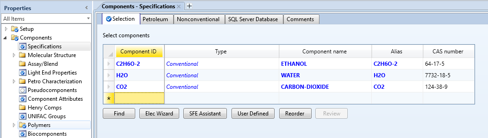 
**圖7-13 輸入組分**

選擇物性方法為 **NRTL**（圖 7-14）。本例雖以 KLL 關聯式輸入分配係數，NRTL 仍用於估算液相密度等輔助性質。

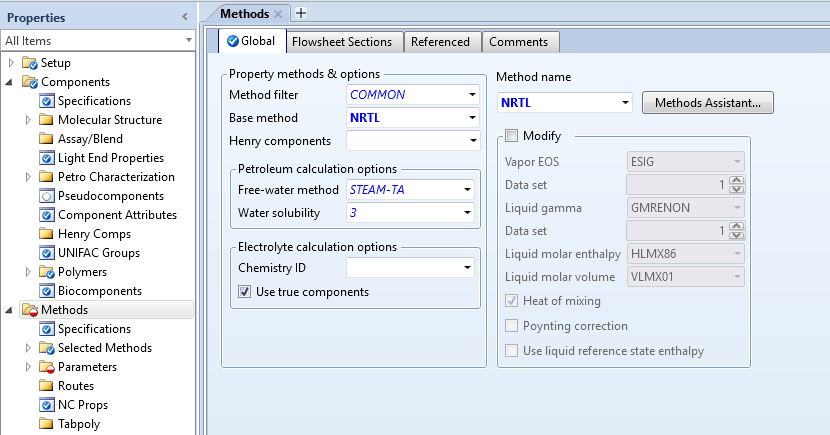 
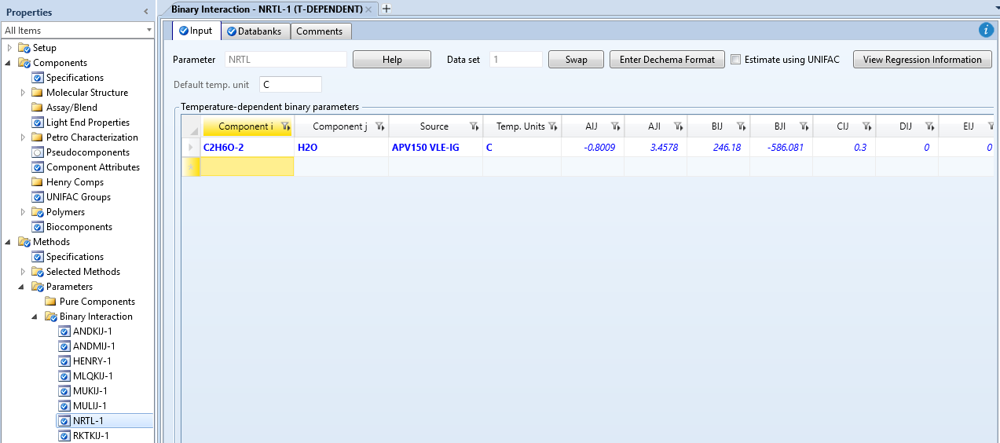
**圖7-14 物性方法選擇**

#### （2）建立流程圖

切換至模擬環境，建立如圖 7-15 所示的萃取流程。萃取塔採用模型庫「塔」選項卡下的 **EXTRACT 模型**，進出料設定如下：

- **S2H2O**（乙醇水溶液，第一液相）→ 第 1 板進料（塔頂進入，密度大的水相自上而下）
- **S1CO2**（超臨界 CO₂，第二液相）→ 第 5 板進料（塔底進入，密度小的超臨界相自下而上）
- **S4CO2**（萃取相出料，第二液相）→ 第 1 板採出（塔頂）
- **S3H2O**（萃余相出料，第一液相）→ 第 5 板採出（塔底）

進料液密度大（水相）從上方進入、萃取劑 CO₂ 密度相對小從下方進入，符合逆流接觸的物理方向。

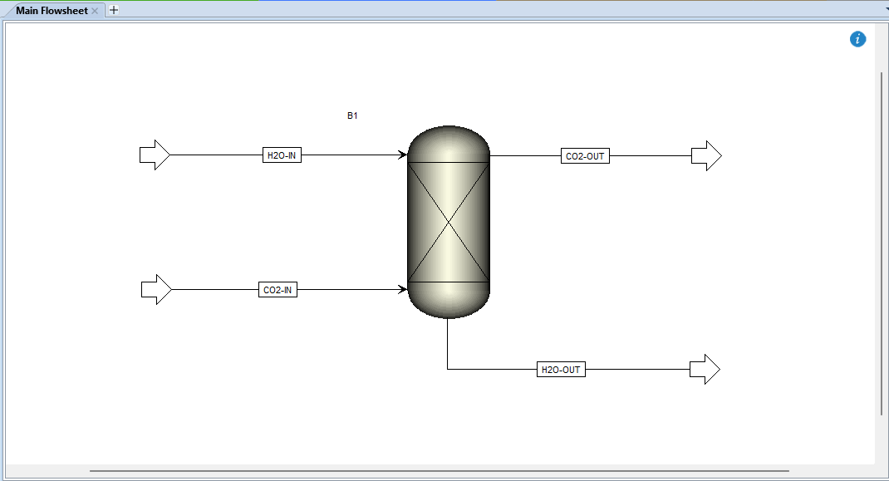
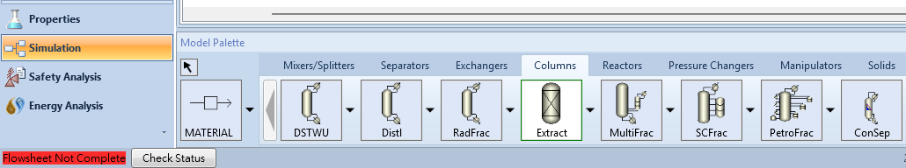 
**圖7-15 萃取塔流程圖**

#### （3）設置流股信息

在流股 **S1CO2** 頁面（圖 7-16），輸入超臨界 CO₂ 進料條件：溫度 $32^{\circ}\mathrm{C}$ 、壓力 $98.6\,\mathrm{bar}$ 、CO₂ 質量流量 $475\,\mathrm{kg/h}$ 。

> **物性說明**：在 $32^{\circ}\mathrm{C}$ 、 $98.6\,\mathrm{bar}$ 下，CO₂ 已超過臨界點（ $T_c = 31.1^{\circ}\mathrm{C}$ ， $P_c = 73.8\,\mathrm{bar}$ ），以超臨界流體形態存在，密度約 $0.7 \sim 0.8\,\mathrm{g/cm^3}$ 。Aspen 將其識別為單一液相（第二液相），參與液液平衡計算。

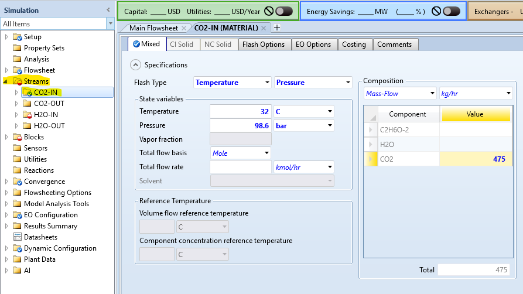 
**圖7-16 超臨界二氧化碳進料條件設定**

在流股 **S2H2O** 頁面（圖 7-17），輸入乙醇水溶液進料條件：溫度 $32^{\circ}\mathrm{C}$ 、壓力 $98.6\,\mathrm{bar}$ 、總摩爾流量 $69\,\mathrm{kmol/h}$ 、C₂H₆O-2 質量分率 $0.1$ 、H₂O 質量分率 $0.9$ 。

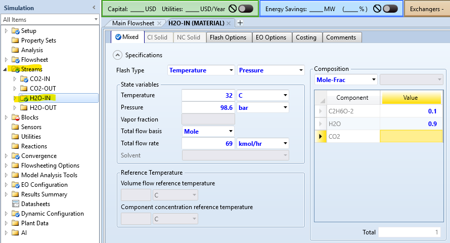 
**圖7-17 乙醇水溶液進料條件設定**

#### （4）設置模塊操作參數

在模塊 **|EXTRACT|** 設置 | 規定頁面（圖 7-18），設定萃取塔有 5 塊理論板；在「熱選項」區域勾選**指定溫度分布**，輸入第一板溫度 $32^{\circ}\mathrm{C}$ （等溫操作，取代能量衡算）。

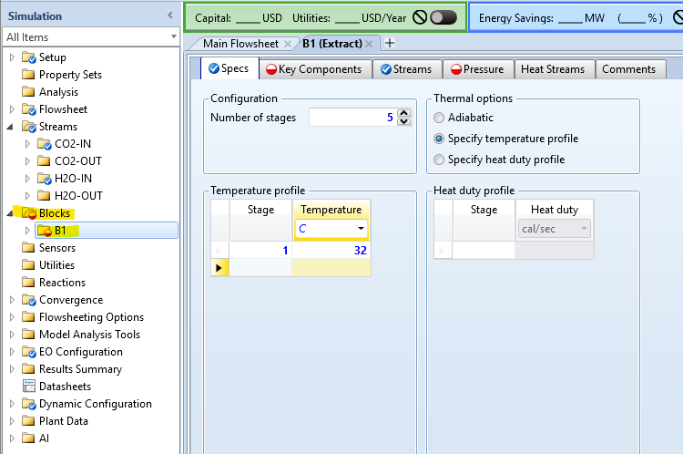 
**圖7-18 萃取塔配置**

在設置 | 關鍵組分頁面（圖 7-19），指定第一液相關鍵組分為 **H₂O**（代表水相），第二液相關鍵組分為 **CO₂**（代表超臨界相）。此設定使 Aspen 在每塊板上正確識別兩個液相的歸屬，避免相序反轉造成計算錯誤。
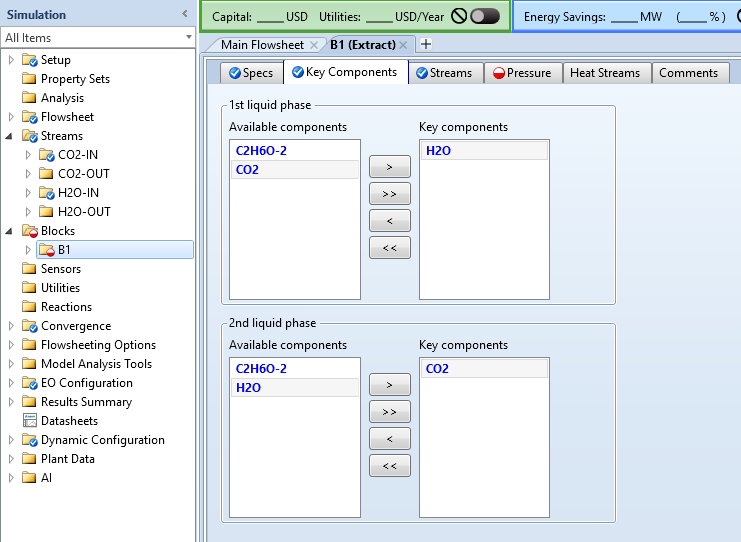 
**圖7-19 關鍵組分設定**

在設置 | 壓力頁面（圖 7-20），設定第一板壓力為 $98.6\,\mathrm{bar}$ ，維持全塔超臨界操作條件，確保 CO₂ 以超臨界相存在。
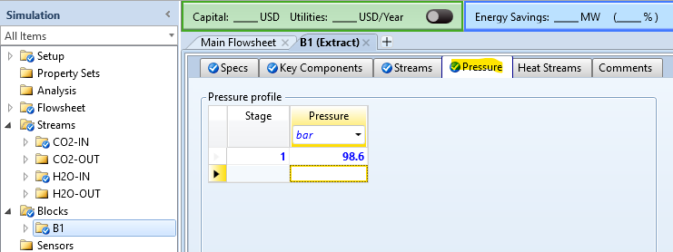 
**圖7-20 壓力分布設定**

在物性 | 選項頁面（圖 7-21），勾選 **KLL 關聯式**作為液液平衡係數計算方法。
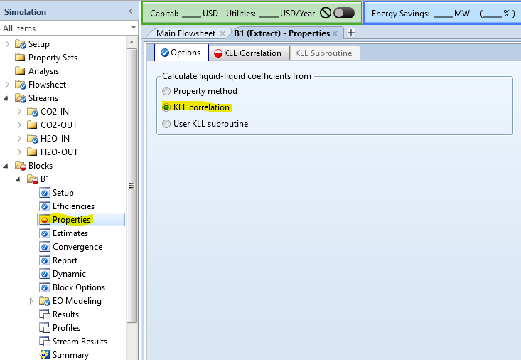 
**圖7-21 物性選項設定**

在物性 | KLL 關聯式頁面（圖 7-22），填入各組分的關聯式參數。KLL 關聯式形式為：

$$
\ln(KLL_i) = a_i + \frac{b_i}{T} + c_i \ln T + d_i\,T
$$

依表 7-2 輸入 $a_i$ 值（ $b_i = c_i = d_i = 0$ ）：CO₂ 輸入 $a = 3.540$ ，C₂H₆O 輸入 $a = -2.163$ ，H₂O 輸入 $a = -5.159$ 。此等溫設定確保各板 KLL 值恆等於實驗測定值，不受組成變化影響。
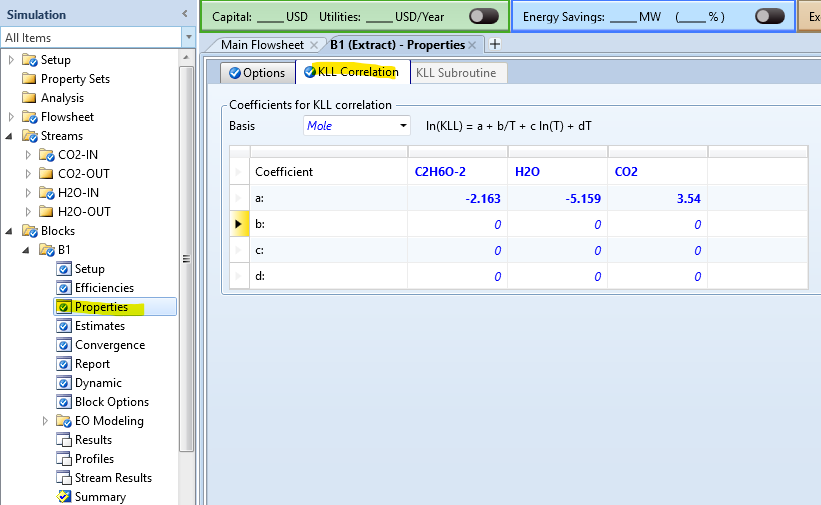 
**圖7-22 KLL 關聯式設定**

在設置 | 流股頁面（圖 7-23），確認進出料位置與相態設定：S2H2O 從第 1 板進入（第一液相）、S1CO2 從第 5 板進入（第二液相）；S4CO2 從第 1 板採出（第二液相）、S3H2O 從第 5 板採出（第一液相）。
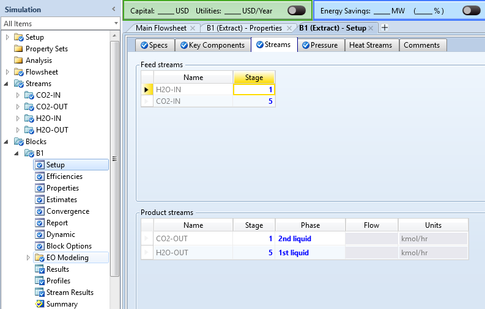 
**圖7-23 流股信息確認**

#### （5）運行並查看結果

完成設定後執行模擬，在 **|EXTRACT|** 結果 | 摘要頁面（圖 7-24）查看萃取塔整體計算結果。
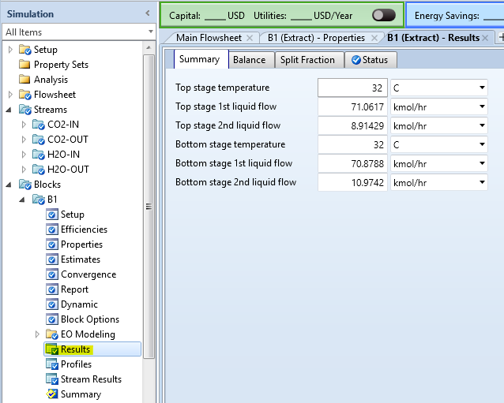 
**圖7-24 萃取塔結果摘要**

在結果 | 切割分率頁面（圖 7-25）查看各組分在萃取相（S4CO2）與萃余相（S3H2O）的分割分率，此為判斷萃取效率的關鍵數據。
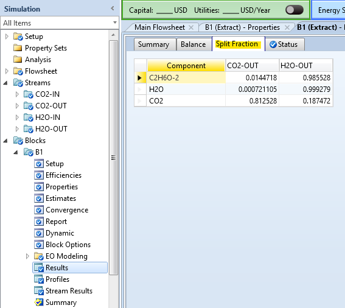 
**圖7-25 各組分切割分率**

在分布 | TPFQ 頁面（圖 7-25-0）查看各板的溫度（T）、壓力（P）、流量（F）與熱負荷（Q）分布，驗證等溫等壓假設是否全塔成立。
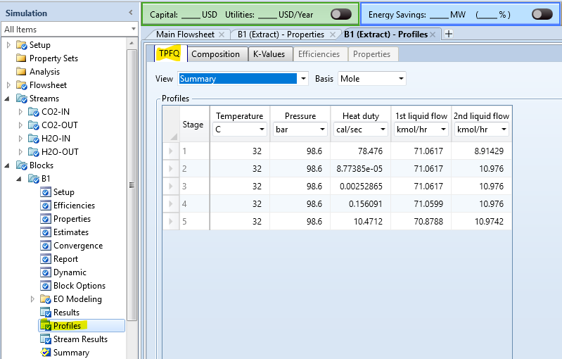 
**坡7-25-0 各塔板 TPFQ 分布**

在分布 | 組成頁面查看各板兩相組成分布（圖 7-26、圖 7-27）：
（a）第一液相（水相）摩爾分率分布：
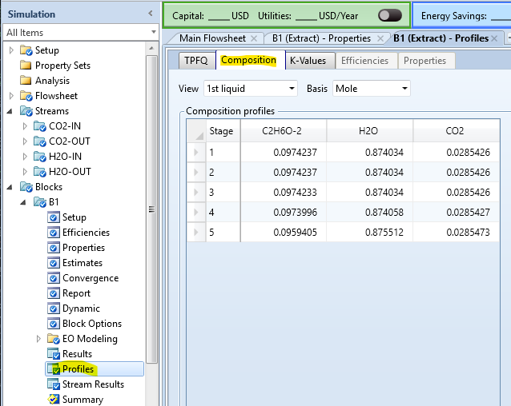 
**圖7-26 第一液相（水相）各板組成分布**

（b）第二液相（超臨界 CO₂ 相）摩爾分率分布：
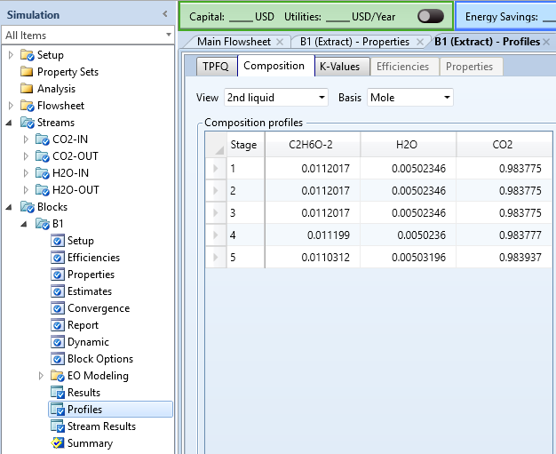 
**圖7-27 第二液相（CO₂ 相）各板組成分布**

在分布 | K 值頁面（圖 7-29）查看各板 KLL 值分布，驗證 KLL 是否符合輸入值（採用等溫常數 KLL 關聯式，全塔應一致）。
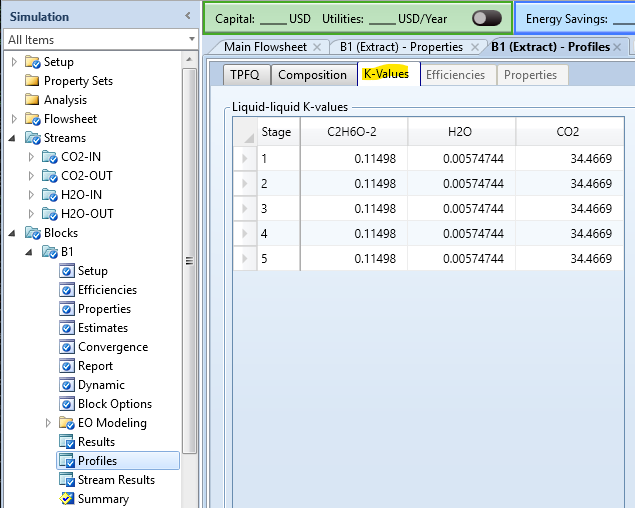 
**圖7-29 各塔板 KLL 值分布**

在流股結果 | 物料頁面（圖 7-30）查看進出物流的完整計算結果：溫度、壓力、摩爾流量、組成及焓值。
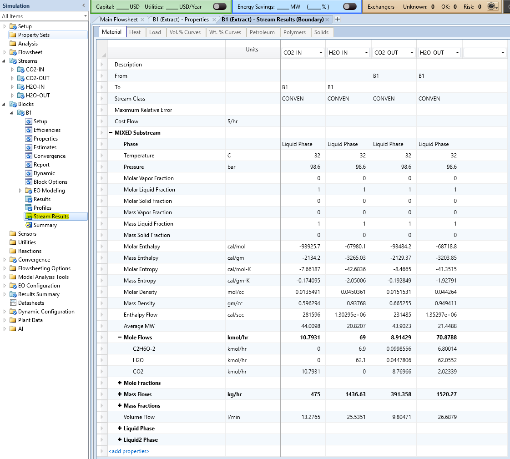 
**圖7-30 流股物料計算結果**

**模擬結果分析：**

由圖 7-25 切割分率與圖 7-30 流股物料結果，可得以下關鍵結論：

1. **乙醇萃取效率極低**：由於萃取因子 $E \approx 0.019 \ll 1$ ，5 塊理論板下進入超臨界 CO₂ 相（S4CO2）的乙醇僅佔進料總量的約 1.44%，逾 98.5% 仍留在萃余水相（S3H2O）。根本原因是此操作條件下 CO₂ 用量（ $10.8\,\mathrm{kmol/h}$ ）相對水相進料（ $66\,\mathrm{kmol/h}$ ）嚴重不足，溶劑比 $S'/F' \approx 0.16$ 遠低於使 $E > 1$ 所需的最低值。

2. **水的損失極低**： $KLL_{\text{H}_2\text{O}} = 0.00575 \ll 1$ ，水幾乎完全留在水相，進入 CO₂ 相的水不足 0.07%，超臨界 CO₂ 對水的選擇性極佳。

3. **CO₂ 的相間損耗**： $KLL_{\text{CO}_2} = 34.5 \gg 1$ ，CO₂ 強烈偏向超臨界相，但仍有約 18.9% 的 CO₂ 溶入水相（參見切割分率）。這反映超臨界 CO₂ 在高壓下對水具有可觀溶解度，是工程設計中需評估的 CO₂ 損耗來源。

4. **各板 KLL 值全塔恆定**（圖 7-29 各板 K 值一致）：這是 KLL 關聯式法（ $b_i = c_i = d_i = 0$ 等溫常數）的預期結果，與活度係數模型（KLL 隨組成和溫度變化）的結果不同。若需更高精度，應採用回歸完整 NRTL 液液平衡（LLE）參數的方法。

5. **工程啟示**：若欲提高乙醇回收率，應大幅增加 CO₂ 用量（提高 $S'/F'$ 使 $E > 1$ ），或採用萃取–精餾耦合流程。超臨界 CO₂ 更適用於 $KLL > 1$ 的非極性物質萃取場景；對於極性較強的乙醇－水體系，水的氫鍵網絡顯著削弱了 CO₂ 的萃取驅動力，這是選擇萃取劑時需著重考量的物性限制。

---

### 【延伸計算】有效萃取所需 CO₂ 用量估算

本例以低 CO₂ 用量示範模擬設定，以下估算若欲達到工程上有效萃取（ $E \geq 1$ ），CO₂ 流量應修改的目標值。

**已知條件：**

- 液液分配係數 $KLL_{\text{EtOH}} = 0.115$
- 溶劑基準水相進料 $F' \approx 66\,\mathrm{kmol/h}$
- 萃取因子定義： $E = m \cdot S'/F'$
- 現況（教學示範）： $S' = 475/44 \approx 10.8\,\mathrm{kmol/h}$ ， $E \approx 0.019$

**估算一：使 $E = 1$ 的臨界 CO₂ 用量**

$$S'_{\text{critical}} = \frac{F'}{m} = \frac{66}{0.115} \approx 574\,\mathrm{kmol/h}$$

$$\dot{m}_{\text{CO}_2} = 574 \times 44 \approx 25{,}300\,\mathrm{kg/h}$$

**估算二：5 塊理論板達 90% 回收率所需的萃取因子**

令 $Y_S = 0$ （純 CO₂ 進料）、回收率 $\eta = 0.90$（即 $X_R = 0.1\,X_F$ ），代入 Kremser 公式：

$$N = \frac{\ln\!\left[\dfrac{X_F}{X_R}\!\left(1 - \dfrac{1}{E}\right) + \dfrac{1}{E}\right]}{\ln E} = \frac{\ln\!\left[10 - \dfrac{9}{E}\right]}{\ln E} = 5$$

數值求解（試誤）：

| $E$ | 計算所得 $N$ |
|:---:|:---:|
| 1.2 | ≈ 5.0 ✓ |
| 1.5 | ≈ 3.4 |
| 2.0 | ≈ 2.5 |

求得 $E \approx 1.2$ 時恰好滿足 5 塊板、90% 回收率的設計目標，對應所需 CO₂ 用量：

$$S' = \frac{E \cdot F'}{m} = \frac{1.2 \times 66}{0.115} \approx 688\,\mathrm{kmol/h}$$

$$\dot{m}_{\text{CO}_2} \approx 688 \times 44 \approx 30{,}300\,\mathrm{kg/h}$$

**各情境 CO₂ 用量對比：**

| 情境 | $E$ | CO₂ 質量流量 |
|:---|:---:|:---:|
| 本例教學示範 | 0.019 | 475 kg/h |
| $E = 1$ 臨界點 | 1.0 | 25,300 kg/h（×53 倍） |
| 5 板、90% 回收（ $E \approx 1.2$ ） | 1.2 | **30,300 kg/h（×64 倍）** |
| 設計安全餘裕（ $E = 1.5$ ） | 1.5 | 37,900 kg/h（×80 倍） |

> **物性限制說明**：須將 CO₂ 用量增加約 **64 倍**（ 475 → 30,300 kg/h ）才能達到 90% 回收率。這個懸殊差距直接源自 $KLL_{\text{EtOH}} = 0.115 < 1$ ——乙醇因氫鍵作用強烈偏向水相，使超臨界 CO₂ 對此極性體系的萃取驅動力極弱。此為選擇萃取劑時的根本物性限制，工業上乙醇脫水通常採用精餾或吸附，而非液液萃取。

依據延伸計算結果，將 CO₂-IN 進料量由 475 kg/h 修改為 **30,300 kg/h**（圖 7-31），對應萃取因子 $E = 0.115 \times 688.6/66 \approx 1.20$ ，以驗證 Kremser 公式預測的 5 板、90% 乙醇回收率。

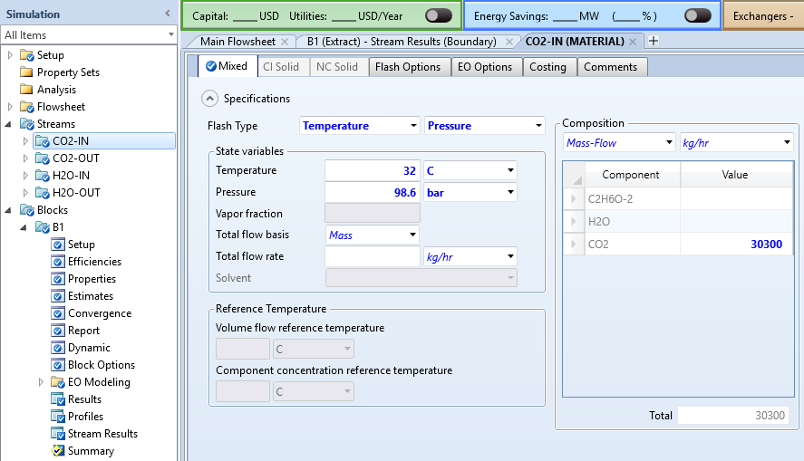 
**圖7-31 修改後 CO₂ 進料條件（30,300 kg/h）**

**切割分率結果（圖 7-32）：**

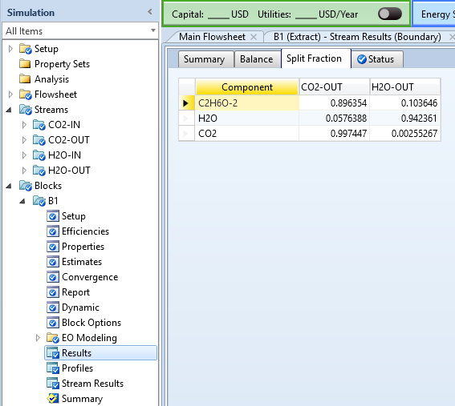 
**圖7-32 各組分切割分率（Split Fraction）**

| 組分 | 進入 CO₂ 出口（CO2-OUT） | 留於水相出口（H2O-OUT） |
|:---|:---:|:---:|
| 乙醇（C₂H₆O-2） | **89.64%** | 10.36% |
| 水（H₂O） | 5.76% | 94.24% |
| CO₂ | 99.74% | 0.26% |

乙醇回收率達 **89.6%** ，與 Kremser 公式預測值（ $\eta \approx 90\%$ ， $N = 5$ ， $E = 1.2$ ）高度吻合，驗證了延伸計算的準確性。與原始低 CO₂ 用量模擬（475 kg/h，乙醇回收僅 1.44%）相比，回收率提升約 **62 倍**。水的損失由原本 <0.07% 升至 5.76%，源於大量 CO₂ 攜帶部分水分進入超臨界相，在工程評估中應一併考量。CO₂ 溶入水相僅 0.26%，損耗依然極低。

**各板組成分布（圖 7-33、圖 7-34）：**

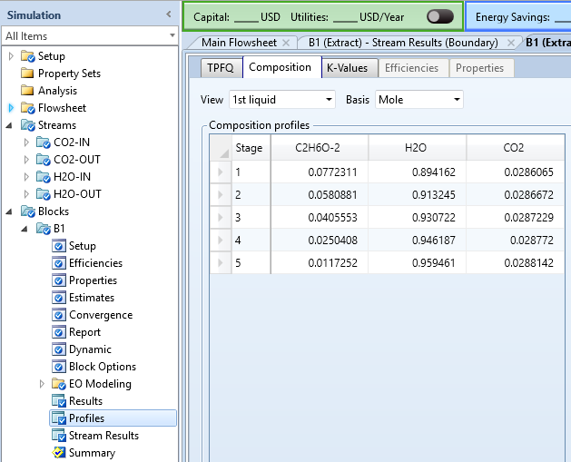 
**圖7-33 第一液相（水相）各板摩爾組成分布**

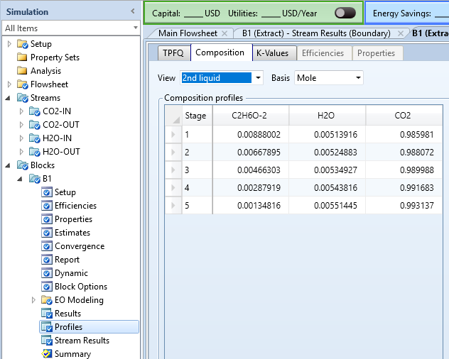 
**圖7-34 第二液相（CO₂ 相）各板摩爾組成分布**

| 板號 | 水相 $x_{\text{EtOH}}$ | 水相 $x_{\text{CO}_2}$ | CO₂ 相 $y_{\text{EtOH}}$ | CO₂ 相 $y_{\text{H}_2\text{O}}$ |
|:---:|:---:|:---:|:---:|:---:|
| 1 | 0.07723 | 0.02861 | 0.008880 | 0.005139 |
| 2 | 0.05809 | 0.02867 | 0.006679 | 0.005249 |
| 3 | 0.04056 | 0.02872 | 0.004663 | 0.005349 |
| 4 | 0.02504 | 0.02877 | 0.002879 | 0.005438 |
| 5 | 0.01173 | 0.02881 | 0.001348 | 0.005514 |

由各板組成分布可得以下觀察：

1. **各板液液平衡驗證**：每塊板兩相組成均滿足 $y_{\text{EtOH}} = KLL \times x_{\text{EtOH}} = 0.115\,x_{\text{EtOH}}$ ，與 KLL 關聯式法的輸入值完全一致（如板 1： $0.00888/0.0772 = 0.115$ ，板 5： $0.00135/0.0117 = 0.115$ ），確認模擬已收斂至逐板平衡。

2. **乙醇濃度梯度明確**：水相 $x_{\text{EtOH}}$ 由板 1 的 0.0772 單調遞減至板 5 的 0.0117，CO₂ 相 $y_{\text{EtOH}}$ 同樣由板 1 的 0.00888 遞減至板 5 的 0.00135，方向一致——CO₂ 相乙醇富集端（板 1）與水相乙醇進料端重合，符合逆流萃取操作的質量傳遞設計原則。

3. **水相 CO₂ 溶解量近乎恆定**：全塔水相 $x_{\text{CO}_2} \approx 0.0287$ ，各板相差不超過 0.001。這反映在 98.6 bar 高壓下 CO₂ 在水中已接近飽和溶解度，且等溫（ $32^{\circ}\mathrm{C}$ ）條件下溶解度不隨板間乙醇組成的變化而顯著改變，因此 CO₂ 在水相中呈現幾乎均勻的溶解背景。

4. **CO₂ 相水含量微幅上升**：CO₂ 相 $y_{\text{H}_2\text{O}}$ 從板 1 的 0.00514 略升至板 5 的 0.00551，增幅約 7%。此現象源於板 5 與高濃度水相進料直接接觸，使少量水被帶入超臨界 CO₂ 相；而板 1 接觸的是已部分脫水的水相，CO₂ 相中水含量相對較低。

5. **與原始模擬（475 kg/h）的全面對比**：

| 指標 | 原始模擬（475 kg/h） | 修改後模擬（30,300 kg/h） |
|:---|:---:|:---:|
| 萃取因子 $E$ | 0.019 | **1.20** |
| 乙醇回收率 | 1.44% | **89.64%** |
| 水損失至 CO₂ 相 | <0.07% | 5.76% |
| CO₂ 溶入水相 | 18.9% | 0.26% |
| 各板 KLL 恆定 | ✓（等溫常數） | ✓（等溫常數） |

原始模擬中大量 CO₂（18.9%）溶入水相，是因 CO₂ 用量遠小於所需，超臨界相"淹沒"在水相中，使相分率失衡。修改為 30,300 kg/h 後，CO₂ 相主導，相平衡回復正常，水相中 CO₂ 溶解降至僅 0.26%。

---

**課程資訊**
- 課程名稱：化工程序模擬 (ChemE 1395)
- 課程單元：Unit 07 吸收與萃取單元模擬
- 課程製作：逢甲大學 化工系 智慧程序系統工程實驗室
- 授課教師：莊曜禎 助理教授
- 更新日期：2026-05-21

**課程授權 [CC BY-NC-SA 4.0]**
- 本教材遵循 [創用CC 姓名標示-非商業性-相同方式分享 4.0 國際 (CC BY-NC-SA 4.0)](https://creativecommons.org/licenses/by-nc-sa/4.0/deed.zh) 授權。

