# Unit07 進階：多級逆流萃取（Multistage Countercurrent Extraction）

---

## 前言：本單元學習指南

### 知識學習重點

本單元為 Unit07 萃取操作的進階延伸，聚焦於**多級逆流萃取（Multistage Countercurrent Extraction, MSCCE）** 的理論分析、設計方法與 Aspen Plus 嚴格模擬。相較於單級萃取，多級逆流操作能以更少的萃取劑用量達到更高的溶質回收率，是工業萃取流程設計的核心技術。

| 知識點 | 說明 |
|:------|:----|
| 萃取操作模式比較 | 單級、錯流多級與逆流多級的效率比較與溶劑消耗分析 |
| 逆流質量平衡與操作線 | 以不變溶劑基準推導操作線，在 $Y$-$X$ 圖上確立操作線端點 |
| 圖解求理論級數 | McCabe-Thiele 逐級階梯法在 $Y$-$X$ 圖上的操作步驟 |
| Kremser 解析公式 | 線性平衡條件下直接計算理論級數的解析方程 |
| 最小萃取劑用量 | 夾緊點條件下 $S'_{\min}$ 的推導與計算 |
| 萃取因子 $E$ | 與吸收因子的對偶關係、可行條件分析 |
| **實驗室常見設備** | 混合澄清槽、離心萃取器、脈衝萃取柱的特性與適用場景 |
| Aspen Plus EXTRACT 模擬 | 多級逆流萃取塔的嚴格模擬設定與結果解讀 |

### 學習路徑建議

```
步驟 1：萃取模式比較（MSCCE.1）
  └─ 釐清單級、錯流多級、逆流多級的流程差異與效率優勢
        ↓
步驟 1.5：實驗室設備與應用場景（MSCCE.1.2）
  └─ 了解混合澄清槽、離心萃取器、脈衝萃取柱的物理原理與適用場景
        ↓
步驟 2：逆流萃取理論（MSCCE.2）
  └─ 操作線推導 → Y-X 圖 → 圖解法 → Kremser 公式的完整分析鏈
        ↓
步驟 3：Aspen Plus 模擬設定（MSCCE.3）
  └─ EXTRACT 模塊設定要點：溫度指定、相態識別、LLE 參數選用
        ↓
步驟 4：教學案例演練（例 MSCCE-1）
  └─ 模擬乙酸乙酯-丙酮-水體系，比較單級、3 級、5 級逆流萃取效果
```

> **與 Unit07 的知識銜接**：本單元直接延伸 Unit07 第 7.2 節（分配係數 KLL、操作線、最小萃取劑用量）及第 7.2.5 節（EXTRACT 模塊設定方法）。建議完成 Unit07 基礎內容後再進入本單元學習。

---

## MSCCE.1 萃取操作模式概述

### MSCCE.1.1 單級萃取的根本限制

**單級萃取（Single-Stage Extraction）**：進料液（Feed）與萃取劑（Solvent）在單一接觸器中充分混合達到液液平衡後，分離為萃余相（Raffinate）與萃取相（Extract）。在熱力學平衡條件下，單級萃取的最高回收率受分配係數 $KLL$ 與溶劑比 $S'/F'$ 的約束：

$$
\eta_{\text{single}} = \frac{E}{1 + E}, \qquad E = \frac{KLL \cdot S'}{F'}
$$

| 萃取因子 $E$ | 單級最高回收率 $\eta_{\text{single}}$ |
|:---:|:---:|
| 0.5 | 33.3% |
| 1.0 | 50.0% |
| 1.5 | 60.0% |
| 2.0 | 66.7% |
| 3.0 | 75.0% |
| 5.0 | 83.3% |

由上表可見，即使加大溶劑用量（ $E \gg 1$ ），單級萃取的理論回收率仍小於 100%。要達到更高的回收率，**必須採用多個接觸級**。

---

### MSCCE.1.2 實驗室常見多級萃取設備與應用場景

在實際操作中，「多個接觸級」可以透過多種方式實現。以下介紹從**實驗室小試規模**到**工業中試規模**的常見設備，以及串聯多級後能解決的核心問題。

#### 實驗室常見設備

**① 分液漏斗串接（Separatory Funnel Train）**

最基礎的多級萃取方式，以多支分液漏斗手動串接：

- **操作方式**：每一支分液漏斗對應一個接觸級，進料相依序流過各漏斗，萃取劑可逆向傳遞（逆流）或每級新鮮加入（錯流）
- **規模**：通常 2～5 級，每次處理量 10～500 mL
- **適用場景**：天然物提取（如植物鹼、天然色素）、藥物合成中間體的初步分離、分析化學中的痕量富集
- **限制**：操作費時、手動誤差大、難以達到嚴格逆流；超過 5 級後耗時顯著增加

**② 混合澄清槽（Mixer-Settler）**

最常見的多級連續萃取設備，每一級由**混合槽（Mixer）**和**澄清槽（Settler）**組成：

```
        ┌─────────┐   ┌─────────┐   ┌─────────┐
Feed →  │ Mixer 1 │→→ │ Mixer 2 │→→ │ Mixer 3 │ → Raffinate
        │         │   │         │   │         │
Solvent │Settler 1│←← │Settler 2│←← │Settler 3│
        └─────────┘   └─────────┘   └─────────┘
         Extract ←          逆流配置
```

- **操作方式**：攪拌槳使兩相充分混合後流入澄清槽靜置分層，萃取相與進料相逆向流過各級
- **規模**：實驗室型（每級 0.1～5 L）至工業型（每級數 m³）均有
- **適用場景**：濕法冶金（銅/鎳/鈷萃取）、核燃料後處理（鈾/釷分離）、藥物中間體連續分離
- **優點**：流程直觀，每級獨立可控；適合高密度差或高黏度體系
- **缺點**：佔地面積大，滯留量大，放大設計較複雜

**③ 脈衝萃取柱（Pulse Extraction Column / Pulsed Column）**

在填料柱中以脈衝（Pulsation）強化兩相接觸：

- **操作方式**：外加脈衝泵使液體上下脈動，增加兩相接觸面積與渦流強度，柱內形成類似多板的分離效果
- **規模**：柱徑 2～30 cm，柱高 0.5～3 m（實驗室到中試）
- **Aspen 對應模型**：可用多板 EXTRACT 模塊模擬，板數由傳質效率（HETP）換算
- **適用場景**：核燃料處理（TBP 萃取鈾）、抗生素提取（青黴素、紅黴素）
- **優點**：連續操作，介面更新快，傳質效率高於混合澄清槽

**④ 離心萃取器（Centrifugal Extractor）**

利用離心力加速兩相混合與分離，大幅縮短相分離時間：

- **操作方式**：進料和溶劑進入高速旋轉的轉鼓，離心力（可達 500 g 以上）快速使兩相分層
- **規模**：每級體積 5 mL～50 L，多台串聯形成多級逆流
- **適用場景**：**熱敏性或易降解物質**（抗生素、生化藥物如胰島素、重組蛋白）的快速萃取；**兩相密度差小**或**形成乳化**的困難分離體系
- **優點**：滯留量極小（秒級），適合不穩定化合物；抗乳化能力強
- **缺點**：設備成本高，維護複雜；規模放大限制多

**⑤ 攪拌盤萃取柱（Rotating Disc Contactor, RDC）**

柱內安裝一系列旋轉圓盤，將柱劃分為多個接觸區間：

- **操作方式**：旋轉圓盤剪切兩相介面，形成微細液滴，增大傳質面積
- **規模**：柱徑 3～50 cm，廣泛用於中試放大驗證
- **適用場景**：有機溶劑萃取廢水中的有機污染物；芳烴精製

#### 串聯多級能解決哪些問題？

**問題 1：分配係數 $KLL$ 接近 1，單級分離因子不足**

當目標溶質的 $KLL \approx 1.0 \sim 2.0$（溶質在兩相分配不偏向任一方），單級萃取無論如何加大溶劑量，回收率上限嚴重受限：

$$\eta_{\text{single, max}} = \frac{KLL \cdot S'/F'}{1 + KLL \cdot S'/F'} < 1$$

多級逆流可突破此限制——即使 $KLL = 1.2$，5 板逆流（ $E = 1.2$ ）已可達 90% 以上回收率。

**問題 2：溶質濃度極低（痕量分析前處理）**

分析化學中，環境水樣、血清、尿液中的目標物濃度可能僅為 ppb～ppt 級。多級逆流萃取可**富集（Preconcentration）**溶質，大幅提高萃取相中的溶質濃度，滿足後續儀器分析的檢測限要求。典型應用：農藥殘留、重金屬、藥物代謝物的痕量預處理。

**問題 3：萃取劑與溶質難以完全分離（高溶劑需求）**

當需要用大量溶劑才能達到目標純度時，多級逆流可在**維持相同溶劑總量**的前提下，顯著提升分離效果（見 MSCCE.1.3 節效率比較），大幅減少後續溶劑回收的能耗。

**問題 4：兩種以上溶質的選擇性分離**

多組分體系中（如天然物中多種生物鹼、廢水中多種酚類），不同溶質具有不同的 $KLL$ 值。多級逆流操作可形成濃度梯度，使 $KLL$ 相差足夠大的組分在不同萃取級富集，實現選擇性分餾（類似精餾的分離原理）。

**問題 5：反應萃取（Reactive Extraction）**

萃取過程中伴隨化學反應（如有機酸的鈉鹽與有機溶劑間的反萃取），反應平衡限制了單級的分離程度。多個接觸級可以逐步推動反應正向進行，提高整體轉化率與分離效率。典型應用：抗生素（青黴素）的 pH 反萃取；金屬絡合物萃取分離。

**各設備與問題對應速查表**：

| 問題類型 | 推薦設備 | 原因 |
|:-------:|:-------:|:----|
| $KLL \approx 1$ 的困難分離 | 混合澄清槽（多級）/ RDC | 可靈活調整級數，逐步累積分離效果 |
| 熱敏性生化物質 | **離心萃取器** | 滯留時間極短（秒級），降低降解風險 |
| 痕量富集（分析前處理） | 分液漏斗串接 / 固相萃取膜（SPE） | 操作靈活，容量可調 |
| 連續工業規模生產 | 混合澄清槽 / 脈衝萃取柱 | 規模放大成熟，操作穩定 |
| 易乳化或密度差小體系 | 離心萃取器 | 離心力強制分離，克服乳化 |
| 核燃料後處理 | 脈衝萃取柱 / 混合澄清槽（防核臨界設計） | 閉合流程，防泄漏要求高 |

> **與 Aspen Plus EXTRACT 模塊的對應**：上述所有設備在 Aspen Plus 中均可用 **EXTRACT 模塊**（設定適當板數 $N$）進行嚴格模擬。實驗室設備的實際板數由**傳質效率（Murphree Efficiency）**決定：實際板數 = 理論板數 / 效率。混合澄清槽的效率通常接近 100%（充分混合後靜置分層），脈衝萃取柱則需由 HETP（等板高度）換算。

---

### MSCCE.1.3 多級萃取操作模式：錯流與逆流

#### 錯流萃取（Cross-flow）

錯流萃取（圖 MSCCE-0a）將總溶劑量 $S'_{\text{total}}$ 均分為 $N$ 份，每一級各用 $s = S'_{\text{total}}/N$ 的**新鮮溶劑**處理上一級的萃余相。每一級的濃度衰減比為：

$$
\frac{X_{R,n}}{X_{R,n-1}} = \frac{1}{1 + KLL \cdot s / F'} = \frac{1}{1 + E/N}
$$

$N$ 級錯流萃取的累計回收率：

$$
\eta_{\text{cross}} = 1 - \left(\frac{N}{N + E}\right)^N
$$

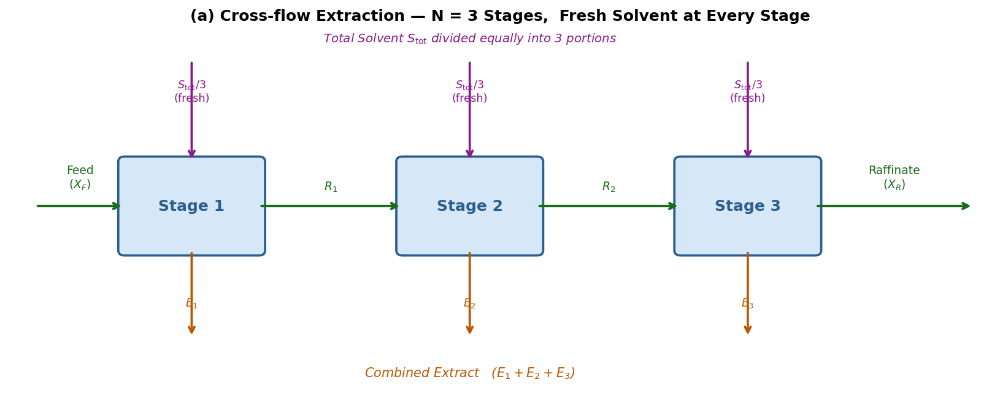 <br>**圖 MSCCE-0a 錯流萃取（Cross-flow）流程示意圖： $N=3$ 級，每級各用一份新鮮溶劑**

#### 逆流萃取（Countercurrent）

逆流萃取（圖 MSCCE-0b）中，進料液與萃取劑**流向相反**——進料液由第 $1$ 板（塔頂）進入，萃取劑由第 $N$ 板（塔底）進入，兩相逐級逆流接觸，溶質持續從進料相轉移至萃取相。同一批溶劑通過全部 $N$ 個接觸級，不像錯流那樣每級均需新鮮溶劑。

對 $N$ 級逆流萃取（稀溶液線性平衡 $Y^* = m X$ ，純溶劑進塔 $Y_S = 0$ ），由 Kremser 公式可推導出回收率：

$$
\eta_{\text{counter}} = \frac{E(E^N - 1)}{E^{N+1} - 1}, \qquad E \neq 1
$$

$$
\eta_{\text{counter}} = \frac{N}{N + 1}, \qquad E = 1
$$

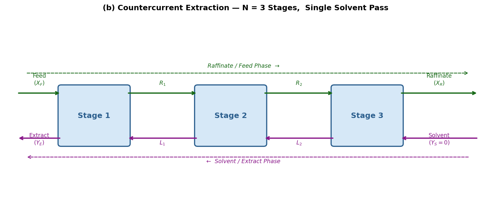 <br>**圖 MSCCE-0b 逆流萃取（Countercurrent）流程示意圖： $N=3$ 級，同一批溶劑逆向流過全塔**

---

### MSCCE.1.4 三種操作模式的效率比較

以 $N = 3$ 級、相同萃取因子 $E = 1.5$ （即相同總溶劑用量）為例：

| 操作模式 | 溶劑分配方式 | 計算公式 | 回收率 $\eta$ |
|:-------:|:-----------:|:-------:|:------------:|
| 單級（ $N=1$ ） | 全部溶劑一次使用 | $E/(1+E)$ | **60.0%** |
| 3 級錯流 | 每級各用 $E/3=0.5$ 份新鮮溶劑 | $1-(3/4.5)^3$ | **70.4%** |
| 3 級逆流 | 同一批溶劑流過全部 3 級 | $E(E^3-1)/(E^4-1)$ | **87.7%** |

> **結論**：相同溶劑用量下，逆流萃取（87.7%）顯著優於錯流萃取（70.4%）與單級萃取（60.0%）。逆流操作使新鮮溶劑與溶質濃度最低的萃余相接觸，維持全塔最大的傳質推動力，是大規模工業連續萃取的首選操作方式。

| 比較項目 | 錯流萃取 | 逆流萃取 |
|:-------:|:-------:|:-------:|
| 溶劑總用量（同回收率目標） | 高 | 低 |
| 萃取效率（同 $N$ 、同 $S$ 條件） | 中等 | 最高 |
| 操作連續性 | 批次或串聯連續 | 連續（首選） |
| 工業適用性 | 小規模、實驗室 | **大規模工業操作** |

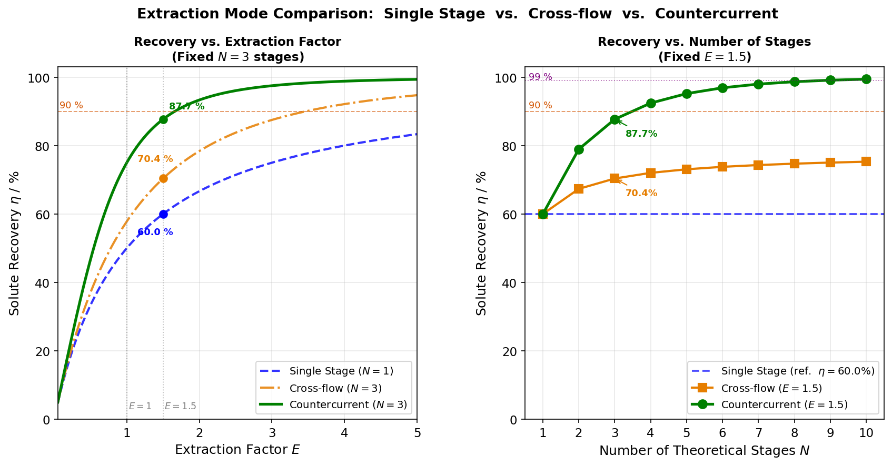 <br>**圖 MSCCE-0c 三種萃取操作模式回收率比較（左：固定 $N=3$ 、變化 $E$ ；右：固定 $E=1.5$ 、變化 $N$ ）**

---

## MSCCE.2 多級逆流萃取理論基礎

### MSCCE.2.1 系統定義與符號規範

逆流萃取塔板號由頂至底編號為第 $1$ 至第 $N$ 板，各流股定義如下：

| 流股 | 符號 | 位置 | 說明 |
|:---:|:---:|:----:|:----|
| 進料液（Feed） | $X_F$ | 第 1 板（進料端） | 含溶質的進料相（稀釋劑 + 溶質） |
| 萃余相出口（Raffinate） | $X_R$ | 第 $N$ 板（溶劑端） | 脱除溶質後的進料相出口 |
| 萃取劑（Solvent） | $Y_S$ | 第 $N$ 板（溶劑端） | 進塔溶劑（純溶劑時 $Y_S = 0$ ） |
| 萃取相出口（Extract） | $Y_E$ | 第 1 板（進料端） | 富溶質的萃取相出口 |

> **「板 1」與「板 $N$」的數學案例與物理對應**：上表中的「板 1（進料端）」與「板 $N$（溶劑端）」是用於推導操作線方程的數學編號**案例**（以進料相 $X_F$ 進入端為板 1），**不代表物理塔頂或塔底**。實際萃取塔中哪一端是「板 1」取決於兩相的密度大小：
>
> - 若進料相（$X$-相）為重相（密度大）→ 她從塔頂進入向下流 → 物理塔頂 = 板 1 ✓
> - 若進料相（$X$-相）為輕相（密度小）→ 她從塔底進入向上流 → 物理塔底 = 板 1（與塔底的 Aspen 板號 $N$ 對應）
>
> **實例對照**：
>
> | 體系 | $X$-相（進料相） | $Y$-相（溶劑相） | $X$-相物理進入位置 | Aspen 板 1 對應 |
> |:---:|:---:|:---:|:---:|:---:|
> | 以水為稀釋劑（举例） | 水相（重） | 有機溶劑（輕） | 塔頂（向下流） | 塔頂 |
> | 以水為萃取劑（例 MSCCE-1） | 有機相（輕） | 水相（重） | 塔底（向上流） | **塔底** |
>
> 因此，使用 Aspen EXTRACT 模擬時需根據密度確認進出料板號，而非简單套用「進料在板 1」的通用規則。

各流股以**不含溶質的惰性基準摩爾比**表示濃度：

$$
X_n = \frac{x_{A,n}^{\mathrm{I}}}{1 - x_{A,n}^{\mathrm{I}}}, \qquad Y_n = \frac{x_{A,n}^{\mathrm{II}}}{1 - x_{A,n}^{\mathrm{II}}}
$$

- $X_n$ ：第 $n$ 板萃余相（第一液相，稀釋劑相）中溶質摩爾比（mol 溶質 / mol 純稀釋劑）
- $Y_n$ ：第 $n$ 板萃取相（第二液相，萃取劑相）中溶質摩爾比（mol 溶質 / mol 純萃取劑）
- $F'$ ：純稀釋劑摩爾流量（kmol/h，全塔各截面恆定）
- $S'$ ：純萃取劑摩爾流量（kmol/h，全塔各截面恆定）

> **為何採用摩爾比而非摩爾分率？**
>
> 由於溶質在板間持續轉移，各截面的稀釋劑相與萃取劑相**總流量**沿塔高變化。以純稀釋劑流量 $F'$ 與純萃取劑流量 $S'$ 為「不變基準」定義摩爾比，可使整塔質量平衡方程中 $F'$ 與 $S'$ 保持恆定，從而使操作線在 $Y$-$X$ 圖上嚴格成直線，便於圖解求板數。

---

### MSCCE.2.2 整塔質量平衡

對全塔溶質作質量衡算（進 = 出）：

$$
F'(X_F - X_R) = S'(Y_E - Y_S)
$$

整理得**溶劑比**（萃取劑流量與進料流量之比）：

$$
\frac{S'}{F'} = \frac{X_F - X_R}{Y_E - Y_S}
$$

此式表明：端點 $( X_R,\, Y_S )$ 與端點 $( X_F,\, Y_E )$ 必定共線，且斜率等於 $F'/S'$ ——這正是操作線的幾何定義。

---

### MSCCE.2.3 截面質量平衡與操作線方程

對**進料端（第 1 板）到第 $n$ 板之間**的控制體積作溶質質量平衡：

$$
F' X_F + S' Y_{n+1} = F' X_n + S' Y_E
$$

整理為**操作線方程**：

$$
Y_{n+1} = \frac{F'}{S'}\,X_n + \left(Y_E - \frac{F'}{S'}\,X_F\right)
$$

此方程在 $Y$-$X$ 座標圖（縱軸 $Y$ 為萃取相溶質摩爾比，橫軸 $X$ 為萃余相溶質摩爾比）中為一條**直線**，稱為**操作線（Operating Line）**：

- **斜率**： $F'/S'$ （稀釋劑流量與萃取劑流量之比）
- **端點**： $( X_F,\, Y_E )$ （進料端）與 $( X_R,\, Y_S )$ （溶劑端）

> **符號辨析**：操作線方程中 $Y_{n+1}$ 為第 $n$ 板與第 $n+1$ 板之間的**萃取相流股濃度**（在標準逆流設定下，為從第 $n+1$ 板向上流入第 $n$ 板的萃取相濃度）；$X_n$ 為離開第 $n$ 板流向第 $n+1$ 板的**萃余相流股濃度**（萃余相由第 1 板向第 $N$ 板流動）。**操作線**連接相鄰兩板**之間**互相傳遞的兩流股 $( X_n,\ Y_{n+1} )$ 之組成；**平衡線**連接**同一板**兩相達到熱力學平衡時的組成——理解此區別是正確進行圖解求板數的基礎。

---

### MSCCE.2.4 Y-X 操作圖的物理意義

$Y$-$X$ 操作圖由兩條核心曲線構成：

**① 平衡線（Equilibrium Curve）**

描述在固定溫度與壓力下，各板兩液相間溶質的熱力學分配關係。

- 稀溶液線性平衡： $Y^* = m X$ （ $m = KLL$ ），過原點直線
- 濃溶液非線性平衡：由實驗 LLE 數據擬合的曲線

**② 操作線（Operating Line）**

斜率為 $F'/S'$ 的直線，端點為 $( X_R,\, Y_S )$ 和 $( X_F,\, Y_E )$ 。

**操作線相對平衡線的位置（判斷傳質方向）**

| 操作類型 | 操作線與平衡線相對位置 | 傳質推動力方向 |
|:-------:|:-------------------:|:------------:|
| **萃取** | 操作線在**平衡線下方** | 萃余相 $X > X^*$ ，溶質由萃余相轉入萃取相 |
| 吸收 | 操作線在**平衡線上方** | 氣相 $Y > Y^*$ ，溶質由氣相轉入液相 |

萃取操作線必須位於平衡線**下方**，確保每一板的萃余相溶質濃度 $X_n$ 高於與萃取相 $Y_n$ 相平衡的理論值 $X_n^*$ ，驅動溶質持續由萃余相向萃取相傳遞。

**不同溶劑比下操作線的位置與影響**

| 溶劑量 | 操作線斜率 $F'/S'$ | 推動力 | 所需理論板數 |
|:------:|:------------------:|:-----:|:-----------:|
| $S' \to \infty$ | $\to 0$ （趨近水平） | 最大 | 趨近 0 |
| $S' = 1.5\,S'_{\min}$ | 適中（工程推薦） | 合理 | 有限 |
| $S' = S'_{\min}$ | 最大，操作線切觸平衡線 | $\to 0$ | $\to \infty$ |

---

### MSCCE.2.5 圖解求理論級數——McCabe-Thiele 逐板法

在 $Y$-$X$ 圖上，由操作線與平衡線逐步「階梯」推進，每完成一個完整的**水平→垂直**步驟即代表一個理論板。操作步驟如下：

**（1）在 $Y$-$X$ 圖上繪出平衡線與操作線**
- 平衡線： $Y^* = m X$ （稀溶液），或由 LLE 實驗數據繪製非線性曲線
- 操作線：由兩端點 $( X_R,\, Y_S )$ 與 $( X_F,\, Y_E )$ 連線

**（2）從進料端起始（第 1 板，塔頂）**

以點 $( X_F,\, Y_E )$ 為出發點（操作線的進料端）。

**（3）水平向左射至平衡線（模擬板上達到相平衡）**

從 $( X_F,\, Y_E )$ 水平向左（固定 $Y = Y_E$ ），交平衡線於點 $( X_1,\, Y_E )$ ，其中 $X_1 = Y_E / m$ ，即第 1 板達到液液平衡時萃余相的溶質摩爾比。此點即為第 1 板的**理論平衡點**，位於平衡線上。

> **為何向左而非向下？** 萃取操作線位於平衡線**下方**（ $Y_E < m X_F$ ），從操作線上的點（ $X_F,\ Y_E$ ）向左保持 $Y$ 不變，才能到達平衡曲線；若向下則遠離平衡線，方向錯誤。

**（4）垂直向下射回操作線（跨過板間界面）**

從平衡點 $( X_1,\, Y_E )$ 垂直向下（固定 $X = X_1$ ），交操作線於 $( X_1,\, Y_2 )$ ，此點代表第 1 板與第 2 板之間**相互傳遞的物流組成**（萃余相 $X_1$ 與從第 2 板上升的萃取相 $Y_2$ 的交叉點）。

**（5）重複步驟（3）-（4），繼續逐板向左推進**

每一個完整「水平→垂直」階梯代表一個理論板，重複直至橫坐標降至目標值 $X_R$ 或以下。完整的逐板路徑如圖 MSCCE-YX 所示。

**（6）計算理論板數**

所完成的完整階梯總數即為所需理論板數 $N$ 。

> **萃取與吸收圖解方向的差異**
>
> | 操作 | 操作線位置 | 第一步 | 第二步 | 推進方向 |
> |:---:|:---:|:---:|:---:|:---:|
> | **萃取** | 平衡線**下方** | 水平向左至平衡線 | 垂直向下至操作線 | 右→左（ $X_F$ → $X_R$ ） |
> | **吸收** | 平衡線**上方** | 垂直向下至平衡線 | 水平向右至操作線 | 左→右（ $Y_1$ → $Y_{N+1}$ ） |
>
> 根本原因：萃取中平衡線在操作線**上方**，保持 $Y$ 不變（水平步）才能向左到達平衡曲線；吸收中平衡線在操作線**下方**，保持 $X$ 不變（垂直步）才能向下到達平衡曲線。

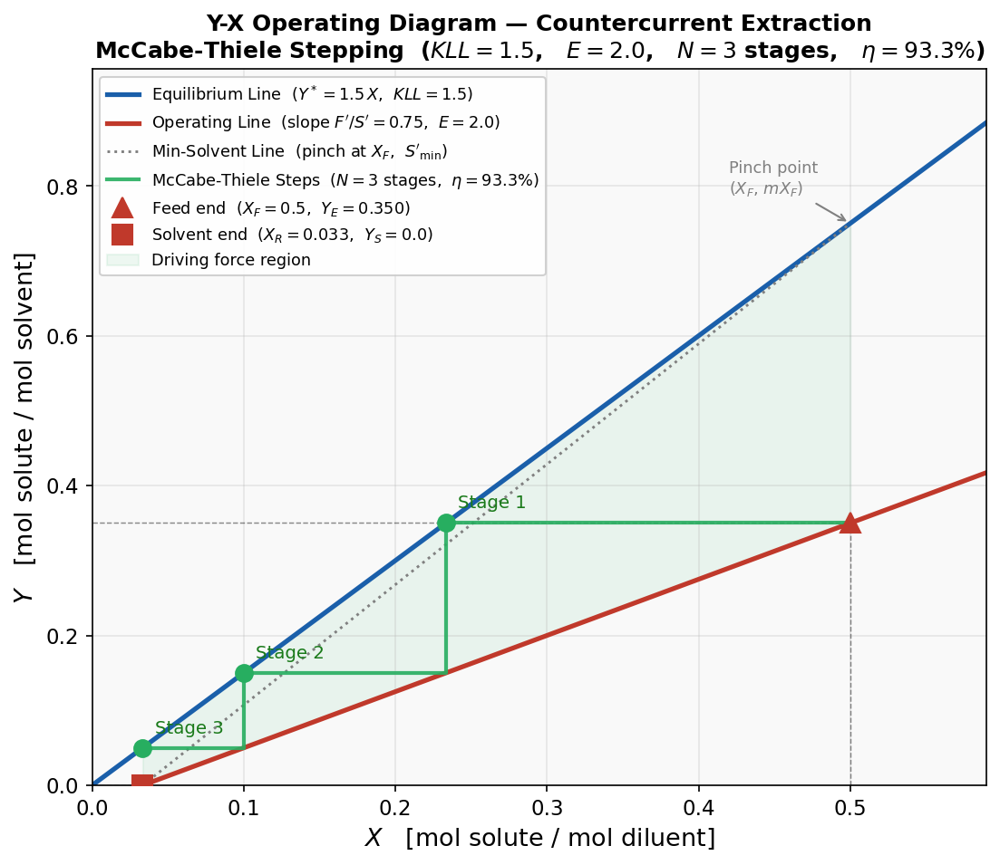 <br>**圖 MSCCE-YX Y-X 操作圖：McCabe-Thiele 逐板階梯法（ $KLL=1.5$ ， $E=2.0$ ， $N=3$ ，綠色陰影為傳質驅動力區域）**

---

### MSCCE.2.6 最小萃取劑用量 $S'_{\min}$

降低溶劑用量（減小 $S'$ ）時，操作線斜率 $F'/S'$ 增大，操作線向平衡線靠近。當操作線碰觸平衡線，出現**夾緊點（Pinch Point）**，傳質推動力為零，所需理論板數趨近無窮大，此時溶劑用量即為最小萃取劑用量 $S'_{\min}$ 。

對**稀溶液線性平衡**（ $Y^* = m X$ ），夾緊點發生在進料端（第 1 板），此時進料液濃度 $X_F$ 與萃取相出口濃度達到平衡：

$$
Y_E^* = m \cdot X_F
$$

代入整塔質量平衡，得**最小萃取劑用量公式**（式 MSCCE-1）：

$$
S'_{\min} = \frac{F'(X_F - X_R)}{m\,X_F - Y_S}
$$

對**純溶劑進塔**（ $Y_S = 0$ ）且稀溶液近似（ $X \approx x$ ），式 (MSCCE-1) 化簡為：

$$
S'_{\min} = \frac{F'\,\eta}{m}
$$

式中 $\eta = (X_F - X_R)/X_F$ 為溶質萃取回收率。

| 符號 | 說明 |
|:---:|:----|
| $S'_{\min}$ | 最小純萃取劑摩爾流量（kmol/h） |
| $F'$ | 純稀釋劑摩爾流量（kmol/h） |
| $X_F$ | 進料液溶質摩爾比 |
| $X_R$ | 目標萃余相溶質摩爾比（設計目標） |
| $m = KLL$ | 液液分配係數 |
| $Y_S$ | 進口萃取劑溶質摩爾比（純溶劑時 $Y_S = 0$ ） |

**工程設計建議**：實際操作溶劑量取 $S' = 1.5 \sim 2.0\,S'_{\min}$ ，以確保操作線與平衡線之間維持足夠的傳質推動力，同時避免因過多溶劑增加再生能耗。

> **與吸收最小溶劑公式的對稱性**
>
> | 操作 | 最小溶劑公式 | 平衡常數意義 |
> |:---:|:----------:|:-----------|
> | 吸收 | $L_{\min} = G\,K\,\eta$ | $K$ 越大（越難溶入液相），需越多吸收劑 |
> | 萃取 | $S'_{\min} = F'\,\eta / m$ | $m = KLL$ 越小（溶質越傾向留在稀釋劑相），需越多萃取劑 |
>
> 兩式在結構上完全對稱，揭示了吸收與萃取在傳質理論框架上的深層等價性。

---

### MSCCE.2.7 萃取因子與 Kremser 解析公式

#### 萃取因子（Extraction Factor）

對稀溶液線性平衡，定義**萃取因子** $E$ ：

$$
E = \frac{m \cdot S'}{F'}
$$

$E$ 的物理意義與吸收因子 $A = L/(KV)$ 完全對偶——吸收中 $K$ 描述溶質脫離液相的傾向，萃取中 $m = KLL$ 描述溶質進入萃取相的傾向。

| $E$ 值 | 物理意義 | 分離可行性 |
|:------:|:-------:|:--------:|
| $E > 1$ | 溶劑充足，溶質傾向萃取相 | 可達任意指定回收率 |
| $E = 1$ | 操作線與平衡線平行，無夾緊點 | 仍可分離，但需更多級數 |
| $E < 1$ | 溶劑不足，溶質傾向留在稀釋劑相 | 回收率上限有限，級數再多也無法突破 |

**工程設計建議**：取 $E = 1.4 \sim 2.0$ ，兼顧萃取劑用量（操作費）與板數（設備費）的最佳平衡。

#### Kremser 解析公式

在**稀溶液**且**平衡線性**（ $Y^* = m X$ ，即 $KLL$ 為常數）的條件下，逆流萃取塔所需的理論板數 $N$ 可由 **Kremser 公式**直接解析計算：

$$
N = \frac{\ln\!\left[\dfrac{X_F - Y_S/m}{X_R - Y_S/m}\!\left(1 - \dfrac{1}{E}\right) + \dfrac{1}{E}\right]}{\ln E}
$$

| $E$ 範圍 | 理論板數 $N$ | 數學解析 |
|:-------:|:-----------:|:-------:|
| $E \to \infty$ | $\to 0$ | 分母 $\ln E \to \infty$ ，分子趨有限值 |
| $E = 1$ | 有限值 $N = q - 1$ （ $q = X_F/X_R$ ） | 0/0 型，L'Hôpital 求極限 |
| $E = E_{\min} = \eta$ | $\to \infty$ | 對數內值 $\to 0$ （夾緊點條件） |
| $E < E_{\min}$ | 無實數解 | 指定回收率不可達 |

**純溶劑進塔（ $Y_S = 0$ ）時的回收率公式**（由 Kremser 推導）：

$$
\eta_{\text{counter}} = \frac{E(E^N - 1)}{E^{N+1} - 1}, \qquad E \neq 1
$$

**數值驗算（ $E = 1.5$ ， $N = 3$ ）：**

- 逆流： $\eta = 1.5 \times (1.5^3-1)/(1.5^4-1) = 1.5 \times 2.375/4.0625 \approx 87.7\%$ ✓
- 錯流： $\eta = 1 - (3/4.5)^3 = 1 - (2/3)^3 \approx 70.4\%$ ✓
- 單級： $\eta = 1.5/2.5 = 60.0\%$ ✓

---

## MSCCE.3 Aspen Plus 多級逆流萃取模擬

### MSCCE.3.1 EXTRACT 模塊操作原理回顧

Aspen Plus EXTRACT 模塊以**逐板 MES 方程組**（質量平衡 M、相平衡 E、加和 S）為核心，省略能量方程（近似等溫操作）。詳細原理見 Unit07 第 7.2.5 節。

多級逆流萃取模擬的關鍵設定要點彙整如下：

| 設定項目 | 說明 |
|:-------:|:----|
| 理論板數 | 由 Kremser 公式預估，再以嚴格計算驗證 |
| 熱選項 | 勾選「指定溫度分布」，輸入第 1 板溫度（等溫操作） |
| 關鍵組分 | 第一液相（重相）與第二液相（輕相）各指定一個代表組分 |
| 進出料位置與相態 | 重相（Phase I）從板 $1$ 進入（塔頂，重力向下流出板 $N$）、輕相（Phase II）從板 $N$ 進入（塔底，浮力向上流出板 $1$）（逆流配置） |
| KLL 計算方式 | NRTL 活度係數模型（由熱力學計算 KLL）或 KLL 關聯式（直接輸入 $a_i$ ） |

**逆流進出料方向的物理對應（關鍵）**

在 Aspen EXTRACT 中，板號 $1$ 在頂端、板號 $N$ 在底端。實際設備中密度較大的相（重相）從塔頂往下流，密度較小的相（輕相）從塔底往上流，形成逆流接觸。對應 Aspen 設定：

| 物流類型 | 密度相對大小 | 板號（Aspen Stage） | 液相歸屬 |
|:---:|:-------:|:------------:|:-------:|
| 重相（Phase I）進料 | 大（重力向下流） | **第 1 板**（塔頂） | Phase I |
| 重相（Phase I）出料 | 大 | 第 $N$ 板（塔底） | Phase I |
| 輕相（Phase II）進料 | 小（浮力向上流） | **第 $N$ 板**（塔底） | Phase II |
| 輕相（Phase II）出料 | 小 | 第 1 板（塔頂） | Phase II |

> **重相對應 Phase I，輕相對應 Phase II**。對於任一新體系，設定前請先查明兩相的密度小大，确定哪一為進料（Feed）、哪一為萃取劑（Solvent），再依對應密度指定板號。
>
> **常見體系板號對應範例**：
>
> | 體系 | 重相（Phase I） | 輕相（Phase II） | 註釋 |
> |:---:|:---:|:---:|:---:|
> | EA–丙酮–水（MSCCE-1） | 水（萃取劑，重） | 有機 EA（進料，輕） | SOLVENT(H2O)→板 1；FEED(EA)→板 $N$ |
> | 廢水–璘酸–MIBK（Unit07 例 7-3） | 水（進料，重） | MIBK（萃取劑，輕） | FEED(H2O)→板 1；SOLVENT(MIBK)→板 $N$ |
> | scCO2–水–乙醇（Unit07 例 7-2） | 水（進料，重） | CO2（萃取劑，輕） | FEED(H2O)→板 1；SOLVENT(CO2)→板 $N$ |

> **密度決定相態歸屬**：輕相（密度小）通常為第二液相（Phase II），從塔底（第 $N$ 板）進入並從塔頂（第 $1$ 板）流出；重相（密度大）為第一液相（Phase I），從塔頂（第 $1$ 板）進入並從塔底（第 $N$ 板）流出。實際進出料方向需根據具體體系的兩相密度確認。

---

### MSCCE.3.2 NRTL 物性方法與 LLE 參數選用

多級逆流萃取需要可靠的液液相平衡（LLE）描述。Aspen Plus 中 NRTL 模型的二元交互作用參數選用優先順序：

| 優先順序 | 來源 | Aspen 標記 | 適用條件 |
|:---:|:---|:---:|:---|
| ① 最優先 | LLE 實驗回歸 | `APV150 LLE-ASPEN` | 液液相分裂體系，精度最高 |
| ② 替代 | UNIFAC-LL 基團貢獻估算 | R-PCES（勾選「使用 UNIFAC 估算」） | LLE 數據缺失時 |
| ③ 備用 | VLE 實驗回歸 | `APV150 VLE-IG` | 完全互溶組分對，精度最低 |

> **LLE vs VLE 參數注意事項**：LLE 回歸參數與 VLE 回歸參數數值往往差異顯著。以 VLE 參數計算 LLE 時，可能低估兩相的不互溶程度，導致 Aspen 無法找到雙液相共存解，模擬失敗或結果嚴重失真。務必以 LLE 參數為優先。

---

### MSCCE.3.3 多級逆流萃取 Aspen Plus 設定流程

| 步驟 | 操作位置 | 設定內容 |
|:---:|:-------:|:-------|
| 1 | 組分 \| 規定 | 輸入所有組分（稀釋劑、溶質、萃取劑） |
| 2 | 物性 \| 規定 | 選擇 NRTL，確認 LLE 二元交互參數 |
| 3 | 流程圖 | 放置 EXTRACT 模塊，連接進出料流股 |
| 4 | 流股 | 設定各流股溫度、壓力、組成、流量 |
| 5 | 模塊 \| 規定 | 設定理論板數、指定溫度分布 |
| 6 | 模塊 \| 關鍵組分 | 指定 Phase I 與 Phase II 的關鍵組分 |
| 7 | 模塊 \| 壓力 | 設定第 1 板操作壓力 |
| 8 | 模塊 \| 估算（可選） | 輸入第 1 板初始溫度估計值，輔助收斂 |
| 9 | 執行並查看結果 | 切割分率、各板組成分布、KLL 值分布 |

---

## 【例 MSCCE-1】水萃取丙酮——乙酸乙酯-丙酮-水體系多級逆流萃取

> **本教學案例參考自影片**：KG Engineering Solutions, *"Aspen Plus: Liquid Liquid Extraction; Single Stage; Multi Stage; Countercurrent"*，YouTube，https://www.youtube.com/watch?v=rZJ2B1AOUk4

---

### 題目描述

**背景**：含有乙酸乙酯（Ethyl Acetate, EA）與丙酮（Acetone）的混合料流（EA 70 wt%，丙酮 30 wt%）需要提高 EA 純度。由於 EA（沸點 77.1°C）與丙酮（沸點 56.1°C）沸點相近，精餾分離尚可，但丙酮對水的親和力極強（與水完全互溶）。以水萃取的方式選擇性地將丙酮轉移至水相，是一種高效且節能的 EA 濃縮方法。

**題目**：進料流量 100 kg/h（EA 70 wt%，丙酮 30 wt%），以純水（100 kg/h）作萃取劑，操作條件 25°C、1 atm。利用 Aspen Plus 比較以下三種方案的萃取效果：

- **方案 A**：單級萃取（1 個理論板）
- **方案 B**：3 級逆流萃取
- **方案 C**：5 級逆流萃取

**求**：各方案下丙酮進入水相（萃取相）的切割分率，以及有機萃余相的丙酮質量分率。

**物性方法**：NRTL，優先選用 LLE 二元交互作用參數。

---

### 組分特性說明

**表 MSCCE-1 組分清單**

| 組分 ID | 組分名稱 | 化學式 | CAS 號 | 密度（25°C）/ g·mL⁻¹ |
|:-------:|:-------:|:------:|:------:|:-------------------:|
| ETAC | Ethyl-Acetate | C₄H₈O₂ | 141-78-6 | 0.894 |
| ACETONE | Acetone | C₃H₆O-1 | 67-64-1 | 0.791 |
| WATER | Water | H₂O | 7732-18-5 | 0.997 |

**液液相平衡特性**

| 組分對 | 互溶性 | 說明 |
|:------:|:------:|:----|
| EA – Water | **部分互溶** | 25°C 下 EA 在水中溶解度 ≈ 8.7 g/100mL；水在 EA 中 ≈ 3.3 wt%。**LLE 數據可用** |
| Acetone – Water | **完全互溶** | 無液液相分裂，VLE 數據描述全濃度段 |
| EA – Acetone | **完全互溶** | VLE 數據 |

> **溶質（丙酮）的分配方向**：丙酮在水相與 EA 相之間的分配係數 $KLL_{\text{Acetone}} = x_{\text{Acetone}}^{\text{water}} / x_{\text{Acetone}}^{\text{EA}} > 1$ ，丙酮優先分配至水相，因此水萃取可有效將丙酮從有機 EA 相帶走，使 EA 相得到濃縮提純。

---

### 設計前分析：萃取因子預估

根據 NRTL-LLE 計算，在 25°C 稀溶液近似條件下，丙酮的液液分配係數 $KLL_{\text{Acetone}} \approx 1.15 \sim 1.3$ （需由 Aspen 嚴格計算確認具體值）。

以有機 EA 相中的純 EA 流量為 $F'$ 基準，以水流量為 $S'$ 基準：

$$
F' \approx \frac{70\,\text{kg/h}}{88\,\text{g/mol}} \approx 0.795\,\text{kmol/h}, \qquad S' = \frac{100\,\text{kg/h}}{18\,\text{g/mol}} \approx 5.56\,\text{kmol/h}
$$

取 $KLL_{\text{Acetone}} \approx 1.2$ 估算萃取因子：

$$
E = KLL_{\text{Acetone}} \times \frac{S'}{F'} \approx 1.2 \times \frac{5.56}{0.795} \approx 8.4
$$

$E \approx 8.4 \gg 1$ ，萃取驅動力強。由回收率公式預估各方案表現：

**表 MSCCE-2 各方案回收率預估（線性平衡假設）**

| 方案 | 板數 $N$ | $E = 8.4$ 回收率公式 | 預估丙酮回收率 |
|:---:|:-------:|:-------------------:|:------------:|
| A | 1 | $E/(1+E)$ | ≈ 89.4% |
| B | 3 | $E(E^3-1)/(E^4-1)$ | ≈ 99.9% |
| C | 5 | $E(E^5-1)/(E^6-1)$ | > 99.99% |

預估顯示：本體系溶劑比充裕（ $E \approx 8.4$ ），即使單級萃取已有約 89% 回收率；多級操作可進一步接近完全萃取。**注意**：以上為線性平衡近似值，嚴格非線性 NRTL 計算結果見模擬結果小節。

---

### Aspen Plus 模擬步驟

本案例依照影片（KG Engineering Solutions）的教學邏輯，從最基礎的單一接觸器出發，逐步演進至嚴格逐板計算模型，共四種方案依序進行模擬與比較。**所有方案共用相同的組分設定與物性方法**，差異僅在流程圖的萃取配置。

---

#### 共同前置設定（組分輸入與物性方法）

用公制單位通用模板新建文件，組分與物性方法設定如下（詳細步驟見圖 MSCCE-1 ～ 圖 MSCCE-3）：

| 設定項目 | 說明 |
|:-------:|:----|
| 組分 | ETAC（C4H8O2）、ACETONE（C3H6O-1）、WATER（H2O） |
| 物性方法 | NRTL，ETAC-WATER 使用 `APV150 LLE-ASPEN` 參數 |
| 進料流股 FEED | 25°C，1.2 bar，100 kg/h，ETAC 70 wt%，ACETONE 30 wt% |
| 溶劑流股 WATER | 25°C，1.2 bar，100 kg/h，H₂O 100% |

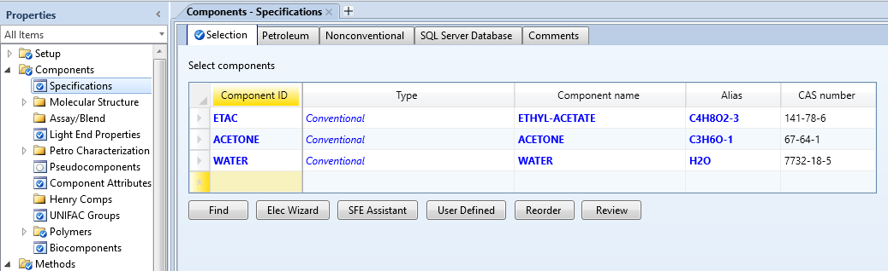 <br>**圖 MSCCE-1 輸入組分（ETAC、ACETONE、WATER）**

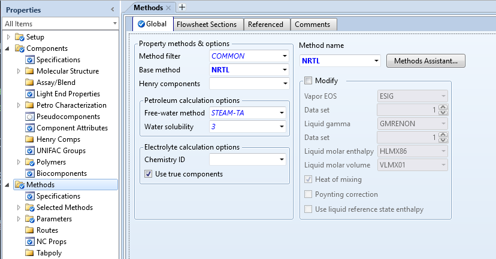 <br>**圖 MSCCE-2 選擇 NRTL 物性方法**

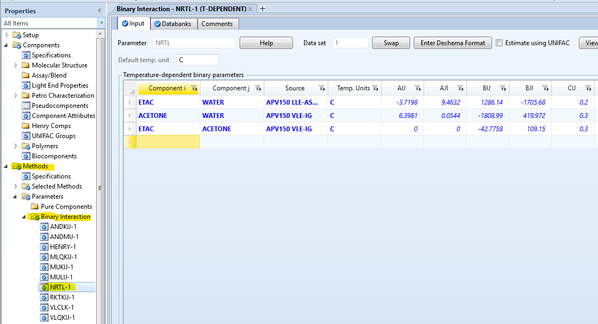 <br>**圖 MSCCE-3 NRTL 二元交互作用參數（ETAC-WATER 應顯示 LLE-ASPEN 來源）**

---

#### 方案一：單一 Decanter（單級萃取）

**Decanter 模塊說明**：位於模型庫「分離器（Separators）」選項卡。Decanter 執行嚴格的**兩相液液閃蒸（LLLE Flash）**，直接由 NRTL 熱力學計算確定兩相分配，不需額外指定 KLL 值。頂端出口為輕相（有機相，密度小），底端出口為重相（水相，密度大）。

**流程配置**：

```
FEED(有機) ─┐
            ├──→ [D1 Decanter] ──→ RAFF_1  (頂端，有機輕相)
WATER      ─┘                  └──→ EXTR_1 (底端，水重相)
```

**操作步驟**：

1. 從「Separators」拖入 **Decanter** 模塊，命名為 D1
2. 連接 FEED 和 WATER 作為兩個進料流股（Decanter 支援多進料直接混合後閃蒸）
3. 設定 D1 的操作條件：
   - 溫度：**25°C**；壓力：**1.01325 bar**（1 atm）
   - 有效相態（Valid Phases）：**Liquid-Liquid**
4. 在「關鍵組分（Key Components）」頁面指定相態辨識：
   - 第一液相（底端重相）：**WATER**
   - 第二液相（頂端輕相）：**ETAC**
5. 進料流股 FEED S1設定 為 25°C、1.2 bar、100 kg/h，組成 ETAC 70 wt%、ACETONE 30 wt%；WATER S2設定為 25°C、1.2 bar、100 kg/h，純水 100 wt%
6. 執行模擬，查看 RAFF_1（S3有機相）與 EXTR_1（S4水相）中丙酮的質量分率

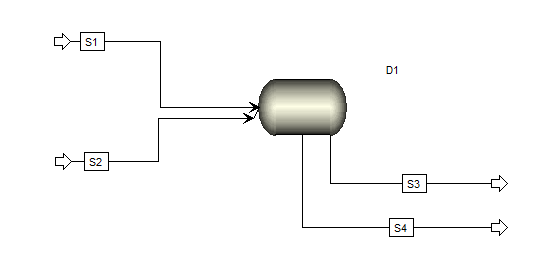 <br>**圖 MSCCE-D1 方案一：單一 Decanter 流程圖**
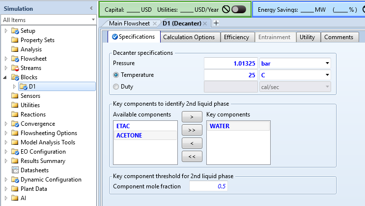 <br>**操作條件設定**
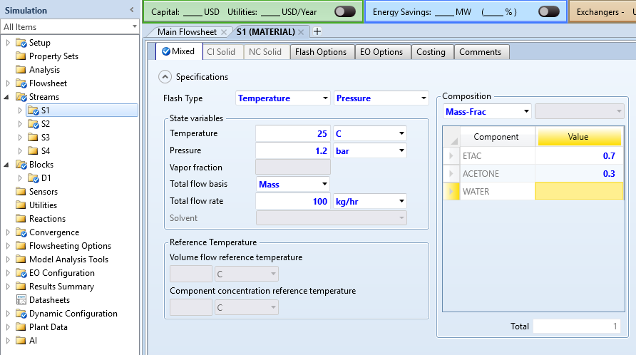 <br>**S1進料流股設定**
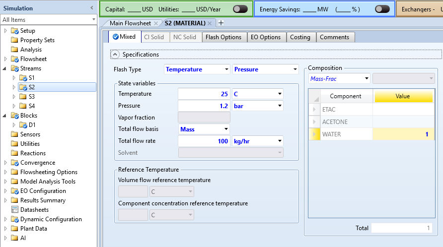 <br>**S2進料流股設定**
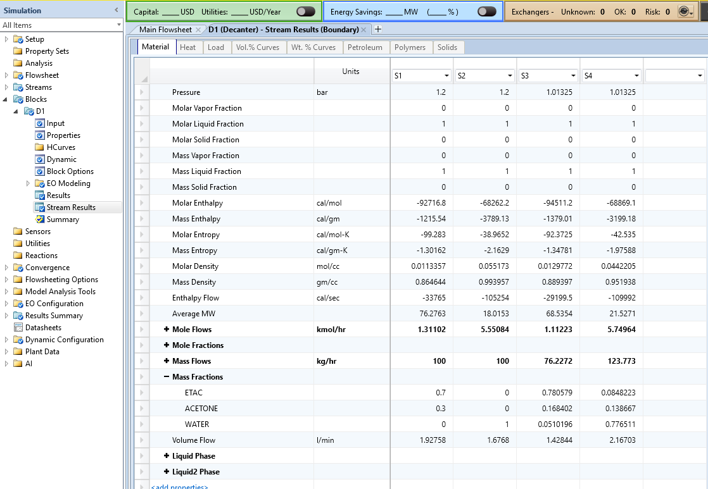 <br>**模擬結果查看：RAFF_1（S3有機相）與 EXTR_1（S4水相）中丙酮的質量分率**

---

#### 方案二：三個 Decanter 錯流萃取

**流程概念**：將 100 kg/h 水均分為三份（各 ≈ 33.3 kg/h），分別在三個串聯的 Decanter 中**獨立加入新鮮溶劑**。有機相依序通過 D1 → D2 → D3，每一級使用的都是新鮮水，萃取後的水相直接排出，不再循環。

**流程配置**：

```
W1(33.3)          W2(33.3)          W3(33.3)
   ↓                  ↓                  ↓
FEED → [D1] ─有機→ [D2] ─有機→ [D3] → RAFFINATE（最終有機相）
          ↓               ↓               ↓
       EXTR_1          EXTR_2          EXTR_3
             ↘            ↓           ↙
               合併 → 總萃取水相
```

**操作步驟**：

1. 放置 **FSPLIT**（流量分割器）模塊，將 WATER 均等分割為 W1、W2、W3；
   在 FSPLIT「分率」頁面設定各出口分率各為 **0.3333**
2. 放置三個 **Decanter** 模塊（D1、D2、D3），各自設定為 25°C、1 atm、液-液，關鍵組分同方案一
3. 建立串聯連接：
   - D1 進料：FEED + W1；D1 有機出口（RAFF_1）→ D2 進料
   - D2 進料：RAFF_1 + W2；D2 有機出口（RAFF_2）→ D3 進料
   - D3 進料：RAFF_2 + W3；D3 有機出口即最終 **RAFFINATE**
4. 三個水相出口（EXTR_1、EXTR_2、EXTR_3）可用 **MIXER** 合併顯示為總萃取水相
5. 執行模擬，查看 RAFFINATE 中丙酮殘留量

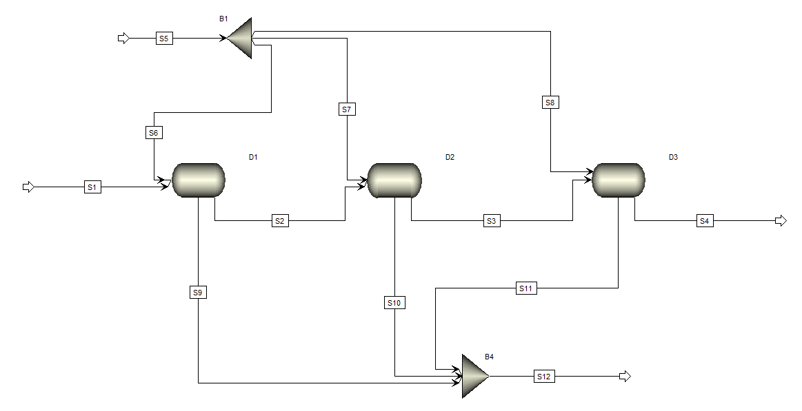 <br>**圖 MSCCE-D2 方案二：三個 Decanter 錯流萃取流程圖**
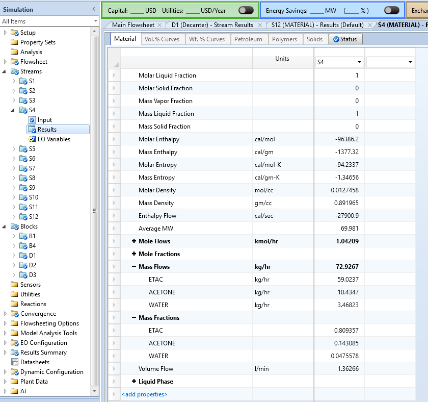 <br>**模擬結果查看：RAFFINATE (S4) 中丙酮的質量分率**

> **說明**：方案二三個 Decanter 合計水用量仍為 100 kg/h，與方案一相同，確保公平比較基準。

---

#### 方案三：三個 Decanter 逆流萃取

**流程概念**：有機相由左至右（D1 → D2 → D3），純水（100 kg/h）**從最末端（D3）進入**，水相**逆向回流**（D3 水相出口 → D2 進料；D2 水相出口 → D1 進料），最終從 D1 排出。兩相方向相反，構成真正的逆流接觸。

**流程配置**：

```
← 水相逆流方向 ←──── WATER(100)
FEED → [D1] ─有機→ [D2] ─有機→ [D3] → RAFFINATE
         ↓  水←        ↓  水←        ↓
       EXTRACT        水相_21        水相_32（進 D2）
```

水相流向的具體邏輯：

$$\text{WATER} \to D3 \xrightarrow{\text{水相出口}} D2 \xrightarrow{\text{水相出口}} D1 \xrightarrow{\text{水相出口}} \text{EXTRACT}$$

**操作步驟**：

1. 放置三個 **Decanter** 模塊（D1、D2、D3），各自設定為 25°C、1 atm、液-液
2. 建立**逆流連接**：
   - 有機相（左→右）：FEED → D1 有機出口 → D2 → D2 有機出口 → D3 → RAFFINATE
   - 水相（右→左）：WATER → D3 底端出口（水相）→ D2 底端進料；D2 底端出口（水相）→ D1 底端進料；D1 底端出口 = EXTRACT
3. 上述逆向水相連接在 D1–D2 與 D2–D3 之間各形成一個**循環回路（Recycle Loop）**
4. Aspen Plus 序貫模組求解器自動識別**撕裂流（Tear Streams）**，以 Wegstein 疊代算法收斂，通常 5～20 次外迴圈即可
5. （選用）若收斂困難，在「收斂設定（Convergence）」頁面為撕裂流設定接近真實的初始組成估計，或切換算法為「Direct Substitution」
6. 執行模擬，確認收斂後查看 RAFFINATE 中丙酮殘留量

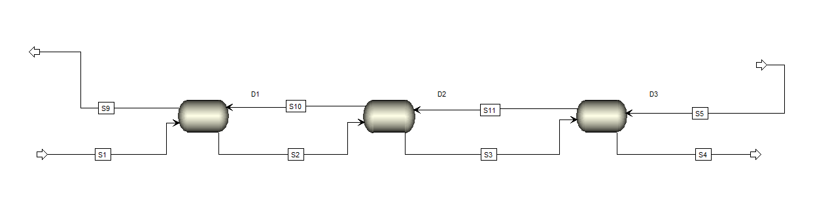 <br>**圖 MSCCE-D3 方案三：三個 Decanter 逆流萃取流程圖
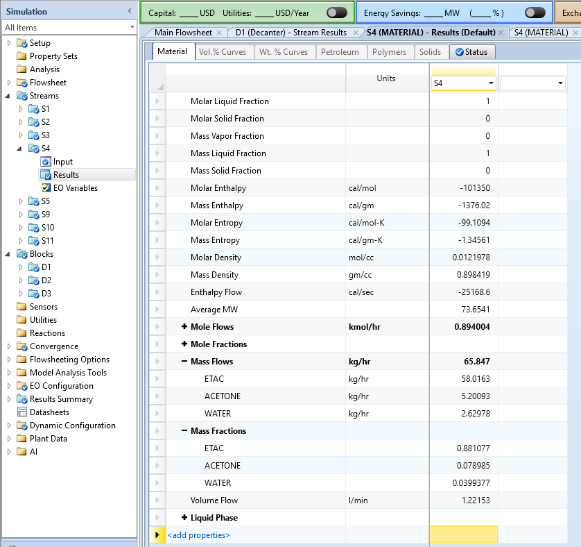 <br>**模擬結果查看：RAFFINATE (S4) 中丙酮的質量分率**

---

#### 方案四：EXTRACT 模塊逆流萃取（3 塊理論板）

**流程概念**：以 **EXTRACT 模塊**直接模擬 3 塊理論板的嚴格逆流萃取。模塊內部以 MES 方程組（質量平衡 M、相平衡 E、加和 S）逐板求解，等效於方案三的逆流 Decanter 串接，但**無需手動建立回流迴路**，設定更簡潔、收斂更穩定。

**關鍵設定彙整**：

| 設定項目 | 數值 |
|:-------:|:----|
| 理論板數 | **3** |
| 熱選項 | 指定溫度分布，第 1 板 **25°C**（等溫） |
| Phase I 關鍵組分（輕相） | **ETAC** |
| Phase II 關鍵組分（重相） | **WATER** |
| 第 1 板壓力 | **1.01325 bar** |
| FEED（Phase I）進料板號 | 板 **1**（塔頂） |
| WATER（Phase II）進料板號 | 板 **3**（塔底） |
| EXTRACT（Phase II）出料板號 | 板 **1**（塔頂） |
| RAFFINATE（Phase I）出料板號 | 板 **3**（塔底） |

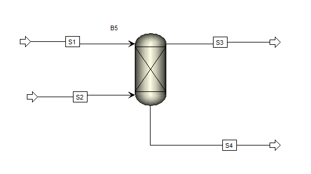 <br>**圖 MSCCE-4 方案四：EXTRACT 模塊流程圖（3 板逆流）**
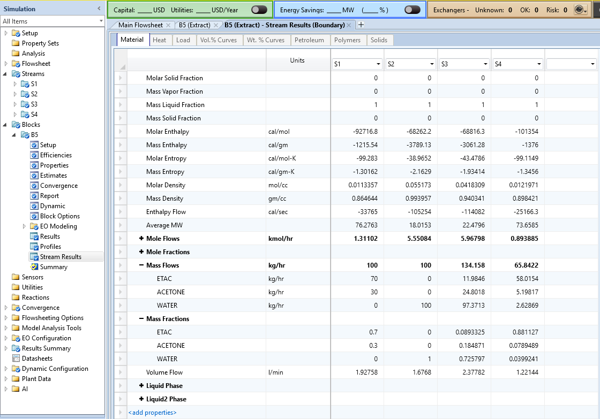 <br>**模擬結果查看：RAFFINATE (S4) 中丙酮的質量分率**

---

### 四種方案模擬結果比較

執行上述四種方案後，查看各方案有機出口（RAFFINATE）中丙酮的質量分率，彙整為表 MSCCE-3。

> **注意——實際結果與線性平衡預估的差異**：表 MSCCE-2 依線性平衡（稀溶液）預估丙酮回收率可達 89～99%，但本體系進料為 ETAC 70 wt%＋丙酮 30 wt%，屬**高濃度、強非線性**體系。在高丙酮濃度下 ETAC 相對丙酮的溶解度顯著增大，實際有效分配係數遠低於稀溶液近似值，導致各方案的絕對回收率均低於線性預估。**本表所列為 Aspen Plus NRTL-LLE 嚴格計算結果。**

**表 MSCCE-3 四種萃取方案模擬結果比較（Aspen Plus NRTL-LLE 嚴格計算，25°C，水/進料 = 100/100 kg/h）**

| 方案 | 模塊配置 | 溶劑用量 / kg·h⁻¹ | 丙酮進入水相（切割分率） | RAFFINATE 丙酮 wt% | RAFFINATE EA wt% |
|:---:|:-------:|:-----------------:|:----------------------:|:-----------------:|:----------------:|
| 方案一 | 單一 Decanter | 100 | 57.2%（17.16 kg/h） | **16.84%** | 78.06% |
| 方案二 | 3 Decanter 錯流 | 100（3×33.3） | 65.2%（19.57 kg/h） | **14.31%** | 80.94% |
| 方案三 | 3 Decanter 逆流 | 100 | 82.7%（24.80 kg/h） | **7.90%** | 88.11% |
| 方案四 | EXTRACT 3 板逆流 | 100 | 82.7%（24.80 kg/h） | **7.89%** | 88.11% |

**結果解析：**

**① 方案一→方案二（增加接觸級數，錯流配置）**：從單一 Decanter 改為三個錯流 Decanter，RAFFINATE 中丙酮由 16.84% 降至 14.31%，丙酮進入水相的比率從 57.2% 提升至 65.2%（**提升約 8 個百分點**），**驗證「多級接觸優於單級」**的核心原理。在相同溶劑總量下，將溶劑分批加入多個接觸級可改善分離效果。

**② 方案二→方案三（相同設備數，錯流→逆流）**：同樣三個 Decanter，僅改變溶劑流動方向，RAFFINATE 中丙酮從 14.31% 大幅降至 7.90%，丙酮回收率從 65.2% 躍升至 82.7%（**提升約 17.5 個百分點**），**驗證「逆流優於錯流」**。此提升幅度遠超 Kremser 稀溶液預估（1～4%），正是因為本體系濃度高、非線性效應顯著——逆流操作使新鮮溶劑始終接觸溶質最稀的有機相，在整個塔高維持最大傳質推動力，在非線性體系中效益更為突出。

**③ 方案三≈方案四（逆流 Decanter vs EXTRACT）**：兩者結果極為接近（RAFFINATE 丙酮分別為 7.90% 與 7.89%，差異僅 0.01 wt%），確認三個逆流 Decanter 與 EXTRACT 3 板在嚴格 NRTL-LLE 計算下**數學等價**——均求解同一組逐板 MES 方程，差異僅在數值求解策略（外部撕裂流疊代 vs EXTRACT 內部牛頓法）。

**④ 建議採用 EXTRACT 模塊的工程理由**：

| 比較項目 | Decanter 逆流串接 | EXTRACT 模塊 |
|:-------:|:----------------:|:------------:|
| 流程圖設定 | 複雜（需手動建立回流迴路） | **簡潔**（一個模塊） |
| 收斂穩定性 | 中等（需設定撕裂流估計） | **高**（內部牛頓法） |
| 板數調整 | 需增刪 Decanter 模塊 | **修改一個數字** |
| 結果詳細度 | 各 Decanter 需分別查看 | **逐板組成、KLL 統一輸出** |
| 等效性 | — | **數學等價於逆流 Decanter 串接** |

**各方案效率提升來源彙整：**

| 比較組合 | 主要改變 | 丙酮進水相（切割分率） | 提升幅度 | 對應設計概念 |
|:-------:|:-------:|:--------------------:|:-------:|:----------:|
| 方案一 | 單一 Decanter | 57.2% | — | 基準 |
| 方案一→方案二 | 1 級→3 級（錯流） | 65.2% | **+8.0 pp** | 多接觸級的級數效益 |
| 方案二→方案三 | 錯流→逆流（同 3 級） | 82.7% | **+17.5 pp** | 逆流操作的方向效益（非線性放大） |
| 方案三→方案四 | 建模方式不同（數學等價） | 82.7% | **≈ 0%** | EXTRACT 完整等效逆流 Decanter 串接 |

---

### 延伸分析：萃取劑用量的影響

在方案三(3級逆流萃取)設定下，利用 Aspen Plus **靈敏度分析（Sensitivity）** 工具，改變水的進料量（50～300 kg/h，步長 50 kg/h），觀察 RAFFINATE 中丙酮質量分率的變化：

- **自變量**：水流股總質量流量（50、100、150、200、250、300 kg/h）
- **結果變量**：RAFFINATE 中 ACETONE 質量分率

**表 MSCCE-4 水流量靈敏度分析結果（3 板逆流 EXTRACT，Aspen Plus NRTL-LLE 嚴格計算）**

| 水流量 / kg·h⁻¹ | $S/F$ 質量比 | 萃取因子 $E$（估算） | RAFFINATE 丙酮 wt% | 丙酮進水相比率（估算） |
|:--------------:|:-----------:|:------------------:|:-----------------:|:-------------------:|
| 50 | 0.5 | ~4.2 | **17.98%** | ~56% |
| 100 | 1.0 | ~8.4 | **7.90%** | ~83% |
| 150 | 1.5 | ~12.6 | **3.40%** | ~93% |
| 200 | 2.0 | ~16.8 | **1.67%** | ~97% |
| 250 | 2.5 | ~21.0 | **0.92%** | ~98% |
| 300 | 3.0 | ~25.2 | **0.56%** | ~99% |

> **丙酮進水相比率**：依有機相質量平衡估算（進料丙酮 30 kg/h，RAFFINATE 流量由有機相組成推算），僅供趨勢參考。

**實際結果與線性平衡預估的關鍵差異：**

線性 Kremser 公式預估在 $S/F = 0.5$（50 kg/h 水）時 3 板逆流應達約 99% 回收率，但 Aspen 嚴格計算結果顯示此條件下 RAFFINATE 仍含 **17.98% 丙酮**，進水相比率僅約 56%——與線性預估相差超過 40 個百分點。造成此差異的根本原因是**高濃度非線性平衡效應**：

1. **高濃度下 $KLL$ 顯著降低**：進料丙酮濃度為 30 wt%，在高溶質濃度下兩相的實際分配係數遠低於稀溶液假設下的常數 $m = KLL$
2. **EA 大量進入水相**：有限的水量（50 kg/h）使丙酮難以充分轉移，有機相中高濃度丙酮又促進 EA 溶入水相，進一步壓縮有效萃取驅動力

**工程設計建議（本體系，3 級逆流）：**

| 設計目標 | 建議 $S/F$ | 水用量 | RAFFINATE 丙酮 wt% |
|:-------:|:---------:|:-----:|:-----------------:|
| RAFFINATE 丙酮 < 10% | $S/F \geq 1.0$ | ≥ 100 kg/h | 7.90% |
| RAFFINATE 丙酮 < 5% | $S/F \geq 1.5$ | ≥ 150 kg/h | 3.40% |
| RAFFINATE 丙酮 < 2% | $S/F \geq 2.0$ | ≥ 200 kg/h | 1.67% |
| RAFFINATE 丙酮 < 1% | $S/F \geq 2.5$ | ≥ 250 kg/h | 0.92% |

由結果可知：增加水用量的**邊際效益在 $S/F > 2.0$ 後顯著遞減**（從 $S/F = 2.0$ 到 3.0 僅從 1.67% 降至 0.56%）。若設計目標為 RAFFINATE 中丙酮低於 2 wt%，取 $S/F = 2.0$（水 200 kg/h）為合理操作點；若需更高純度，應優先考慮**增加理論板數**而非單純加大水量，以避免後段廢水處理負擔過重。


#### 增加理論板數的效益驗證（3 板 → 5 板，水用量維持 100 kg/h）

以方案四（EXTRACT 模塊）為基礎，將理論板數從 3 板增至 **5 板**，保持水用量 100 kg/h 不變，模擬結果如圖 MSCCE-5 與圖 MSCCE-6 所示：

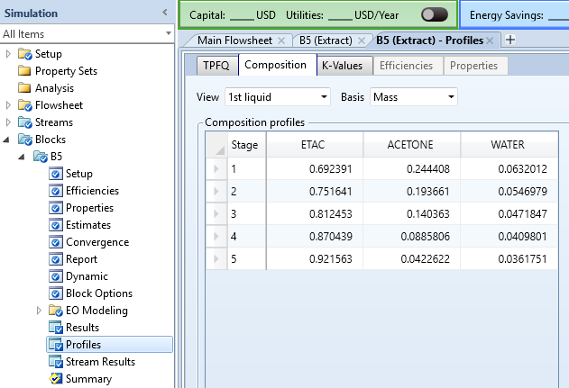 <br>**圖 MSCCE-5 5 板逆流 EXTRACT 各板有機相組成分布（第 1 液相，質量分率，板 1 為有機相進料端，板 5 為出料端）**

**表 MSCCE-5 5 板逆流 EXTRACT 各板有機相組成分布（Aspen Plus 嚴格計算）**

| 板號 | ETAC wt% | ACETONE wt% | WATER wt% |
|:---:|:--------:|:-----------:|:---------:|
| 1（進料端） | 69.24% | **24.44%** | 6.32% |
| 2 | 75.16% | 19.37% | 5.47% |
| 3 | 81.25% | 14.04% | 4.72% |
| 4 | 87.04% | 8.86% | 4.10% |
| 5（出料端） | 92.16% | **4.23%** | 3.62% |

各板組成分布清楚呈現**逐板傳質梯度**：有機相中丙酮濃度從板 1（進料端）的 24.44% 沿板號方向單調降低至板 5（出料端）的 4.23%，顯示每一塊理論板均有效承擔了部分分離任務。

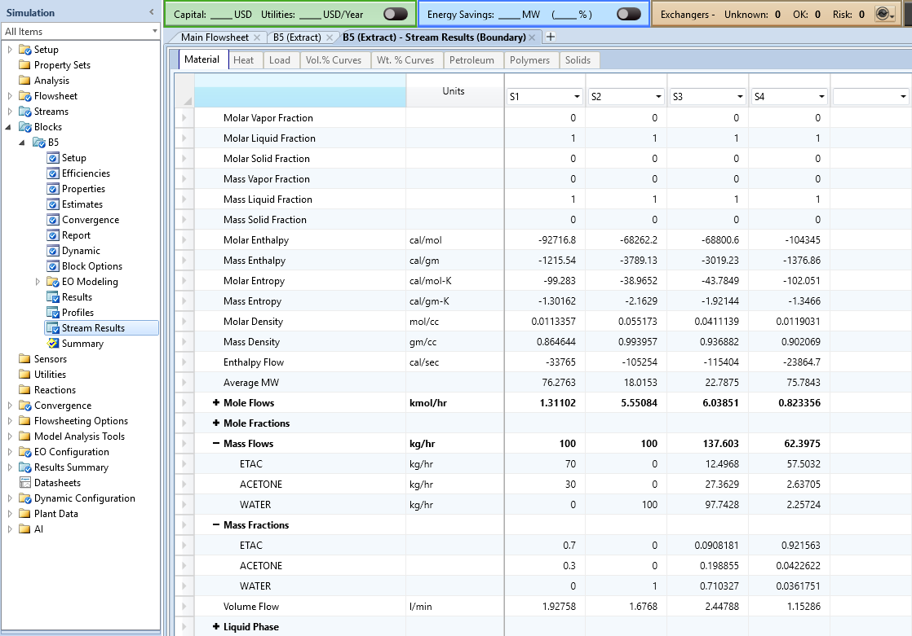 <br>**圖 MSCCE-6 5 板逆流 EXTRACT 流股結果（S4 = RAFFINATE 有機相出口；S3 = EXTRACT 水相出口）**

**5 板逆流 EXTRACT（水 100 kg/h）流股彙整**：

| 流股 | 流量 / kg·h⁻¹ | ETAC wt% | ACETONE wt% | WATER wt% |
|:---:|:---:|:---:|:---:|:---:|
| S1（FEED，有機進料） | 100.0 | 70.00% | 30.00% | 0% |
| S2（WATER，水進料） | 100.0 | 0% | 0% | 100% |
| S3（EXTRACT，水相出口） | 137.60 | 9.08% | 19.89% | 71.03% |
| S4（RAFFINATE，有機出口） | 62.40 | **92.16%** | **4.23%** | 3.62% |

**丙酮回收計算**：RAFFINATE 含丙酮 62.40 × 4.23% = 2.64 kg/h；進入水相 = 30 − 2.64 = **27.36 kg/h**，回收率 = **91.2%**。

**增板 vs 增水量的效益比較：**

| 設計策略 | 板數 | 水用量 / kg·h⁻¹ | RAFFINATE 丙酮 wt% | 丙酮回收率 |
|:-------:|:---:|:--------------:|:-----------------:|:--------:|
| 基準（方案四） | 3 | 100 | 7.89% | 82.7% |
| **增板至 5 板**（同水量） | **5** | 100 | **4.23%** | **91.2%** |
| 增水量至 150 kg/h（同板數） | 3 | 150 | 3.40% | 93.1% |
| 增水量至 200 kg/h（同板數） | 3 | 200 | 1.67% | 97.2% |

**分析結論：**

1. **增板效益顯著（+8.5 pp 回收率）**：從 3 板增至 5 板（水量不變），丙酮回收率從 82.7% 提升至 91.2%，RAFFINATE 丙酮從 7.89% 降至 4.23%，**提升幅度達 3.66 個百分點**。

2. **增板可節省水耗**：若目標為 RAFFINATE 丙酮 < 5%，採用「3 板 + 150 kg/h 水」（3.40%）或「5 板 + 100 kg/h 水」（4.23%）均可達標。後者**節省 33% 水用量（50 kg/h）**，可大幅降低後段廢水處理能耗。

3. **逐板濃度梯度驗證理論**：表 MSCCE-5 中各板濃度呈現單調遞減梯度，確認 NRTL-LLE 嚴格計算下每板均發揮有效分離作用，與 McCabe-Thiele 逐板理論一致。

4. **高濃度非線性體系仍有級數效益**：本體系進料丙酮高達 30 wt%，稀溶液 Kremser 理論預估增板效益接近飽和，但嚴格計算結果顯示從 3→5 板仍有明顯改善（8.5 pp），說明**嚴格計算優於線性近似**，應以 Aspen Plus NRTL-LLE 結果為設計依據。

---

## 本單元知識架構總覽

```
液液相平衡（LLE 數據、KLL 分配係數）
           │
           ▼
    萃取因子 E = KLL × S'/F'
           │
     ┌─────┴──────────┐
     ▼                ▼
最小溶劑用量      Kremser 解析法
S'min = F'η/m    N = f(E, η, N)
     └─────┬──────────┘
           ▼
    設計操作條件
    S' = 1.5 S'min，確定 N
           │
           ▼
  Aspen Plus EXTRACT 嚴格模擬
  （NRTL-LLE + 逐板 MES 方程）
           │
           ▼
  收斂結果 → 切割分率、各板組成
  → 萃取效率驗證 → 設備尺寸估算
```

> **設計兩段式流程**：(1) 以 Kremser 公式快速估算初步設計點（板數與溶劑量）；(2) 以 Aspen Plus 嚴格計算驗證並細化（非線性平衡、溶劑損耗、溫度效應）。此流程在工業萃取設計中普遍採用。

---

**課程資訊**
- 課程名稱：化工程序模擬 (ChemE 1395)
- 課程單元：Unit07 進階 — 多級逆流萃取（Multistage Countercurrent Extraction）
- 課程製作：逢甲大學 化工系 智慧程序系統工程實驗室
- 授課教師：莊曜禎 助理教授
- 更新日期：2026-06-11

**課程授權 [CC BY-NC-SA 4.0]**
- 本教材遵循 [創用CC 姓名標示-非商業性-相同方式分享 4.0 國際 (CC BY-NC-SA 4.0)](https://creativecommons.org/licenses/by-nc-sa/4.0/deed.zh) 授權。
