# 第 10 章 經濟分析與評價


## 章節概述

在完成一個工藝流程的設計模擬後，可能需要對工藝流程的經濟效益進行分析和評價，包括建設投資、成本、費用、稅金等財務基礎資料的測算，以及投資回收期、內部收益率、淨現值等經濟性指標的分析，並根據經濟分析結果評價專案的可行性。

在 AspenONE V12.2 版本中，Aspen Economic Evaluation 為獨立於 Aspen Plus 的模組。Aspen Economic Evaluation 中共包含三款軟體，各有其適用場景：

1. **Aspen Capital Cost Estimator（ACCE）**：以設備類型、操作條件與材質規格為輸入，估算設備採購費用、安裝費用及工程建設費用，適用於方案比選與早期概算階段。
2. **Aspen In-Plant Cost Estimator（AICE）**：針對已運轉中的工廠，用於追蹤操作成本與評估設備更換、工藝改造的成本效益。
3. **Aspen Process Economic Analyzer（APEA）**：整合工藝模擬結果，提供資本投入估算、公用工程費用及完整財務指標（NPV、IRR、投資回收期等）分析，可直接與 Aspen Plus 連線，是本章重點介紹的工具。

其中，Aspen Process Economic Analyzer（APEA）可以和 Aspen Plus 連線，能夠將 Aspen Plus 中建立的工藝流程及模擬結果在 Aspen Plus 內直接進行經濟分析，或者也可將工藝流程匯入 APEA 軟體進行分析。

相比較而言，Aspen Plus 內建的經濟分析功能雖然基於 APEA，但功能的全面性不及獨立的 APEA 軟體。因此，本章首先介紹 Aspen Plus 中內建的經濟分析功能，隨後介紹 APEA 軟體的使用方法，使用者可根據實際情況進行選擇。為了更好地展現經濟分析功能，本章將基於 Aspen Plus 中內建的示例檔案，以環氧乙烷制乙二醇工藝流程為例，介紹經濟分析功能。

---

### 經濟分析核心工作流程

APEA 的資本成本估算依循三個核心步驟依序進行，形成從「模擬結果」到「財務指標」的完整分析鏈。在 Aspen Plus 內建的經濟分析功能中，這三個步驟對應 Economics 分頁上的三個主要操作環節（`Mapping`、`Sizing`、`Evaluation`）。

**1. 映射（Mapping）**

將 Aspen Plus 模擬中的**邏輯單元操作**（如 RadFrac 精餾塔、Heater 換熱器、Pump 泵等）轉換為對應的**實體工業設備類型**（如板式塔/填料塔、殼管式換熱器、離心泵等），並定義各設備的子元件組成（如精餾塔的冷凝器、再沸器、塔頂儲罐、回流泵等）。

此步驟中，使用者需確認每個設備的構型（Configuration）與子元件清單的合理性，並**移除無對應實體裝置的虛擬元件**（如僅為計算流量平衡而設的分流器 Splitter 和混合器 Mixer），以避免後續估算產生錯誤。

**2. 尺寸計算（Sizing）**

依據 Aspen Plus 模擬所得的流量、組成、熱負荷與壓降等計算結果，自動確定各設備的**物理維度**，例如：

- 精餾塔的塔徑（Vessel diameter）與切線高度（Tangent-to-tangent height）
- 換熱器的換熱面積（Heat transfer area）與管程/殼程尺寸
- 泵與壓縮機的功率（Power）及對應尺寸規格
- 反應器的體積、長度與內徑

此步驟由軟體根據模擬結果自動執行，無需使用者另行輸入設備尺寸（除非選擇 `Customize sizing` 模式提供詳細設計數據，以提高估算精度）。

**3. 估算（Estimating）**

以物理維度為基礎，查詢 APEA 內建的設備費用資料庫，分層計算：

| 成本類別 | 主要項目 |
|---|---|
| **直接成本** | 設備採購費、管道費、儀表費、電氣費、土建費、保溫費、塗裝費 |
| **間接成本** | 設計工程費、採購管理費、現場管理費、意外準備金（Contingency） |
| **彙整結果** | 設備成本（Equipment Cost）、總安裝成本（Total Installed Cost）、總資本投資（Total Capital Cost） |

三個步驟完成後，APEA 進一步結合物流價格（原料成本與產品收益）、公用工程費用及財務假設（稅率、折舊方式、分析年限、期望報酬率等），計算並輸出 NPV、IRR、投資回收期（P.O. Period）等完整財務評估指標。

> **學習提示**：在 Aspen Plus 的 Economics 分頁中，`Mapping`、`Sizing`、`Evaluation` 三個圖示前出現**綠色勾號**，表示三個步驟均已成功執行，完整的經濟評估已完成。任何步驟出現紅色警示圖示，即代表該步驟存在需要處理的錯誤或警告。

---

### 乙二醇製程背景

乙二醇（Ethylene Glycol, EG）是最重要的大宗有機化工產品之一，全球年需求量超過 3,000 萬噸。其主要應用包括：

- **聚酯纖維與 PET 塑料**：作為對苯二甲酸（PTA）的共聚單體，用於製造聚酯纖維（滌綸）、PET 瓶及聚酯薄膜，佔 MEG 消費量的 60% 以上。
- **防凍劑**：MEG（單乙二醇）具有高沸點（197.3 °C）與低凝固點，廣泛用於汽車冷卻液與工業防凍液。
- **其他用途**：DEG（二乙二醇）用於溶劑及飽和聚酯；TEG（三乙二醇）用於天然氣脫水等。

**EO 水合制乙二醇**是目前最主流的工業生產路線，核心反應為連串平行反應：

$$
\begin{aligned}
\text{EO} + \text{H}_2\text{O} &\longrightarrow \text{MEG} \quad \text{（目標產物）} \\
\text{MEG} + \text{EO} &\longrightarrow \text{DEG} \quad \text{（副產物）} \\
\text{DEG} + \text{EO} &\longrightarrow \text{TEG} \quad \text{（副產物）}
\end{aligned}
$$

MEG 的選擇性主要由進料**水/EO 莫耳比**決定：工業上通常採用水/EO 莫耳比 **≥ 20:1**（大量過剩水），使 MEG 選擇性可達 90% 以上，但同時需配備大型蒸發及脫水設備以回收過剩水，能耗較高。

本教學範例採用水/EO 莫耳比約 **2.44:1**（教學示例，非工業最優），MEG 選擇性約 86.5%，目的在於同時展示 MEG、DEG、TEG 各精餾塔的設計特性與相對建設成本，使學生能對完整甘醇分離流程的經濟意義有全面認識。

**本例模擬規模概述：**

| 項目 | 數值 |
|---|---:|
| EO 進料量 | 55,000 kg/hr（年耗 EO 約 48.2 萬噸） |
| 水進料量 | 55,000 kg/hr |
| 水/EO 莫耳比 | 2.44:1 |
| MEG 年產量 | ~587,800 噸/年 |
| DEG 年產量 | ~73,700 噸/年 |
| TEG 年產量 | ~4,065 噸/年 |
| MEG 對 EO 選擇性 | ~86.5% |

此規模約相當於一座中型工業乙二醇裝置，適合作為製程經濟分析的完整教學案例。

---

### 原料成本、操作成本與產品售價：獲利與回收的核心

在化工廠的經濟分析中，決定一個專案能否快速回收投資並持續盈利的核心，在於以下三項因子之間的比例關係。正確理解三者的互動，是讀懂任何經濟分析結果的基礎。

#### 三大關鍵因子

**① 原料成本（Raw Materials Cost）**

原料成本通常是化工廠**最大的單一支出項目**，一般佔年度總操作成本的 **60%–80%**，且往往比設備投資更能決定工廠的長期獲利能力。影響原料有效成本的因素包括：

- **市場行情**：原料現貨或長約採購價格，受全球供需影響，波動幅度可達 ±30% 以上。
- **製程選擇性**：副產物生成量越多，代表同樣的原料投入產生較少的目標產品，等同於隱性地拉高每單位主產品的原料成本。例如，MEG 選擇性從 86.5% 提升至 92%，意味著同樣的 EO 進料可多生產約 6.4% 的 MEG，使每噸 MEG 的有效 EO 成本顯著降低。
- **自產 vs 外購**：若上游原料可自行生產（如從乙烯直接氧化制 EO），原料的轉移成本可大幅低於市場採購價。

**② 操作成本（Total Operating Cost）**

年度操作成本的主要組成如下：

| 成本項目 | 說明 | 典型佔比 |
|---|---|---:|
| 原料成本 | 最大宗，隨產量與價格波動 | 60–80% |
| 公用工程費用 | 蒸汽、冷卻水、電力 | 5–15% |
| 人工與維護費用 | 操作人員、設備維護 | 1–5% |
| 管理與一般費用（G&A） | 行政、保險等 | 5–10% |
| 資本折舊（含財務費用） | 固定資產分期攤銷 | 1–5% |

公用工程費用雖佔比相對較小，但對製程最佳化影響顯著——特別是需要大量加熱（精餾塔再沸器）或冷卻（塔頂冷凝器）的分離製程，降低能耗是降低操作成本的重要方向。

**③ 產品售價收益（Product Sales Revenue）**

產品收益由**各產品的市場售價 × 實際年產量**決定。需注意以下幾點：

- **主副產品售價差異**：若主產品（如 MEG）售價偏低，而高附加值副產品（如 DEG）產量較少，總收益可能受限。
- **產品純度**：純度不達市場要求的產品流（如本例的 4EG 混合物流）可能完全無法出售，造成原料損失。
- **市場量限制**：即使工廠能夠生產，也需考慮市場是否有足夠的需求量吸收產能。

---

#### 獲利能力的判斷準則

年度淨現金流（Net Cash Flow, CF）可簡化為：

$$\text{CF} = \underbrace{\text{產品銷售收益}}_{\text{Total Product Sales}} - \underbrace{\text{總操作成本}}_{\text{Total Operating Cost (含原料)}}$$

以此為基礎，三種典型情境對應不同的財務結論：

| 情境 | 條件 | 財務結論 |
|:---:|---|---|
| 明顯盈利 | 產品售價 ≫ 原料成本 + 操作費用 | P.O. Period 短，NPV > 0 |
| 邊際盈利 | 產品售價 ≈ 原料成本 + 操作費用 | P.O. Period 長，需謹慎評估 |
| **虧損** | **產品售價 ＜ 原料成本** | **P.O. Period = 0，專案不可行** |

第三種情境正是本例（EG 製程）的現況：由於 EO-WATER 流股的混合定價使原料成本（$530M/yr）直接超過產品總收益（$410M/yr），專案從一開始就無法覆蓋成本，**P.O. Period = 0** 表示在任何期望報酬率下均無法回收投資。

---

#### 投資回收期（P.O. Period）的直觀理解

投資回收期（Payout Period）的核心概念為：

$$\text{P.O. Period} \approx \frac{\text{總資本投資（TCC）}}{\text{年度淨現金流（CF）}}$$

例如，若 TCC = \$20M，CF = \$10M/yr，則 P.O. ≈ 2 年——即約 2 年後累積現金流入即可覆蓋初期資本投入。一般化工廠的可接受投資回收期約為 **3–7 年**（視專案風險與資本成本而定）。

當 CF ≤ 0（虧損），分母趨近於零甚至為負，回收期理論上趨向無窮大，軟體報告為 **P.O. = 0**。

> **實務啟示**：在化工廠規劃與最佳化中，對**原料成本的敏感度分析**（Sensitivity Analysis）通常比設備投資的敏感度分析更重要。以本例為例，EO 市場價格每上漲 10%（約 $0.11/kg），年度原料成本即增加 **$53M**，其影響遠超過任何設備效率改善所能節省的資本成本。因此，長約採購、自建上游原料供應鏈，或在原料價格低位啟動建設，往往是決定化工廠最終獲利能力的關鍵策略決策。

---

**例 10-1**  基於 Aspen Plus 中內建的環氧乙烷制乙二醇示例檔案：

`Bulk Chemical/Ethylene Glycol/Ethylene Glycol Plant Example.bkp`

對工藝流程的經濟性進行分析。

---

## 10.1 Aspen Plus 中的經濟分析

### 10.1.1 開啟示例檔案

在軟體初始頁面選擇“開啟本地例項”，並在隨後彈出的視窗中選擇：

`Bulk Chemical/Ethylene Glycol/Ethylene Glycol Plant Example.bkp`

開啟模擬檔案後，將檔案另存為新檔案，此處命名為：

`Ethylene Glycol Plant Example 1.apwz`
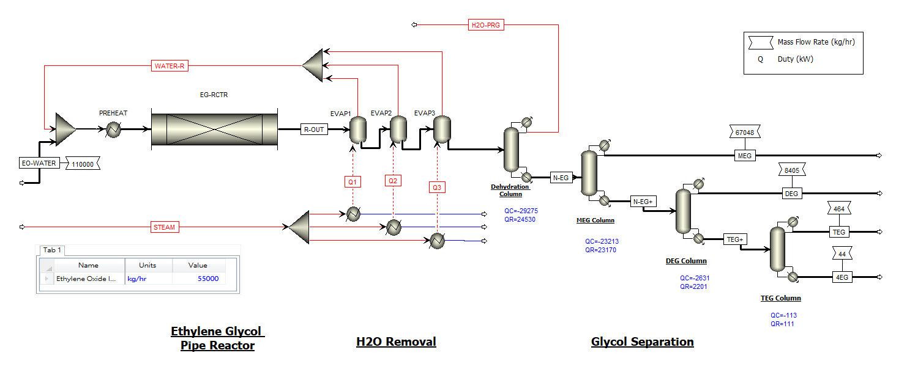
圖 10-2 為環氧乙烷制乙二醇工藝流程圖，主要包括：

- Ethylene Glycol Pipe Reactor
- H2O Removal
- Glycol Separation

主要單元包括預熱器、管式反應器、蒸發器、脫水塔、MEG 塔、DEG 塔與 TEG 塔等。

---

### 10.1.2 設定成本核算選項

在模擬環境中，在導航窗格中選擇：

`設定 / 成本核算選項`

在圖 10-3 中，“模板”是指經濟分析所依據的地區和單位。預設的 `US_IP` 指美國、英制單位。

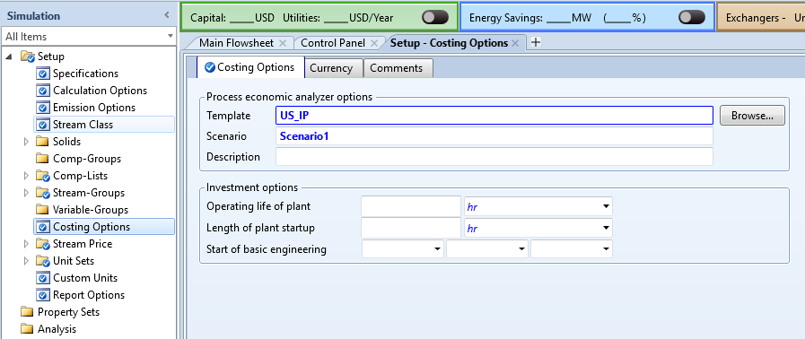
圖 10-3 為成本核算選項介面。

下方的“方案”是本次經濟分析的專案名稱。同一個工藝模型可生成多個場景，用以對不同條件下的工藝流程進行經濟分析。

“投入選項”用於財務基礎資料的計算。若不輸入，軟體將使用預設值：

- 工程啟動日期：2019 年 1 月 1 日（軟體內建預設值）
- 啟動時間：20 周
- 執行年限：10 年

> **注意**：上述預設啟動日期（2019 年）為 Aspen Plus V12.2 的軟體內建值，並不代表實際分析年份。在真實工程分析中，應將此日期更新為符合計畫時程的年份，以確保成本基準（Cost Base Date）與通膨調整（Escalation）計算的準確性。本例為教學目的，不作修改。

在“貨幣”標籤頁中，使用者可設定經濟分析結果所使用的貨幣。每個模板有其預設貨幣；若使用者需使用其他貨幣，可在此設定貨幣轉換因子，即 1 美元所對應的目標貨幣數量（即匯率）。本例中無需再做貨幣定義。

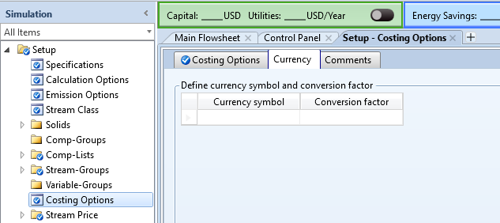
圖 10-4 為貨幣選項。

---

### 10.1.3 輸入原料與產品物流價格

原材料成本和產品售價是經濟分析的重要依據。在導航窗格中開啟：

`設定 / 流股價格 / 輸入`

在頁面中輸入原料和產品的物流價格。

從本工藝流程可知，原料流股為 `EO-WATER`，其中 EO（環氧乙烷）和 WATER（水）的質量流量均為 `55000 kg/h`。

產品流股共四支：

- `MEG`：乙二醇
- `DEG`：二乙二醇
- `TEG`：三乙二醇
- `4EG`：四乙二醇

執行模擬後檢視流股結果，可知流股的組分。

**如何查詢化工原料價格**

在進行經濟分析前，需先取得原料與產品的市場價格。化工產品的報價通常以 **FOB（Free On Board，離岸價格）** 表示。FOB 是指賣方將貨物運送至指定裝運港，並在貨物越過船舷後，風險即轉移給買方；買方需負擔後續的運費、保險費等。換言之，FOB 價格即為貨物在出口港的裝船價格，不含國際運費與保險。

以下介紹兩個常用的化工價格查詢網站：

#### 1. echemi.com（蓋德化工網）

1. 開啟瀏覽器前往 [https://www.echemi.com/](https://www.echemi.com/)。
2. 在搜尋欄中輸入欲查詢的化學品名稱（如 "Ethylene Glycol" 或 "Monoethylene Glycol"）。
3. 在搜尋結果中，可透過左側篩選條件選擇：
   - **Grade**: 選擇 `Industrial Grade`（工業級），以符合化工製程模擬的需求。
   - **Price Type**: 選擇 `FOB`，以查看離岸價格。
4. 瀏覽搜尋結果列表，即可看到多家供應商提供的報價及包裝規格。建議取多家報價的平均值作為經濟分析的參考價格。

#### 2. lookchem.com（LookChem）

1. 開啟瀏覽器前往 [https://www.lookchem.com/](https://www.lookchem.com/)。
2. 在搜尋欄中輸入化學品名稱（如 "Ethylene Glycol"）。
3. 在結果頁面中，同樣可利用篩選功能選擇 `Industrial Grade` 與 `FOB` 價格。
4. 點選感興趣的供應商條目，可查看詳細的產品規格、包裝方式及報價區間。

#### 注意事項

- 化工原料價格會隨市場供需波動，建議查詢後記錄查詢日期，以便後續追溯。
- 若查無工業級價格，可參考 `Tech Grade`（技術級）作為替代，但需注意純度差異可能影響模擬結果。
- 網站上的報價多為供應商報價（Offer Price），實際成交價可能因採購量、合約條件而有所不同。建議在經濟分析中保留一定的價格彈性區間。

---

依據 2026 年 6 月市場報價，各原料與產品物流的參考價格設定如下表所示。

| 流股 ID | 型別 | 來源/目標 | 基準 | 價格 | 單位 | 說明 |
|---|---:|---|---|---:|---|---|
| EO-WATER | 原料 | FMIX | 質量 | 550 | $/tonne | 由水與環氧乙烷按質量流量折算 |
| MEG | 產品 | MEG-1 | 質量 | 600 | $/tonne | 乙二醇 |
| DEG | 產品 | DEG-C | 質量 | 750 | $/tonne | 二乙二醇 |
| TEG | 產品 | TEG-C | 質量 | 600 | $/tonne | 三乙二醇 |

由於 4EG 物流為 TEG（三乙二醇）和 4EG（四乙二醇）的混合物，因此認為 4EG 物流產品無法出售，不定義價格。

在導航窗格中的“流股價格 / 輸入”頁面中新增 `EO-WATER`、`MEG`、`DEG`、`TEG` 四支流股，並從最右列單位的下拉選項中選擇 `$/tonne`。

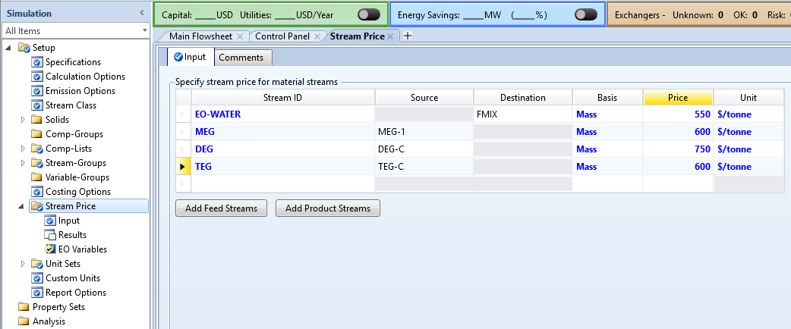
圖 10-5 為輸入流股價格。

---

### 10.1.4 啟用經濟估算

必要參數輸入完畢後，在頂部功能區開啟「Economics」分頁，勾選「Economic Active」，開啟經濟分析功能。開啟經濟估算後，右側圖示均變為可點選模式。

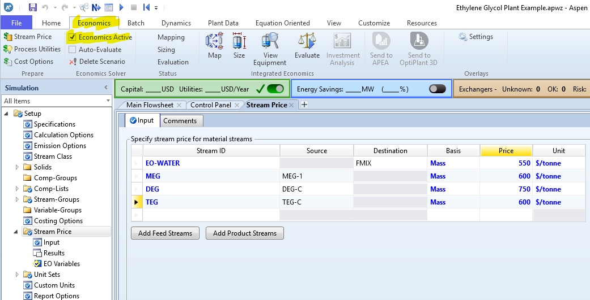
圖 10-6 Economics 分頁設定。

下一步需將單元操作模型 Mapping 到裝置模型，以便軟體估算裝置投資及執行成本。此處的對映並不一定是一一對應。初始化並執行模擬，使軟體獲得工藝流程的結果資訊。隨後點選 Economics 分頁中的「Mapping」圖示，彈出圖 10-7 視窗。

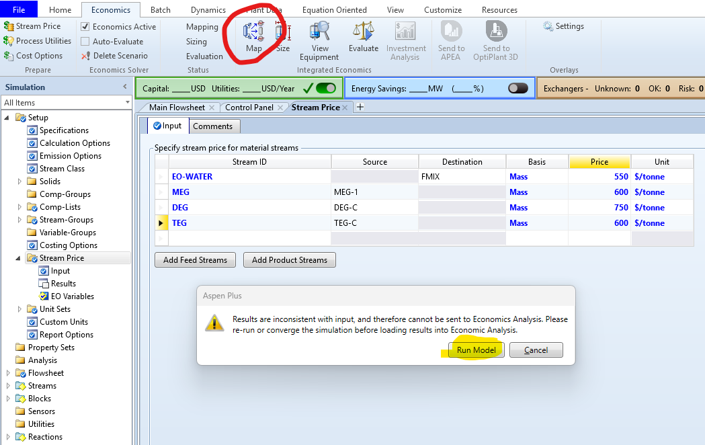
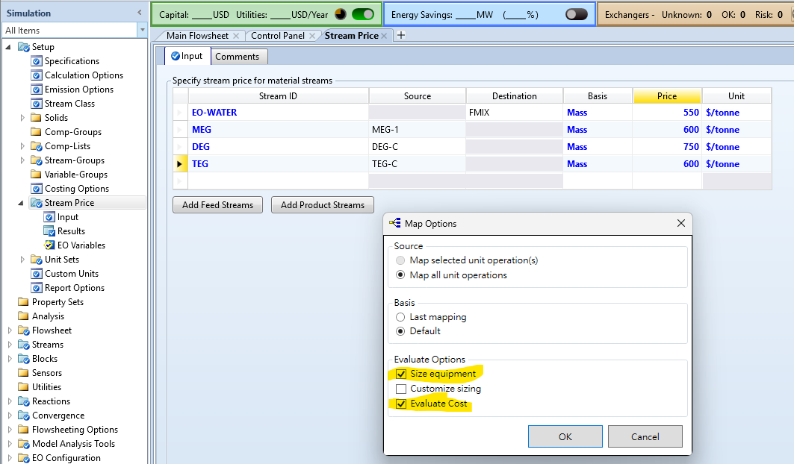
圖 10-7 為對映選項。

本例將對所有單元操作模型進行設計選型，因此選擇：

- `Map all unit operations`
- `Default`
- `Size equipment`
- `Evaluate Cost`

其中：

- `Map selected unit operation(s)`：僅對映所選單元操作
- `Map all unit operations`：對映所有單元操作
- `Last mapping`：基於之前的對映選項
- `Default`：基於預設選項，建議選擇以減少未知錯誤
- `Size equipment`：裝置選型
- `Evaluate Cost`：成本估算
- `Customize sizing`：使用 XML 檔案進行裝置選型，本課程不做要求

---

### 10.1.5 裝置對映與裝置模型選擇

點選 `OK` 後，彈出圖 10-8 視窗。本工藝流程中的所有單元操作模型均需在此視窗中選擇相應的裝置模型，並規定裝置模型的組成部分。軟體會根據模擬中的輸入參數或計算結果自動生成所有裝置模型的型別。

以 `DEG-C (RADFRAC)`（二乙二醇精製塔）為例，可以在圖 10-8 右下角看到此裝置的佈局圖。此佈局選項可以在左側 `Configuration` 下拉選單中選擇，預設為 `Standard-Total`（標準全迴流），使用者也可根據實際情況選擇其他佈局。

在上方表單中可以看到 `Equipment Tag` 下共有七項，表示此精餾塔包含七個子裝置：

- `DEG-C-cond`：冷凝器
- `DEG-C-cond acc`：塔頂儲罐
- `DEG-C-reflux pump`：塔頂回流泵
- `DEG-C-overhead split`：塔頂分流器
- `DEG-C-bottoms split`：塔釜分流器
- `DEG-C-reb`：再沸器
- `DEG-C-tower`：塔體

第二列和第三列分別為裝置型別（Equipment Type）和裝置型別描述（Description）。注意子裝置數量和型別與 `Configuration` 的選擇有關。如果需要修改裝置型別，可點選 `Equipment Type` 列的相應行。

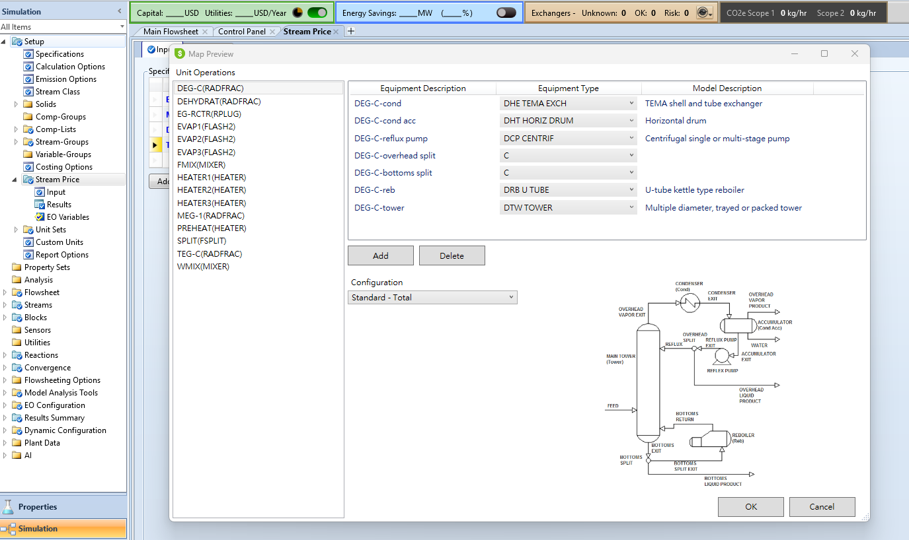
圖 10-8 為裝置對映預覽。

---

### 10.1.6 刪除無實際裝置對應的分流器與混合器

可以注意到，子裝置中的 `DEG-C-overhead split`（塔頂分流器）和 `DEG-C-bottoms split`（塔釜分流器）的裝置型別均為 `C`，表示此模組在實際工藝中沒有對應的裝置模型，裝置成本為零。這是因為實際工廠中分流可採用管路分流方式實現，成本可忽略不計。

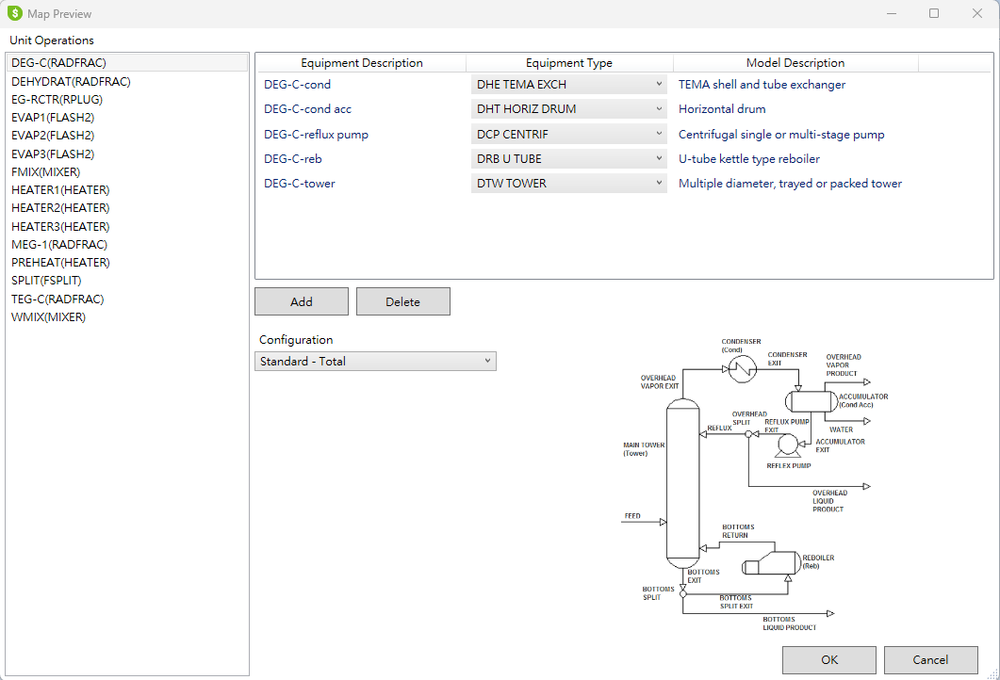

若保留此子裝置，後續經濟評估中將會報錯。因此應分別選中：

- `DEG-C-overhead split`
- `DEG-C-bottoms split`

然後點選下方 `Delete` 刪除。

此外，點選 `DEG-C-tower` 的 `DTW TOWER` 字樣，彈出圖 10-9 視窗。此視窗中可在 `Project Equipment Name` 處修改子裝置名稱，也可透過雙擊下方列表選擇適當的裝置型別。

本例中 `DEG-C` 為填料塔，因此在下方列表中依次雙擊：

1. `Towers, columns-trayed/packed`
2. `Tower - single diameter`
3. `Packed tower`

最終介面如圖 10-10 所示。如果需要回到上級選單，可以點選上方的灰色方框。點選 `OK` 回到對映預覽視窗，`DEG-C (RADFRAC)` 的裝置設定如圖 10-11 所示。

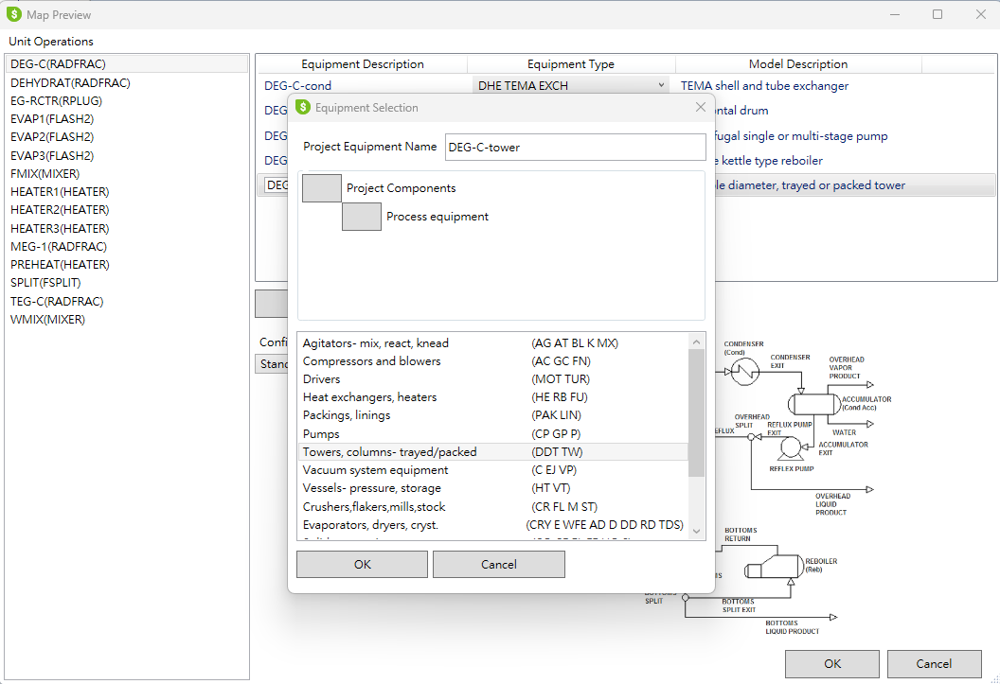
圖 10-9 為修改子裝置型別的選擇視窗。

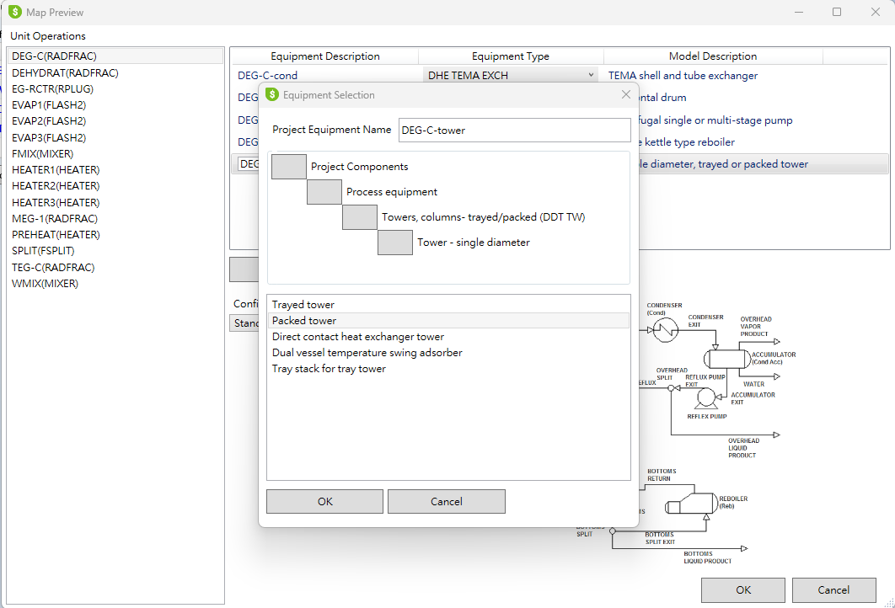
圖 10-10 為選擇適當的塔體型別。

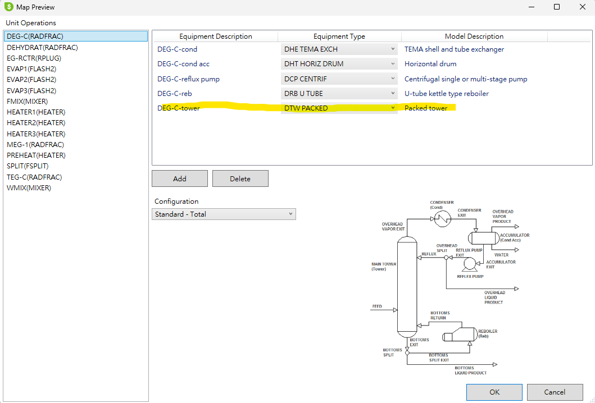
圖 10-11 為 `DEG-C (RADFRAC)` 的裝置選型。

圖 10-8 中的其他裝置也可按需修改佈局或子裝置型別。本例中的所有分流器和混合器均可透過管件實現，不對應具體裝置。因此，為了避免後續出現錯誤資訊，需要刪除本例中的所有混合器及分流器。

除了 `DEG-C` 外，`DEHYDRAT`、`MEG-1`、`TEG-C` 三個塔中的塔頂、塔釜分流器，以及 `WMIX`、`FMIX`、`SPLIT` 亦需刪除。
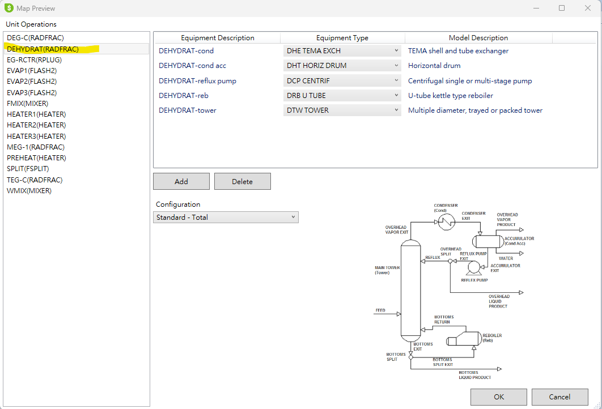
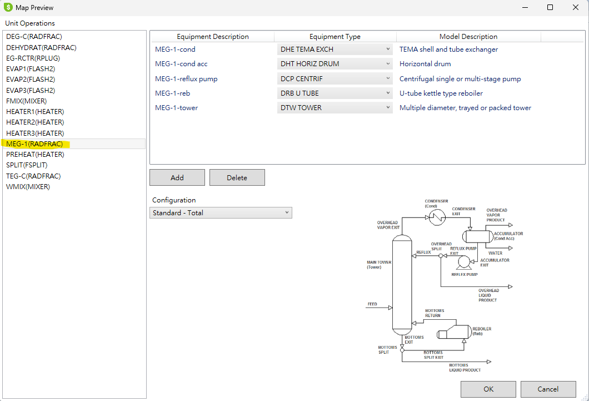
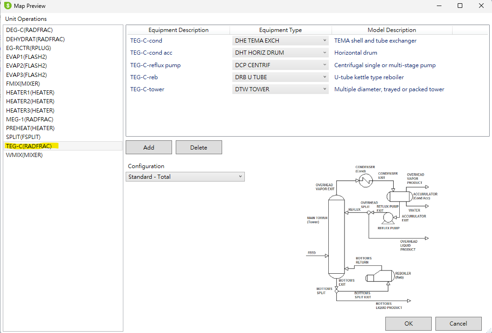

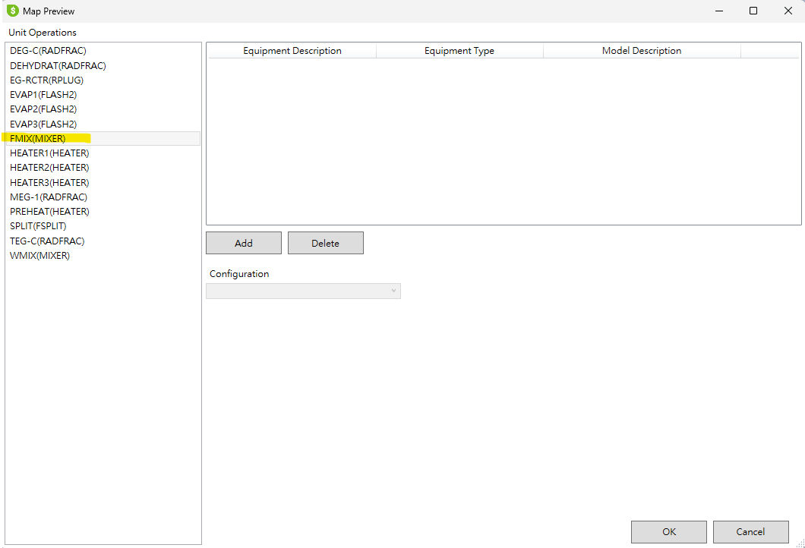
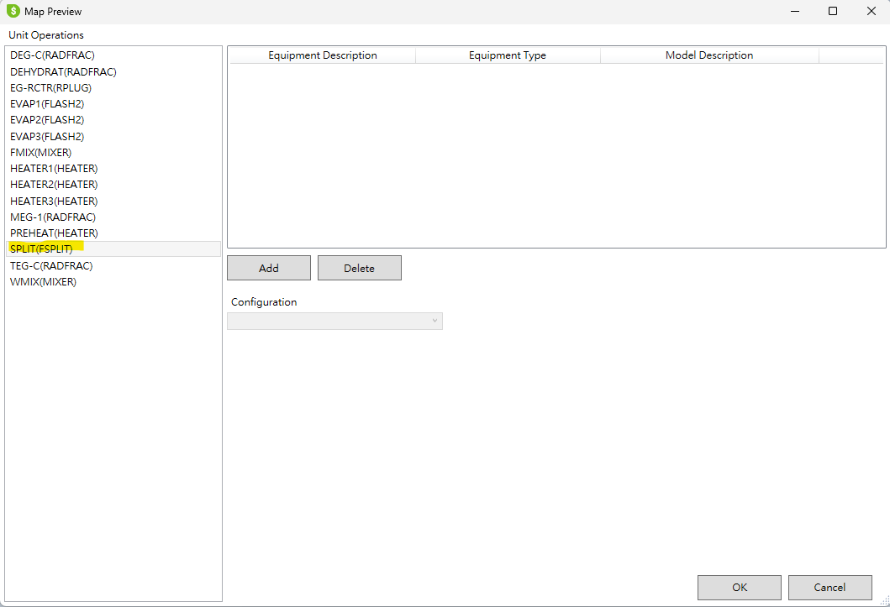

上圖為 `DEHYDRAT`、`MEG-1`、`TEG-C` 三塔及 `WMIX`、`FMIX`、`SPLIT` 各模組的裝置對映設定；各塔中的塔頂與塔釜分流器，以及三個混合器／分流器模組，均需依同樣方式刪除，方可完成全部裝置對映。

---

### 10.1.7 完成裝置對映並檢視經濟計算結果

點選 `OK`，等待軟體計算完畢後，可以看到 Economics 分頁中的「Mapping」、「Sizing」及「Evaluation」前出現勾號，表示評估任務已完成。下方綠色經濟儀表板中也出現資本和公用工程的經濟估算結果，如圖 10-12 所示。

點選儀表板中的數字，會彈出“Results Summary / Equipment”標籤頁，顯示本工藝的各項詳細計算結果，如圖 10-13。也可點選其他標籤檢視相關資訊，包括：

- `Utilities`：公用工程
- `Unit operation`：單元操作模型
- `Equipment`：裝置

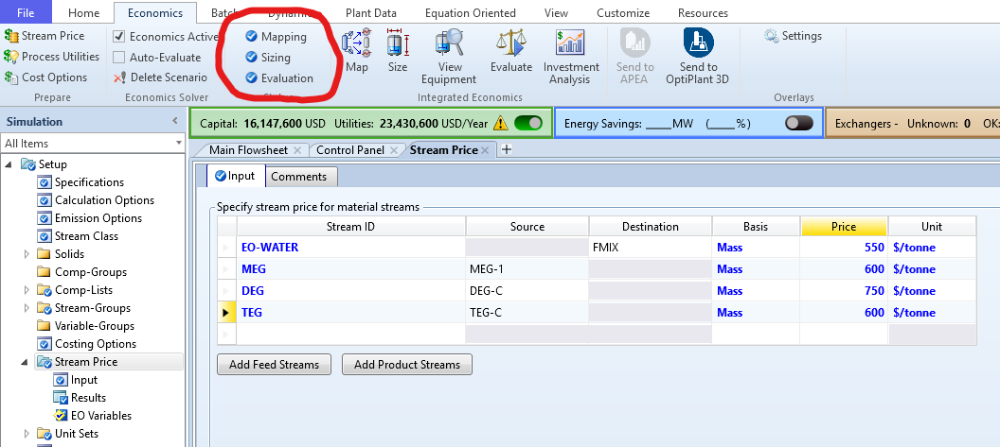
圖 10-12 為完成裝置對映與成本評估後，Economics 儀表板顯示的資本成本與公用工程估算結果。

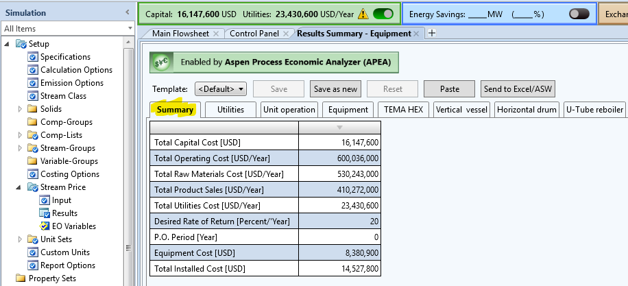
圖 10-13 為經濟計算結果。

經濟計算結果中可見如下專案：

| 專案 | 數值 |
|---|---:|
| Total Capital Cost [USD] | 16,147,600 |
| Total Operating Cost [USD/Year] | 600,036,000 |
| Total Raw Materials Cost [USD/Year] | 530,243,000 |
| Total Product Sales [USD/Year] | 410,272,000 |
| Total Utilities Cost [USD/Year] | 23,430,600 |
| Desired Rate of Return [Percent/Year] | 20 |
| P.O. Period [Year] | 0 |
| Equipment Cost [USD] | 8,380,900 |
| Total Installed Cost [USD] | 14,527,800 |

---

### 10.1.8 處理經濟評估中的警告與錯誤

可以注意到，儀表板中出現警告標誌，表示經濟評估過程中存在警告。點選此圖示，進入 `Equipment` 頁面，其中 `EG-RCTR` 和 `PREHEAT` 兩個裝置有錯誤資訊。
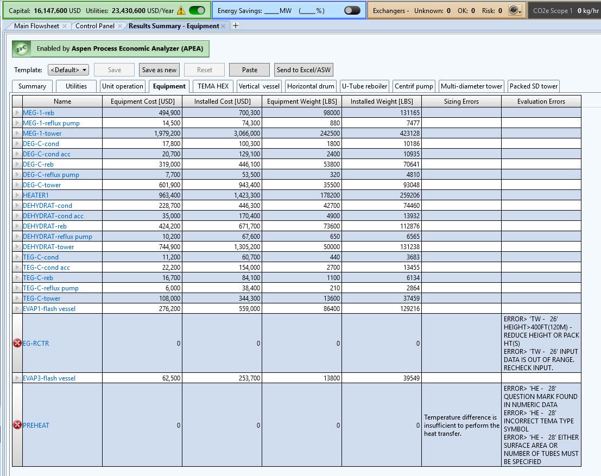

`EG-RCTR` 的錯誤資訊如下：

```text
ERROR > TW - 26' HEIGHT > 400FT (120M) - REDUCE HEIGHT OR PACK HT(S)
ERROR > TW - 26' INPUT DATA IS OUT OF RANGE. RECHECK INPUT.
```

這是因為模擬中使用的平推流反應器採用填料塔模型，但反應器長度（高度）為 196 m，超過了填料塔所允許的最高高度。實際工業裝置對於這樣的反應器可採用多塔串聯形式，將此反應器分為獨立的多個裝置，同時在裝置之間安裝增壓泵。但在此模擬中，此模組被簡化為單個反應器。

為了消除此錯誤，可以根據停留時間（即反應器體積）不變的原則，將原反應器模組 `EG-RCTR` 的長度 196 m 和內徑 0.6096 m 更改為 50 m 和 1.1977 m（兩者反應器體積分別約為 $57.2 \; \mathrm{m}^3$ 與 $56.3 \; \mathrm{m}^3$，誤差不超過 2%），以確保停留時間不變、模擬結果基本維持一致。
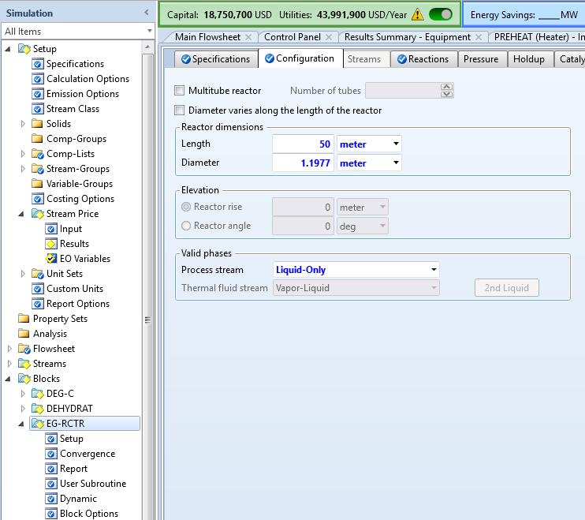

`PREHEAT` 模組的錯誤資訊如下：

```text
Temperature difference is insufficient to perform the heat transfer.
ERROR > HE - 28' QUESTION MARK FOUND IN NUMERIC DATA
ERROR > HE - 28' INCORRECT TEMA TYPE SYMBOL
ERROR > HE - 28' EITHER SURFACE AREA OR NUMBER OF TUBES MUST BE SPECIFIED
```

從工藝流程可以看出，氣-液兩相組成的原料經 `PREHEAT` 模組後失去熱量同時溫度升高，意味著 `PREHEAT` 模組是一個簡化的換熱器模組。現實中難以透過單一換熱器實現，因此 Aspen Plus 對此模組的裝置選型及估算會出現錯誤。

為了解決這一問題，可以在不改變反應器進料條件、不考慮最優能耗的情況下對原工藝流程進行簡單修改。具體方法是在 `PREHEAT` 和 `EG-RCTR` 之間增加一個泵 `PUMP1` 和一個換熱器 `PREHEAT2`：

1. 使原料（144 °C、4 MPa、摩爾汽相分率 0.846）經 `PREHEAT` 冷卻為同壓下的飽和液體（4 MPa、摩爾汽相分率 0）。
2. 再經 `PUMP1` 恆溫升壓至 35 bar。
3. 最後經 `PREHEAT2` 恆壓升溫至 35 bar、170 °C。

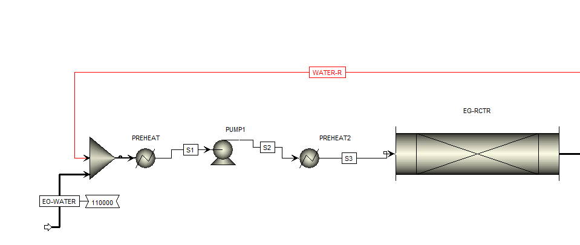
圖 10-14 為調整後的反應器前預熱工段。


圖 10-15 為調整後的 `PREHEAT` 模組輸入。


圖 10-16 為調整後的 `PUMP1` 模組輸入。


圖 10-17 為調整後的 `PREHEAT2` 模組輸入。

完成上述工藝流程修改後，請重新執行模擬並確認收斂無誤，再繼續進行 10.1.9 節的公用工程設定與重新評估步驟。

---

### 10.1.9 新增公用工程並重新計算

完成 10.1.8 節的工藝流程修改並重新執行模擬後，本節說明如何新增公用工程並重新進行完整的經濟評估流程。為了展示公用工程的經濟估算結果，在本模擬中新增冷卻水和中壓蒸汽兩個公用工程，分別用於 `PREHEAT` 和 `PREHEAT2` 兩個換熱器的換熱。

設定完成後，在 Economics 分頁下點選「Delete Scenario」，以初始化經濟估算。經濟估算前若未刪除已有方案，可能會導致意外錯誤。隨後重新勾選「啟用經濟核算」，初始化流程並執行模擬以獲得流程參數。之後點選對映圖示，在 `Map Options` 視窗中重複前述步驟，刪除裝置模型中的混合器和分流器。

計算結果完成後，儀表板中的警告標誌消失，並出現勾號，表明之前出現的錯誤資訊均已清除。如果未出現經濟分析結果，可點選頂部功能區 Economics 分頁中的「估算」按鈕。

在經濟分析的「結果摘要」頁中，點選 `Equipment`，可檢視每個裝置的基本資訊。以填料塔為例，點選 `Packed SD tower` 標籤，可看到 `DEG-C-tower` 和 `EG-RCTR` 兩個裝置的詳細設計資訊，如直徑（Vessel diameter）、總高（Vessel tangent to tangent height）等。對於某些參數，如殼體材料（Shell material）、裙座高度（Skirt height）等，軟體可以在缺少這些參數的情況下使用內建裝置模型進行成本估算。若使用者有精餾塔、換熱器的詳細設計參數，也可根據相關章節內容進行詳細設計後重新估算裝置成本。

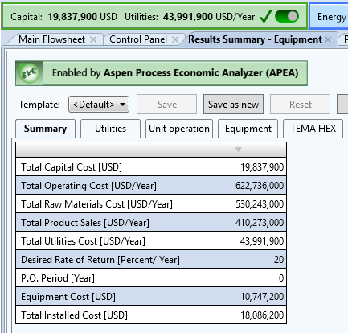
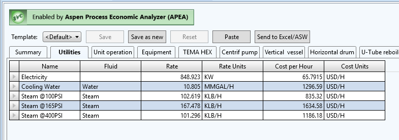
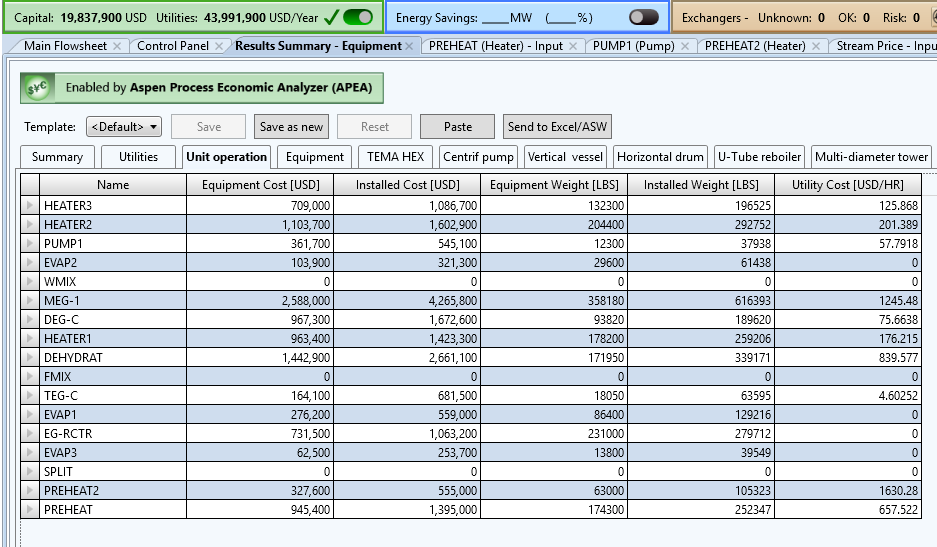
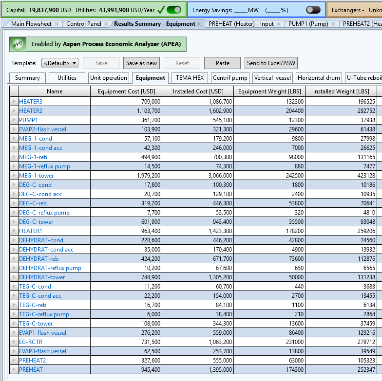

圖 10-18 各項成本分析結果。

#### 結果討論

**(0) 主要產品流股質量平衡分析**

執行模擬後，在「Stream Results」可檢視所有物流的詳細組成與流率。原料與產品流股的關鍵數據如下表所示：

| 流股 | 來源 | 總質量流量 [kg/hr] | 主要組分質量流量 [kg/hr] | 純度 |
|---|---|---:|---|---:|
| EO-WATER | FMIX (進料) | 110,000 | EO: 55,000 / H₂O: 55,000 | — |
| MEG | MEG-1 (塔頂) | 67,049 | MEG: 67,015 / H₂O: 14 / DEG: 20 | 99.95% |
| DEG | DEG-C (塔頂) | 8,405 | DEG: 8,397 / MEG: 7 / TEG: 2 | 99.90% |
| TEG | TEG-C (塔頂) | 464 | TEG: 463 / DEG: 0.8 | 99.82% |
| 4EG | TEG-C (塔釜) | 43.7 | TEG: 24.4 / 4EG: 19.4 | — （混合物）|

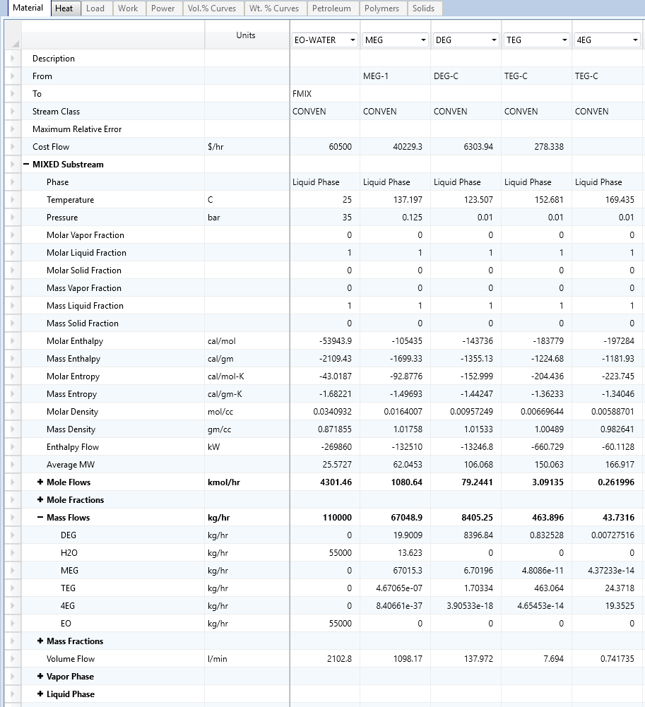

**① EO 轉化率**

進料中 EO = 55,000 kg/hr，所有產品流股中 EO 殘量接近於零，故 **EO 總轉化率 ≈ 100%**，說明反應完全。

**② 乙二醇生成的選擇性**

以 EO 的莫耳流量為基準（ $55{,}000 \div 44 = 1{,}250 \; \mathrm{kmol/hr}$ ），各產品消耗 EO 的莫耳數為：

| 產品 | MW | 分子量中 EO 數 | 莫耳流量 [kmol/hr] | 消耗 EO [kmol/hr] | EO 選擇性 |
|---|---:|---:|---:|---:|---:|
| MEG（乙二醇） | 62 | 1 | 1,081 | 1,081 | **86.5 %** |
| DEG（二乙二醇） | 106 | 2 | 79.2 | 158.4 | **12.7 %** |
| TEG（三乙二醇） | 150 | 3 | 3.09 | 9.3 | **0.74 %** |
| 4EG 流股（混合物） | — | — | ~0.26 | ~0.9 | **0.07 %** |

MEG 選擇性僅 **86.5%**，遠低於工業標準（通常 > 90%），根本原因在於**進料水/EO 莫耳比過低**：

$$\frac{n_{\mathrm{H_2O}}}{n_{\mathrm{EO}}} = \frac{55{,}000/18}{55{,}000/44} = \frac{3{,}056}{1{,}250} \approx 2.44$$

工業上，為提高 MEG 選擇性，常採用水/EO 莫耳比 **20:1 以上**（即大量過剩水），使連串反應 EO→MEG→DEG→TEG 的副產物生成受到抑制。本模擬使用 2.44:1 的低水比，導致較多 DEG 和 TEG 生成。

**③ 年產量估算**

以每年運轉 8,766 小時計：

| 產品 | 小時流量 [kg/hr] | 年產量 [tonne/yr] | 售價 [$/tonne] | 年收益 [M USD/yr] | 收益佔比 |
|---|---:|---:|---:|---:|---:|
| MEG | 67,049 | 587,800 | 600 | **352.7** | 85.9 % |
| DEG | 8,405 | 73,700 | 750 | **55.3** | 13.5 % |
| TEG | 464 | 4,065 | 600 | **2.4** | 0.6 % |
| 4EG | 43.7 | 383 | — | 0 | 0 % |
| **合計** | | | | **410.4** | 100 % |

MEG 是本工藝最主要的獲利來源，貢獻約 **85.9%** 的年度產品收益；DEG 以較高售價（$750/tonne）貢獻約 **13.5%**；TEG 產量極少（年產僅 4,065 tonne），貢獻不到 1%。

**④ 物料衡算**

進料總質量 110,000 kg/hr，可分配為：
- 轉化為甘醇產品（MEG + DEG + TEG + 4EG）：75,962 kg/hr（69.1%）
- 進料水分離為廢水（在 DEHYDRAT 脫水塔去除）：~34,038 kg/hr（30.9%）

這 ~34,038 kg/hr 的廢水雖然無價值，卻需要龐大的脫水塔（DEHYDRAT）來處理，這也解釋了為何 DEHYDRAT 是全廠第二昂貴的單元操作（裝置成本 $1,442,900 USD）。

**⑤ 流股成本流量驗算**

| 流股 | Cost Flow [$/hr] | 年化 [M USD/yr] |
|---|---:|---:|
| EO-WATER（原料成本） | 60,500 | 530.2 |
| MEG（收益） | 40,229 | 352.6 |
| DEG（收益） | 6,304 | 55.3 |
| TEG（收益） | 278 | 2.4 |
| **合計收益** | **46,811** | **410.3** |
| **原料虧損** | **−13,689** | **−119.9** |

即使不考慮公用工程與人工成本，**單純原料成本即高出產品收益 $13,689/hr（約 $120M/yr）**，加計公用工程（$44M/yr）與其他運營成本（$48M/yr）後，年度總虧損約 $212M，與現金流量表（CF ≈ −$214M/yr）高度吻合。

---

**(1) 整體經濟概況（Summary）**

由圖 10-18a 可讀取本工藝流程完整經濟評估的彙總結果，如下表所示：

| 項目 | 數值 |
|---|---:|
| Total Capital Cost [USD] | 19,837,900 |
| Total Operating Cost [USD/Year] | 622,736,000 |
| Total Raw Materials Cost [USD/Year] | 530,243,000 |
| Total Product Sales [USD/Year] | 410,273,000 |
| Total Utilities Cost [USD/Year] | 43,991,900 |
| Desired Rate of Return [Percent/Year] | 20 |
| P.O. Period [Year] | 0 |
| Equipment Cost [USD] | 10,747,200 |
| Total Installed Cost [USD] | 18,086,200 |

與 10.1.7 節（修改前）相比，加入 `PUMP1` 與 `PREHEAT2` 後，裝置成本從 $8,380,900 USD 增加至 $10,747,200 USD，總資本成本從 $16,147,600 USD 增加至 $19,837,900 USD，增幅約 23%，反映新增設備對資本投入的影響。

需特別注意：本例的 **P.O. Period（投資回收期）顯示為 0**，表示在 20% 報酬率要求下，軟體判斷該專案無法回收投資。根本原因在於**原料成本（$530M/年）遠高於產品銷售收入（$410M/年）**，以下說明其根本成因。

原料流股 `EO-WATER` 中，EO 與水的質量流量相等（各 55,000 kg/h），合計 110,000 kg/h，以 \$550/tonne 對整支流股定價，其原料成本為：

$$110{,}000 \; \mathrm{kg/h} \times \frac{\$550}{\mathrm{tonne}} \times 8{,}760 \; \mathrm{h/yr} \approx \$530 \mathrm{M/yr}$$

然而，此定價方式隱含了以 **\$1,100/tonne** 計算 EO 的成本（因為水的佔比使均價被稀釋一半）：

$$\text{EO 隱含單價} = \frac{110{,}000 \times 550}{55{,}000} = \$1{,}100/\text{tonne（EO）}$$

再從化學反應的質量關係來看，生產 1 tonne MEG 需消耗約 0.71 tonne EO（由分子量比 44/62 計算）：

$$\text{每噸 MEG 的 EO 原料成本} = 0.71 \times \$1{,}100 \approx \$781/\text{tonne}$$

此成本已遠超過 MEG 的售價 **\$600/tonne**，即「每生產一噸 MEG 就虧損約 \$181」。

因此，**P.O. Period = 0 並非因為產品售價太低，而是因為本例對 EO-WATER 流股的定價方式，隱含了過高的 EO 成本（\$1,100/tonne）**。在實際的乙二醇生產分析中，有幾種常見的定價修正方式：

1. **分開定義 EO 與水的流股價格**：在軟體中分別定義 EO 流股（高價）與工藝水流股（低價，約 \$1–5/tonne），而非以混合流股統一定價，可得到更真實的成本結構。
2. **採用整合生產成本**：若工廠自產 EO（從乙烯氧化），EO 的轉移價格遠低於市場報價，整體經濟性可大幅改善。
3. **更新市場報價**：根據當前市場，EO 報價約 \$800–1,000/tonne，MEG 約 \$550–700/tonne，價差更小，故選用合理的市場價差至關重要。

學生在使用本例時，建議修改 EO-WATER 的定價邏輯，或分別定義 EO 與水的流股，以獲得更具參考價值的經濟評估結果。

**(2) 公用工程消耗（Utilities）**

圖 10-18b 顯示本工藝主要公用工程的消耗量與成本費率（以 US_IP 模板預設報價計算）：

| 公用工程 | 消耗量 | 費率 |
|---|---:|---:|
| Electricity（電力） | 848.9 kW | 65.8 USD/hr |
| Cooling Water（冷卻水） | 10.81 MMGAL/hr | 1,296.6 USD/hr |
| Steam @100 PSI（低壓蒸汽） | 102.6 KLB/hr | 835.3 USD/hr |
| Steam @165 PSI（中壓蒸汽） | 167.5 KLB/hr | 1,634.6 USD/hr |
| Steam @400 PSI（高壓蒸汽） | 101.3 KLB/hr | 1,186.2 USD/hr |

結果顯示，**中壓蒸汽（Steam @165PSI）消耗量最大，且費率最高**，是公用工程費用中最主要的貢獻項目，主要用於各精餾塔再沸器的熱源。冷卻水消耗量極大，以 MMGAL/hr 計量，主要用於塔頂冷凝器。電力消耗相對較小，主要來自幫浦。

值得注意的是，此圖使用 US_IP 模板的預設公用工程報價（美制單位、美國市場價格），若需反映台灣或中國市場的公用工程成本，應在 `設定 / 公用工程` 中自訂冷卻水與蒸汽的價格與參數（如 10.1.9 節所述），以獲得更符合實際的估算結果。

**(3) 單元操作成本比較（Unit Operation）**

圖 10-18c 列出各單元操作模組的裝置成本（Equipment Cost）與安裝成本（Installed Cost）。造價最高的前幾個模組如下：

| 單元操作 | 裝置成本 [USD] | 安裝成本 [USD] |
|---|---:|---:|
| MEG-1（MEG 精餾塔） | 2,588,000 | 4,265,800 |
| DEHYDRAT（脫水塔） | 1,442,900 | 2,661,100 |
| PREHEAT（預熱器） | 945,400 | 1,395,000 |
| HEATER1 | 963,400 | 1,423,300 |
| HEATER2 | 1,103,700 | 1,602,900 |
| EG-RCTR（管式反應器） | 731,500 | 1,063,200 |

**MEG-1 精餾塔為全廠最昂貴的單元操作**，裝置成本佔總裝置成本約 24%，反映該塔處理量大、塔徑高之特性。`WMIX`、`FMIX`、`SPLIT` 等混合器與分流器的成本均顯示為 0，符合先前刪除其虛擬裝置模型的設定。

**(4) 子裝置成本明細（Equipment）**

圖 10-18d 進一步展開各塔的子裝置成本。**MEG-1-tower（塔體）單一子裝置成本即達 $1,979,200 USD（安裝成本 $3,066,000 USD）**，是全廠成本最高的單一裝置，反映其大型塔體所需的製造、材料與安裝費用。

各精餾塔中，再沸器（reb）通常是除塔體外成本最高的子裝置。以 MEG-1 為例，再沸器造價 $494,900 USD，遠高於冷凝器（$57,100 USD），這是因為再沸器操作溫度較高、需處理更大的熱負荷，對材質要求較嚴格。

---

### 10.1.10 投資分析

Aspen Plus 還可以對工藝的經濟性進行投資分析。完成裝置對映後，頂部功能區 Economics 分頁中的「Investment Analysis」圖示變為可點選狀態。

點選「Investment Analysis」圖示，將生成一個名為 `IPEWB2.xlsx` 的 Excel 電子表格，其中包含多個工作表，分別記錄不同面向的財務計算結果：

| 工作表名稱 | 內容說明 |
|---|---|
| `Run Summary` | 專案基本資訊與主要財務指標一覽 |
| `Executive Summary` | 高層次財務摘要，含投資、成本、收入概況 |
| `Cash Flow` | 逐期現金流量、NPV、IRR 等完整財務指標 |
| `Project Summary` | 詳細計算假設與資本成本分解 |
| `Equipment` | 各裝置成本明細 |
| `Utility Summary` | 公用工程消耗彙總 |
| `RawMaterial Summary` | 原料成本彙總 |
| `Product Summary` | 產品銷售收益彙總 |

---

#### 分析假設（Project Summary）

本例採用 US_IP 模板的預設財務假設，關鍵參數如下：

| 財務參數 | 數值 |
|---|---:|
| 經濟分析年限（Economic Life） | 10 年 |
| 稅率（Tax Rate） | 40 % |
| 折現率／期望報酬率（Interest Rate） | 20 % |
| 殘值（Salvage Value） | 資本成本 × 20% |
| 折舊方式（Depreciation Method） | 直線法（Straight Line） |
| 運轉資本比例（Working Capital） | 5 % |

各成本項目的逐年通貨膨脹率（Escalation）設定為：

| 項目 | 年增率 |
|---|---:|
| 資本成本 | 5.0 % |
| 產品售價 | 5.0 % |
| 原料成本 | 3.5 % |
| 人工與維護成本 | 3.0 % |
| 公用工程 | 3.0 % |

---

#### 資本成本結構

本工藝的總資本成本（Total Project Capital Cost）為 **$19,837,900 USD**，以下為主要費用分類：

| 費用項目 | 金額 [USD] |
|---|---:|
| 購置設備（Purchased Equipment） | 11,527,700 |
| 管道系統（Piping） | 3,958,310 |
| 儀表控制（Instrumentation） | 2,100,060 |
| 電氣系統（Electrical） | 1,084,240 |
| 設計工程採購（Engineering） | 4,087,100 |
| 意外準備費（Contingencies） | 5,642,960 |
| 其他直接間接費用 | 8,437,430 |
| **調整後總資本成本** | **19,837,900** |

---

#### 折舊計算

軟體提供四種折舊方法的比較，本例預設採用**直線法（Straight Line）**：

- 折舊年限：10 年（等同經濟分析年限）
- 年折舊金額：$1,587,030 USD/年
- 累計折舊：$15,870,300 USD（= 資本成本 × 80%，殘值 20% 不折舊）

其他折舊方法（年數合計法、雙倍餘額遞減法、加速成本回收法 ACRS）亦計算於 `Cash Flow` 工作表中，供使用者比較不同折舊策略對稅後現金流的影響。

---

#### 逐期現金流量分析

以下為本工藝前 10 個計算期間的現金流量彙總（計算期以「Year」表示，Year 1 為建設與試車期，Year 2 起為全年正常運轉）：

| 計算期 | 營運成本 OP [M USD] | 期間現金流量 CF [M USD] | 累計 NPV [M USD] |
|:---:|---:|---:|---:|
| Year 1（建設＋試車） | 210.6 | -232.5 | -193.8 |
| Year 2（首個完整運轉年） | 666.6 | -240.3 | -360.7 |
| Year 3 | 689.6 | -214.7 | -484.9 |
| Year 4 | 713.5 | -214.8 | -588.5 |
| Year 5 | 738.2 | -214.6 | -674.7 |
| Year 6 | 763.7 | -213.9 | -746.4 |
| Year 7 | 790.2 | -212.9 | -805.8 |
| Year 8 | 817.5 | -211.4 | -854.9 |
| Year 9 | 845.8 | -209.3 | -895.5 |
| Year 10 | 875.1 | -201.8 | **-928.1** |

說明：
- **CF（期間現金流量）**：每期的淨現金流入／流出，此處全為負值，表示每年均虧損。
- **NPV（累計淨現值）**：以 20% 折現率計算的累計淨現值，經 10 年後達 **-$928.1M USD**，深度為負。
- Year 9–10 現金流量損失略有收窄（由 -240M 縮減至 -202M），主要反映產品售價年增率（5%）略高於原料成本年增率（3.5%），但差距不足以彌補虧損。

---

#### 主要財務指標彙總

| 財務指標 | 縮寫 | 數值 | 評估結果 |
|---|---|---:|---|
| 淨現值（Net Present Value） | NPV | < 0（全期負值） | ❌ 不可行 |
| 內部收益率（Internal Rate of Return） | IRR | 無法計算 | ❌ 不可行 |
| 修正內部收益率（Modified IRR） | MIRR | 14.97 % | ⚠️ 低於門檻 20% |
| 淨回報率（Net Return Rate） | NRR | −34.78 % | ❌ 不可行 |
| 會計報酬率（Accounting Rate of Return） | ARR | −1837.48 % | ❌ 不可行 |
| 投資回收期（Payout Period） | PO | 0 年（無法回收） | ❌ 不可行 |
| 獲利能力指數（Profitability Index） | PI | 0.652 | ❌ < 1，不可行 |

> **指標說明：**
> - **NPV < 0**：整個分析期間累計淨現值始終為負，專案投入的資金在折現後永遠無法回收。
> - **IRR 無法計算**：因每期現金流量全為負，不存在使 NPV = 0 的折現率，故 IRR 無解。
> - **MIRR = 14.97%**：修正 IRR 假設正現金流以市場利率再投資，其值雖為正，但仍低於要求報酬率 20%，表示即使考慮再投資效益，專案仍不達標。
> - **PI = 0.652 < 1**：現值收益僅為現值成本的 65.2%，每投入 1 元僅能回收 0.65 元的現值。
> - **ARR = −1837%**：因稅後淨利為大幅負值，會計報酬率極低，說明從會計角度本專案虧損嚴重。

---

#### 小結

透過本例的模擬可以注意到，雖然 Aspen Plus 中的經濟分析功能全面、易於使用，且對裝置重量和安裝重量的估算基本準確，但是對資金成本、裝置成本、安裝成本的估算都和國內實際情況有較大差別。此外，在經濟估算過程中使用者可手動修改的參數較少，因此計算結果與實際情況相差較大時，使用者可手動調整的餘地較小。這也是 Aspen Plus 內建經濟分析的不足之處。

本例所有財務指標均顯示專案不具可行性，其根本原因已在 10.1.9 節結果討論中說明：EO-WATER 流股的混合定價方式使 EO 的隱含成本高達 \$1,100/tonne，遠超過 MEG 市場售價所能覆蓋的範圍。實際工程分析時，應採用更合理的物流定價方式，並結合 APEA 軟體進行更詳細的財務評估。

有鑑於此，下一節將介紹功能更為強大的 APEA 軟體的使用方法。

---

**課程資訊**
- 課程名稱：化工程序模擬 (ChemE 1395)
- 課程單元：第 10 章 經濟分析與評價
- 課程製作：逢甲大學 化工系 智慧程序系統工程實驗室
- 授課教師：莊曜禎 助理教授
- 更新日期：2026-06-26

**課程授權 [CC BY-NC-SA 4.0]**
 - 本教材遵循 [創用CC 姓名標示-非商業性-相同方式分享 4.0 國際 (CC BY-NC-SA 4.0)](https://creativecommons.org/licenses/by-nc-sa/4.0/deed.zh) 授權。

---